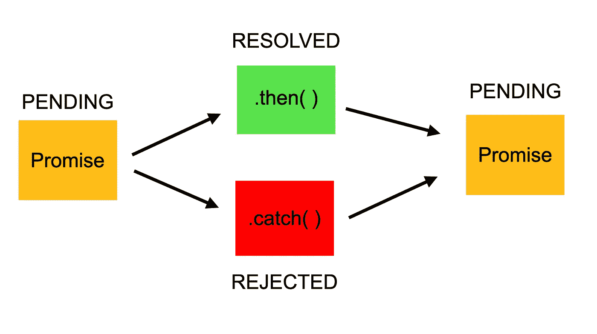

# 无中生有

> 原文：<https://blog.devgenius.io/promise-in-nodejs-d8db90fcdd48?source=collection_archive---------9----------------------->



Pic Credit [freeCodeCamp](https://medium.com/u/8b318225c16a?source=post_page-----d8db90fcdd48--------------------------------)

Promise 允许您处理最终值或错误，或者换句话说，它允许您处理未来(异步)值(IO 阻塞任务值)。例如网络呼叫、读取文件等。这使得异步方法像同步方法一样返回值:异步方法不是立即返回最终值，而是返回一个*承诺*在未来的某个时间提供该值。

承诺具有以下一组状态

1.  待定—初始状态，既未完成也未拒绝。

*2。完成*:表示操作成功完成。

*3。拒绝*:表示操作失败。

承诺的语法

```
const promise = new ***Promise***((resolve, reject) => {}).then(out => {}).catch(err => {})
```

Promise 有两个参数，一个是 resolve，另一个是 reject。 **resolve** 在未来(IO 阻塞任务)没有任何错误的情况下被调用，然后您可以使用 IO 任务值的输出调用 resolve。

而 **reject** 则是在执行一些阻塞任务时出现错误时调用。

**连锁承诺&拒绝旁路**

我们可以创造承诺链。然后功能。在 then 函数中，我们可以将值传递给下一个 then 函数。我们还可以**在 **then 函数**中抛出错误**，这将绕过当前 then 函数的所有 then，并在缓存函数中捕捉错误。

```
const promise = new ***Promise***((resolve, reject) => {
    // Both asynchronous or synchronous code can be present here
    resolve('good')
    //reject('bad') // this will directly call catch method
})
    .then(data => {
        ***console***.log(data);
        return 1;
    })
    .then(data => {
        throw 'really bad'; // this exception will get caught in the catch method and next then function will get bypass
        ***console***.log(data);
        return 2;
    })
    .then(data => {
        ***console***.log(data);
        return 3;
    })
    .then(data => {
        ***console***.log(data);
        return 4;
    })
    .catch(err => {
        ***console***.log(err);
    })
```

**承诺的好处**

1.  为了克服回调地狱，我们可以使用承诺

为了克服回调地狱，我们可以使用承诺。然后->。然后->。然后，当我们需要方法使它像同步代码一样运行时

```
const fs = require('fs');new ***Promise***((resolve, reject) => {
    fs.readFile('../dir/file1.txt', (err, data) => {
        if (err) {
            reject(err);
        } else{
            resolve(data.toString());
        }
    })
}).then(data => {
    ***console***.log(data);
}).catch(err => {
    ***console***.log(err);
})
```

2.一次调用多个同步方法

我们可以使用 promise.all 函数一次调用多个同步函数。我举了一个从磁盘读取文件的例子

为了克服以回调地狱方式读取文件，我们可以使用 promise.all 方法，所有文件的输出将以最近的数组格式提供。然后方法。

Promise.all 方法将一个参数作为我们从 util.promisify 方法中提取的承诺数组

```
const fs = require('fs');
const utils = require('util');const read = utils.promisify(fs.readFile);
***Promise***.all([
    read('../dir/file1.txt'),
    read('../dir/file2.txt'),
    read('../dir/file3.txt')
]).then(
    data => {
        ***console***.log(data[0].toString());
        ***console***.log(data[1].toString());
        ***console***.log(data[2].toString());
    })
```

这就是我所要分享的一切。如果你有更多的观点要分享，请在下面评论。这将帮助我和其他人获得更多关于承诺的知识。感谢阅读。请关注支持和更多这样的内容。

你喜欢这篇文章吗？如果有，通过 [**订阅获取更多类似内容解码，我们的 YouTube 频道**](https://www.youtube.com/channel/UCvEB7wXUEXGFE9lCx0USR3Q) **！**

注:更多精彩内容还可登陆 [https://ajaykrp.me](https://ajaykrp.me) 。请检查一下。