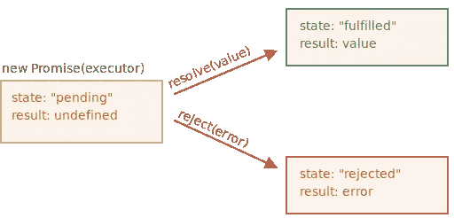
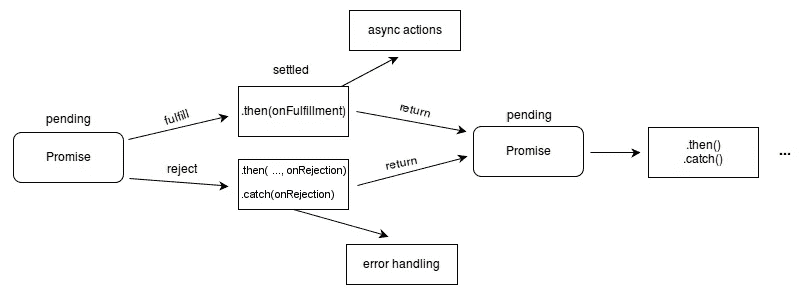

# Javascript 中的承诺

> 原文：<https://blog.devgenius.io/promises-in-javascript-2992d371938d?source=collection_archive---------5----------------------->


关于 Javascript 中的承诺、承诺的概念、状态、方法和示例的介绍性文章。

# Javascript 中的异步

Javascript 依靠非阻塞异步模型实现网络上的多种操作，处理用户交互，同时保持界面流畅。这就是为什么处理多个异步操作有时很难做到的原因。

几年前处理异步最常见的方式是通过回调函数，但是随着 ES6 的开始，他们增加了额外的机制。

# 承诺

承诺是表示异步操作最终完成或失败的对象。在 **ECMAScript 2015 (ES6)** 中，这个新对象被添加到 Javascript 语言中，以更好地支持异步管理。

承诺的运作由两个主要机制组成:

*   **状态**:承诺的内部属性，表示承诺可以采用的当前或未来的情况。
*   **控制器**:它们是由承诺的状态触发的方法，用来捕获最终的流程和条件。

# 承诺状态

承诺由以下三种状态组成:

*   **待定**:承诺执行时的初始状态。
*   **已完成(**成功解析 **)** :表示异步操作成功完成的状态。
*   **拒绝**:表示异步运行失败的状态。



# 控制器

*   **Then** :解决状态为“*履行”*的承诺时执行的方法。此方法接收流连续性的执行回调。
*   **Catch** :拒绝状态为“*Rejected”*的承诺时执行的方法。此方法接收一个因错误而执行的回调。



# 用 Javascript 实现承诺

接下来，我们将创建一个承诺，在内部我们将通过 setTimeout 方法模拟对 API 的调用(这是为了模拟异步调用)。

```
**const** fetchPokemon **=** (name) **=>** **new** Promise((resolve, reject) **=>** {setTimeout(() **=>** {  
    **const** pokemon **=** ["Pikachu"];
    **const** search **=** pokemon.find((poke) **=>** poke **===** name);
    **if**(search){
      resolve("Resolve: Pokemon encountered")
    }
    reject("Reject: Pokemon not found");
  }, 2000);});
```

在上面的代码中:

*   异步操作将负责在数组中按名称查找神奇宝贝。
*   如果神奇宝贝存在，则执行由`then`捕获的`resolve`状态。
*   如果神奇宝贝不存在，则执行由`catch`捕获的`reject`状态。

```
fetchPokemon("Pikachu")
  .then(response **=>** console.log(response))
  .**catch**(error **=>** console.log(error));// Resolve: The Pokemon Pikachu is foundfetchPokemon("Bulbasaur")
  .then(response **=>** console.log(response))
  .**catch**(error **=>** console.log(error));// Reject: The Pokemon Bulbasaur is not found
```

# 完整代码

# 结局

承诺是为了更好地处理 Javascript 中的异步操作，增加对这些操作的更好控制和跟踪。许多浏览器 API 都是建立在承诺之上的，其中最著名的是 **fetch()** 。强调承诺可以与其他语言功能如 **Async/Await** 完美结合，以提高他们的阅读和顺序。

感谢你远道而来，如果你觉得这很有用，别忘了鼓掌👏。订阅以接收更多内容🔔。

如果你需要额外的帮助，请联系我🤠。

*   ✉️ [**给我发邮件**](mailto:dcortes.net@gmail.com)
*   🤝 [**在 LinkedIn 上联系我**](https://www.linkedin.com/in/dcortesnet/)
*   📮 [**在 Twitter 上联系我**](https://twitter.com/dcortes_net)

非常感谢您的阅读，我感谢您的时间。