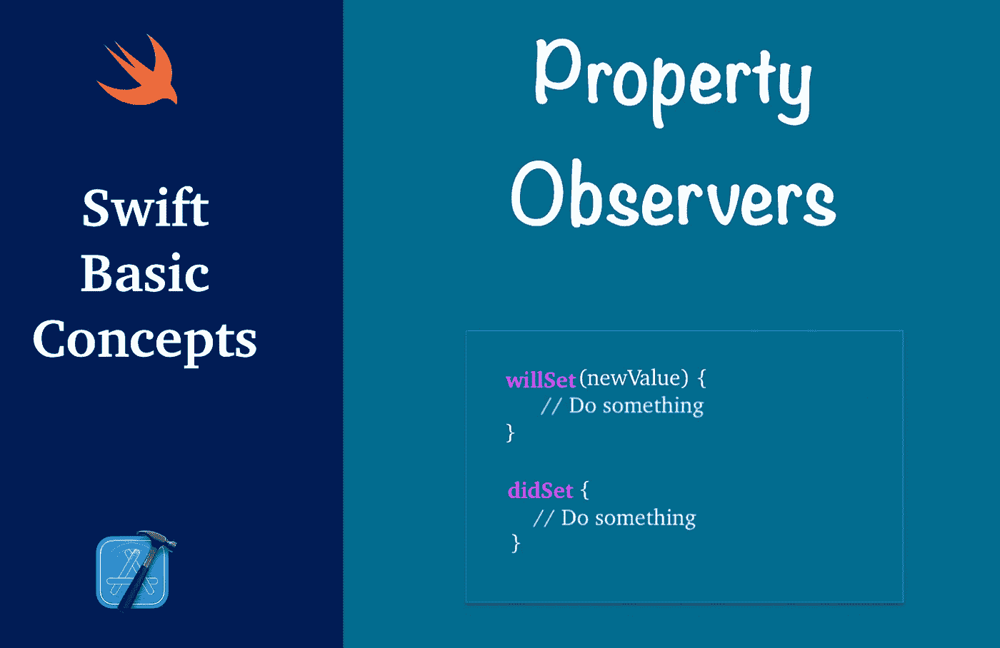

# Swift 中的物业观察员是什么？

> 原文：<https://blog.devgenius.io/property-observers-in-swift-fb3ba5b2c4d7?source=collection_archive---------4----------------------->

## 当属性值发生变化时，willSet 和 didSet 会发出通知



在 iOS 应用程序开发中，观察者是在特定事件中通知用户的对象。财产观察者观察并响应财产价值的变化。每次设置属性值时都会调用它们，即使新值与属性值的当前值相同。它们提供了一种监视属性更改的方法。

对于一个属性，我们可以有两个以下的观察者:

*   **将设置**，在保存值之前调用。它带有一个包含 newValue 的常量参数，默认名称为 newValue。
*   **didSet** 在新值保存后立即被调用。它带有一个包含 oldValue 的常量参数，默认名称为 oldValue。

> 我们可以覆盖这些参数名中的任何一个(newValue，oldValue)，但是如果没有提供名称，则使用默认值。

根据苹果公司的说法，我们可以在以下地方添加物业观察员:

1.  **存储您定义的属性**

```
struct Employee {
    var name: String
    var age: Int {
        willSet(newValue) {
            print("\(name) age is set to \(newValue)")
        }
        didSet {
            print("\(name) age changed from \(oldValue) to \(age)")
        }
    }
}

var emp = Employee(name: "Tom", age: 20)
emp.age = 30

// Tom age is set to 30
// Tom age changed from 20 to 30
```

2.**您继承的存储属性**

```
class Vehicle {
    var currentSpeed = 0.0
    var description: String {
        return "traveling at \(currentSpeed) miles per hour"
    }
}

class Car: Vehicle {
    var gear = 1
    override var description: String {
        return super.description + " in gear \(gear)"
    }
}

class AutomaticCar: Car {
    override var currentSpeed: Double { // inherit Stored property
        didSet {
            gear = Int(currentSpeed / 10.0) + 1
        }
    }
}

let automatic = AutomaticCar()
automatic.currentSpeed = 35.0
print("AutomaticCar: \(automatic.description)")

// AutomaticCar: traveling at 35.0 miles per hour in gear 4
```

> 对于继承的属性，您可以通过在子类中覆盖该属性来添加属性观察器。

3.**您继承的计算属性**

```
class Shape {
    var width = 0.0
    var height = 0.0

    var area: Double {
        get {
            return width * height
        }
        set {
            self.width = sqrt(newValue)
            self.height = sqrt(newValue)
        }
    }
}

class Rectangle: Shape {
    override var area: Double {
        didSet {
            print("Old value is \(oldValue)")
        }
        willSet {
            print("New value is \(newValue)")
        }
    }
}
```

对于您定义的计算属性，请使用该属性的 setter 来观察和响应值的更改，而不是尝试创建一个观察器。

```
struct Rectangle {
    var width = 0.0
    var height = 0.0

    var area: Double {
        get {
            return width * height
        }
        set {
            self.width = sqrt(newValue)
            self.height = sqrt(newValue)
        }
    }
}

var rectAngle = Rectangle(width: 10, height: 10)
print(rectAngle.area)
```

从 Swift 5.3 开始，属性观察者现在可以附加到**懒惰**属性。

```
class GreetingClass {
    lazy var greeting: String = "Hi" {
        willSet(newValue) {
            print(newValue)
        }
       didSet {
        print(oldValue)
      }
    }
}

var obj = GreetingClass()
obj.greeting = "Hello"
```

## 物业观察员需要记住的要点

*   当在初始值设定项中设置属性时，不能调用 willSet 和 didSet 观察器，或者当设置默认值时。
*   属性观察器对*计算属性*不可用，因为您可以通过属性设置器来响应更改。但是，当它们被覆盖时，它们在*继承的计算属性*中可用

> 超类属性的 **willSet** 和 **didSet** 观察器在超类初始化器被调用后，在子类初始化器中设置属性时被调用。在调用超类初始化器之前，类在设置自己的属性时不会调用它们。

## 结论

属性观察器对于值更改通知很有用。理想的场景是，当我们需要添加一些逻辑或者需要在属性值发生变化时更改用户界面时，使用属性观察器。

感谢阅读。如果您有任何意见、问题或建议，请在下面的评论区发表！👇。请**分享**并给予**掌声**👏👏如果你喜欢这个帖子。