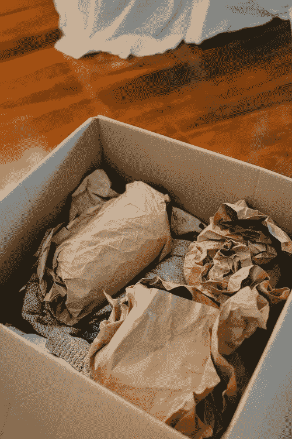
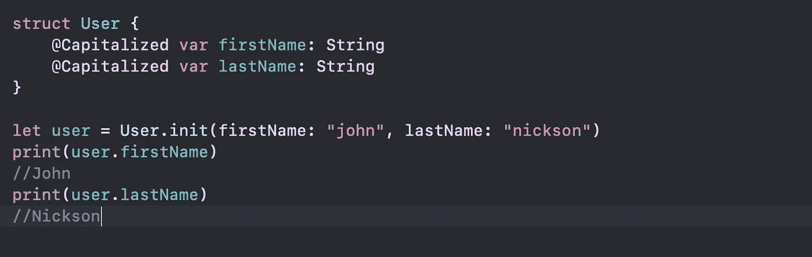
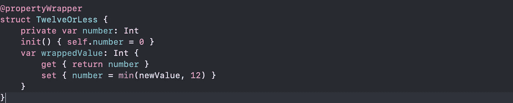
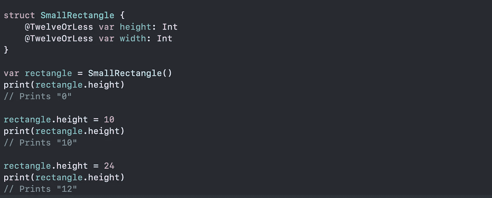
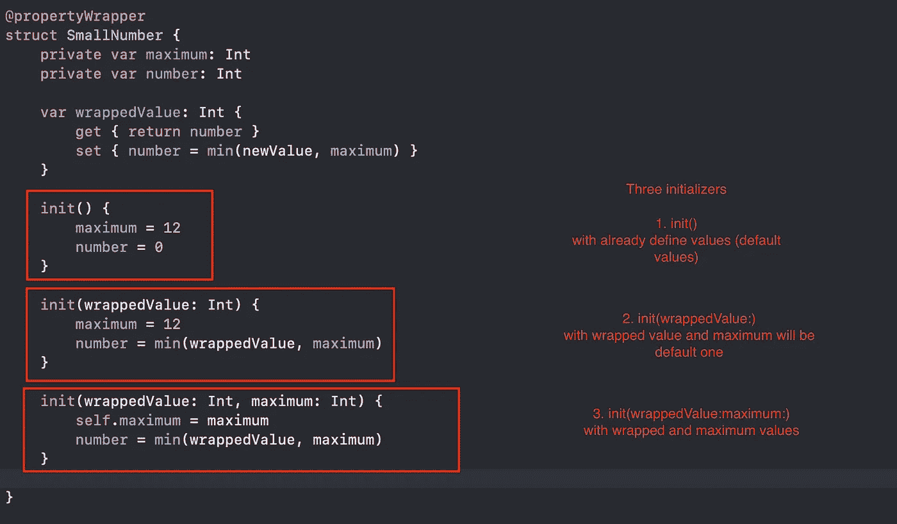
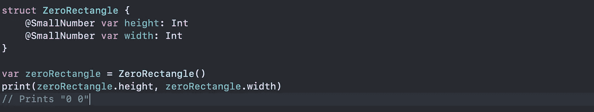
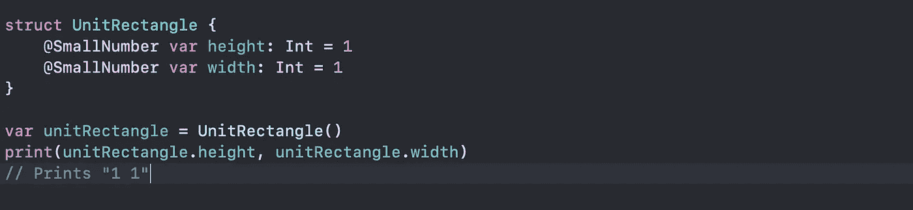
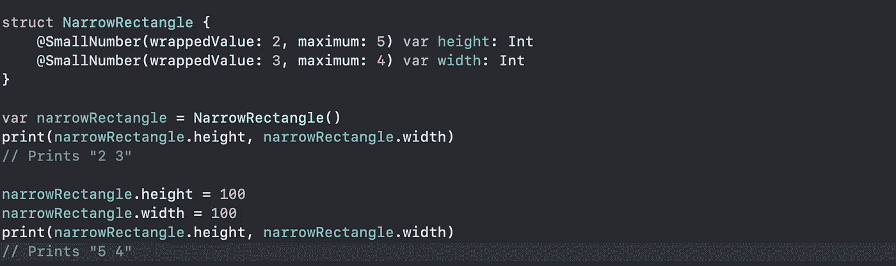

# ✔️酒店包装(Swift 5.1)📦

> 原文：<https://blog.devgenius.io/property-wrapper-swift-5-1-9bc7981019fc?source=collection_archive---------25----------------------->

来自[www.pexels.com](http://www.pexels.com)

## 据苹果公司称:

> 属性包装器在管理如何存储属性的代码和定义属性的代码之间添加了一个分离层。
> 
> 要定义一个属性包装器，需要创建一个结构、枚举或类来定义一个`wrappedValue`属性

# **例如:1** 🔢对于简单的单个属性🍀

假设我们想要创建一个属性包装器，它自动将分配给它的所有`String`值大写。可以是这样的:

大写定义

> 通过将包装器的名称作为属性写在属性之前，可以将包装器应用于属性。

我们如何利用这一点:

要将新的属性包装器应用于我们的任何`String`属性，我们只需用`@Capitalized`对其进行注释，Swift 会自动将该注释与我们的上述类型进行匹配。下面是我们如何确保一个`User`类型的`firstName`和`lastName`属性总是大写的:

大写用途

# **例:2** 🔢有更多的条件😺

在下面的代码中，`TwelveOrLess`结构确保它包装的值总是包含一个小于或等于 12 的数字。如果你要求它存储一个更大的数字，它会存储 12。

无十二层定义

这里有一个存储小矩形的结构，使用由`TwelveOrLess`属性包装器实现的相同(相当随意)的“小”定义:

无十二用途

`height`和`width`属性从`TwelveOrLess`的定义中获取初始值，该定义将`TwelveOrLess.number`设置为零。将数字 10 存储到`rectangle.height`成功，因为它是一个小数字。尝试存储 24 实际上存储的是值 12，因为 24 对于属性设置器的规则来说太大了。

> **上例中对 number 的声明将变量标记为 private，这确保了 number 仅用于 TwelveOrLess 的实现中。在其他地方编写的代码使用 wrappedValue 的 getter 和 setter 来访问值，不能直接使用 number**

# **例:3** 🔢设置包装属性的初始值👷👷

为了支持设置初始值或其他定制，属性包装器需要添加一个初始化器。这里有一个名为`SmallNumber`的`TwelveOrLess`的扩展版本，它定义了设置换行和最大值的初始化器:

设置包装属性的初始值

`SmallNumber`的定义包括三个初始值——`init()`、`init(wrappedValue:)`和`init(wrappedValue:maximum:)`。我们将看到一个接一个的使用例子。

**让我们继续第一个** 1️⃣ **初始化器，即:** `**init()**`

使用 **init()** 设置初始值

包装`height`和`width`的`SmallNumber`实例是通过调用`SmallNumber()`创建的。初始化器中的代码使用默认值 0 和 12 设置初始包装值和初始最大值。

**第二个** 2️⃣ **初始化器即:** `**init(wrappedValue:)**`

使用`**init(wrappedValue:)**`设置初始值

**当你用一个包装器在一个属性上写** `**= 1**` **时，那就转化成了对** `**init(wrappedValue:)**` **初始化器的调用。**包装`height`和`width`的`SmallNumber`实例是通过调用`SmallNumber(wrappedValue: 1)`创建的。初始化器使用这里指定的包装值，它使用默认的最大值 12。

**第三个** 3️⃣ **初始化器即:** `**init(wrappedValue:maximum:)**`

使用`**init(wrappedValue:maximum:)**`设置初始值

包装`height`的`SmallNumber`实例通过调用`SmallNumber(wrappedValue: 2, maximum: 5)`创建，包装`width`的实例通过调用`SmallNumber(wrappedValue: 3, maximum: 4)`创建。

有关更多细节和参考资料，

[https://docs . swift . org/swift-book/language guide/properties . html](https://docs.swift.org/swift-book/LanguageGuide/Properties.html)