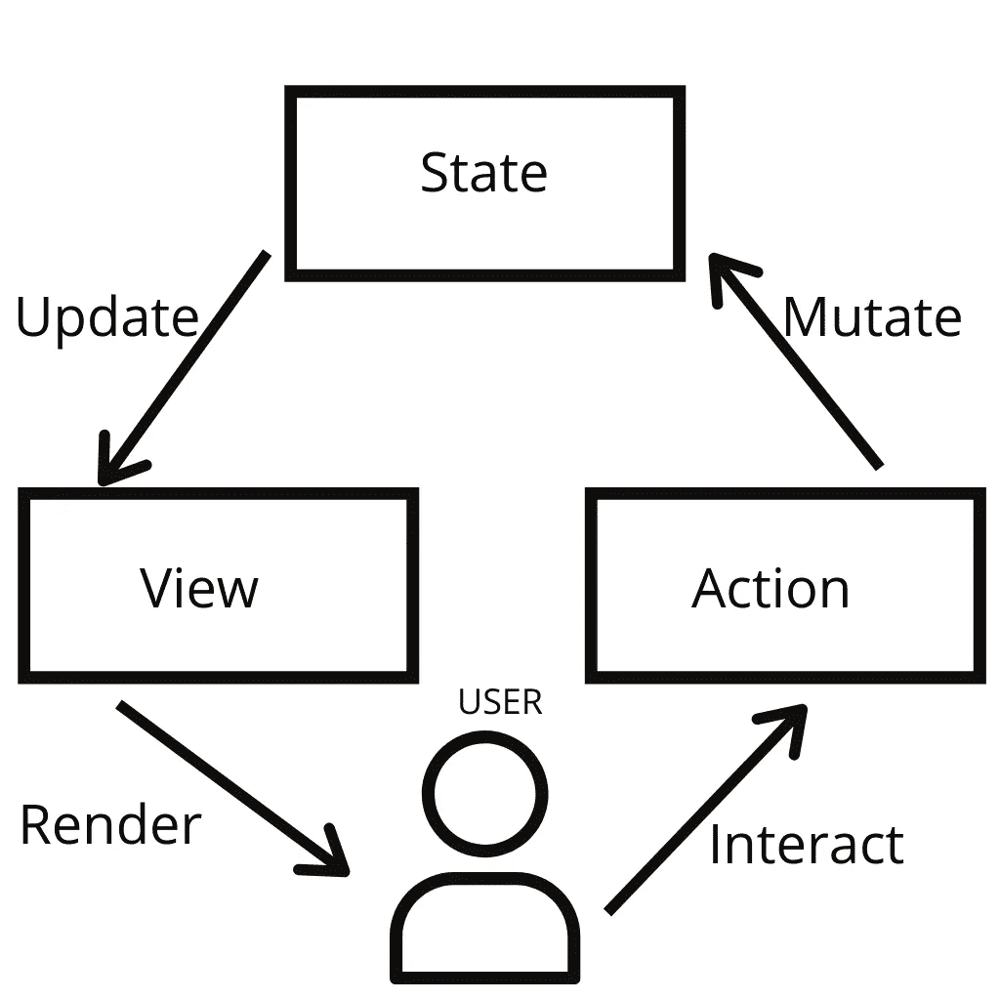
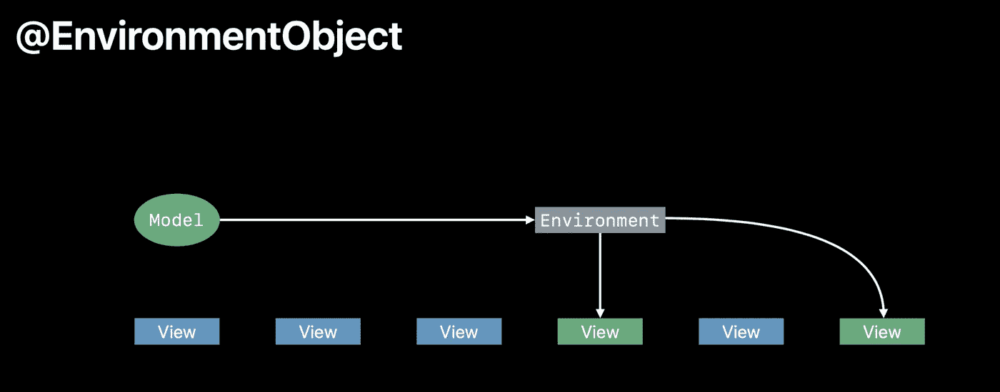

# SwiftUI 中的属性包装器

> 原文：<https://blog.devgenius.io/property-wrappers-in-swiftui-a1f86499bed5?source=collection_archive---------3----------------------->



变量行为通过属性包装得到增强。@ State、@ Binding、@ ObservedObject 和@ EnvironmentObject 是特定于 SwiftUI 的包装器，表示视图对变量所代表的数据的依赖。

# @州


@State 是一个合理的术语，表示允许您自动监视和读取本地视图中的持久值的特性。每个@State 都是一个框架管理的给定值的永久真值源。在声明视图时，具有预期生存期范围的简单值类型是理想的选择。

您可以使用美元符号访问绑定变量的状态。$name

# @绑定

这是对另一个视图值类型的引用。如果你在本地改变绑定，它也会改变它的引用。这个包装器不拥有它的数据。

# @环境

如果你想从系统中读取数据(配色方案，可访问性选项等)，你也可以创建自己的密钥。它不拥有自己的数据。

# **@环境对象**



@EnvironmentObject 跨多个视图在应用程序中保持对象的持久性。它就像静态的，但是你用@EnvironmentObject 标签来访问。当你用@EnvironmentObject 声明一个对象时，你说你的应用程序允许一个内存地址，并允许所有视图访问它。

您可以通过以下方式访问环境对象

```
.environmentObject(variable)
```

# @观察对象

为了正确使用被观察对象，我们的类需要符合`**ObservableObject**`协议。它不拥有自己的数据。

如果我们想观察一个对象的状态，我们添加这个包装器。它与 stateObject 类似，但我们在创建新对象时必须使用 ObservedObject。

我们在内部使用 Published 和 observed object 类，所以当它发生变化时，它会自动发送变化。

# @已发布

当我们有一个符合`**ObservableObject**`协议的类时，我们就有了这个变量的包装器，我们希望跟踪它们的变化。这个包装器告诉 SwiftUI 在发生变化时刷新。

# @ StateObject

用于存储来自符合`**ObservableObject**`协议新实例数据。它拥有自己的数据

如果你想让你的变量在视图刷新时不被破坏，你应该使用这个包装器。

.