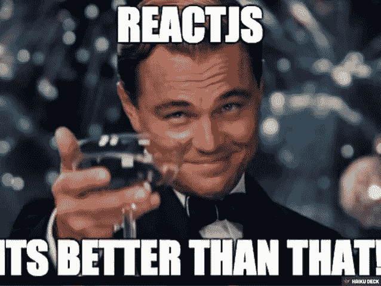
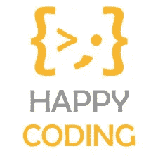

# React 中的道具和功能变得简单！

> 原文：<https://blog.devgenius.io/props-and-functions-in-react-made-easy-2ccbf69b135?source=collection_archive---------19----------------------->


Props 类似于 ReactJS 中传递给函数的参数。React 中的每个组件都被视为一个函数。所以，道具是不可改变的。这肯定是任何人开始写文章的最粗鲁的方式，但是真的，来这里寻找道具信息的人不会在乎。


通过将属性传递给构造函数，可以在实例化时配置组件——这些属性称为 props。props 可以像`this.props`一样从组件的方法中访问，以便改变组件的呈现方式和/或行为方式。然而，道具不能从组件的方法中被修改。

```
function Hello_to_you(props) { return <h1>Hey there, {props.name} !</h1>;}
```

如果 props 被传递给一个类而不是一个函数，那么它就变成了`this.props.whatever` 而不仅仅是 `props.whatever`。这就是代表属性的 props 在不同情况下的访问方式。

```
class Hello_to_you extends React.Component { render() { return <h1>Hey there, {this.props.name} !</h1>; }}
```

构造器方法在类中用于初始化状态，在此之前，声明一个超级全局变量。

```
class App extends React.Component{ constructor() { **super()** **this.state = {** **answer: “Yes”** } } render() { return ( <div> <p>Is the state important to know? {this.state.answer}</p> </div> ) }}
```

【HTML 元素的 JavaScript 函数



如果您需要在 React 页面上创建一些东西，通过点击一个按钮或通过其他方式触发来不断改变它的值，那么您就来对地方了。

React 给了你特权，让你可以在 HTML 所在的地方编写函数，并用它的元素绑定它。这将吸引我的懒惰上瘾的同伴。我将展示两个非常简单的函数的工作原理，它实际上类似于我们用 DOM 操纵编写的函数，只是没有复杂性。下面的函数在单击按钮时增加变量的值。

我们首先需要在构造函数中初始化它。

```
constructor() { super() this.state = { count: 0}
```

1.接下来，我们将按照通常的方式编写函数，在类中编写**:**

```
handleClick(condition) { this.setState(prevState => { if(condition == 1){ return { count: prevState.count + 1 } } else if(condition == 2) { return { count: prevState.count + 2 } }});}
```

条件被传递给函数`handleClick();`。它检查哪个按钮被点击，并相应地改变值。因为它的状态之前已经声明过了，所以现在我们可以操作它了。`prevstate`检查变量条件的先前状态，而`this.setstate`用于改变 React 中变量的状态。

2.将此功能添加到所需的按钮中。

```
 <button onClick={() => this.handleClick(1)}>Increment by 1!</button><br /><button onClick={() => this.handleClick(2)}>Increment by 2!</button><br /> 
```

3.上述函数将不起作用，因为它尚未绑定到构造函数。为此，我们需要在构造函数中编写**下面的语句。**

```
 this.handleClick = this.handleClick.bind(this)
```

4.您需要打印 count 的值，因此，在 return 语句中，您需要将下面的语句放在某个地方。

```
render() {return ( <div className=”main-content”> <h1>{this.state.count}</h1> <button onClick={() => this.handleClick(1)}>Increment by 1! </button><br /><br /> <button onClick={() => this.handleClick(2)}>Increment by 2!</button><br /><br /> </div>
```

现在，去点击你的按钮，果然，你会看到屏幕上的数字正在增加。创建递增、递减、相乘和相除的按钮，享受更多的乐趣。别忘了道具。

