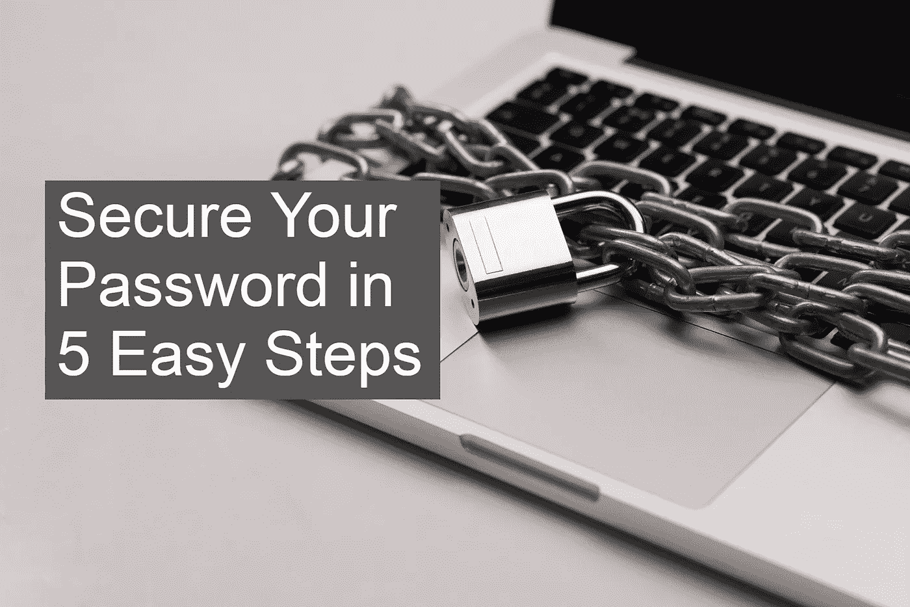

# 通过 5 个简单的步骤保护您的密码

> 原文：<https://blog.devgenius.io/protect-your-password-in-5-steps-cb909c71d9a7?source=collection_archive---------25----------------------->

## 密码是我们的弱点。我们如何保护我们的密码免受网络攻击？

通过 5 个简单的步骤保护您的密码

在我们的日常生活中，我们经常使用密码进入网站，在社交媒体账户上分享，在线购物，甚至在我们的银行交易中。根据《2019 年威瑞森数据泄露调查报告》, 81%的数据泄露是由受损、脆弱和重复使用的密码造成的。通过简单的步骤就可以防止密码被盗。

## **1。重要的是长度，而不是复杂性**

研究表明，密码的长度比包含大写、小写和数字字符的密码更重要。但是简单的密码也是你最大的敌人。不要使用姓名、城市、出生日期等信息。这可以很容易地在你的密码中找到。设置一个尽可能长且容易记忆但难以猜测的密码可以保护你。 *—记住:至少 8 个字符。*

只有又长又难猜的密码才能保护你

## 2.每个帐户的新密码

对网络攻击的研究表明，31%的用户在不同的账户上使用相同的密码。为我们的重要帐户设置相同的密码，如电子邮件、社交媒体、银行帐户，会增加被盗和被攻击的风险。如果有人发现了你一个账户的重复使用的密码，攻击者就有了你其他账户的金钥匙。

## 3.你可以写下你的登录凭证

你有几十个账户，按照我上面的建议，你已经为每个账户设置了尽可能长且不同的密码。那你是怎么记住他们的呢？将密码存储在计算机上的 word 文档中可能不太安全。因为控制你电脑的人可以轻易得到你所有账户的密码。这就是为什么研究人员说物理保存密码是没问题的。但是，请确保您没有将写有这些密码的笔记本放在计算机旁边。

您可以写下您的登录凭据，但不要将它们放在电脑附近

## 4.不要使用别人的电脑

共享电脑可能是你的噩梦。不要在网吧或图书馆的普通电脑上登录你的重要账户。这些电脑可能有恶意软件，可以窃取您的密码。从网吧向全世界传播你的密码可能是你最不想做的事情。

## 5.2FA —第二监护人

即使您的密码被盗，您也有第二个密钥来保护您的帐户:双因素身份验证(2FA)。由于这第二层安全，您通过手机或安全设备获得的密码是您的二级密码。

使用 2FA 也有需要注意的地方。SMS 可能是一种有风险的方法，因为您的 SMS 消息可能会被转发到另一部手机，或者您的 SIM 卡可能会被复制。使用手机应用程序可以更安全地做到这一点，当你需要时，你可以自己获取密码。很多银行都有自己的 2FA 应用。所有的社交媒体网站都支持 Google Authenticator、Microsoft Authenticator 和 Authy 等应用。现在点击账户安全设置，按照简单的步骤快速激活 2FA。

2FA 是你的第二道安全门