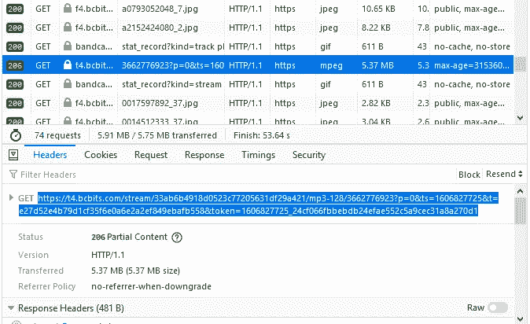

# 使用 Node 和 Javascript 保护音频和音乐资产

> 原文：<https://blog.devgenius.io/protecting-audio-and-music-assets-with-node-and-javascript-5898683fa035?source=collection_archive---------0----------------------->


在我之前的帖子中，我讨论了我最近为 Bandcamp 构建外部音乐播放器的小项目。我意识到，许多类似的网站和服务很容易被滥用于盗版内容，特别是有版权的音频、音乐和视频。在这篇文章中，我将讨论几种保护这些内容的策略。



获取 mp3 文件(和其他数字内容)通常可以通过查看在播放/使用特定内容时发出的 HTTP 请求来完成。在 Bandcamp 的例子中，我只需查看网络流量，找出大小为 5.37MB 的“mpeg”数据类型，然后通过复制粘贴 GET URL，您就可以下载相应的 mp3 文件。

今天，完全保护数字内容几乎是不可能的，总有一些方法可以获取它。但是安全系统的目的是让黑客/盗版者的生活变得非常痛苦。要么让过程变得非常漫长和/或复杂，希望他们放弃。

一个非常基本但非常有效的方法是加密敏感资产。在 Bandcamp 的例子中，他们可以使用某个密钥在服务器端加密 mp3 内容，将其发送到客户端，然后让客户端的 JavaScript 代码解密并播放它。客户端仍然可以下载加密的 mp3 文件，但是如果没有正确的解密算法，它就是一个无用的文件。这种方法的有效性取决于我们隐藏和混淆解密函数的能力。

在下面的代码中，我展示了完成所有这些工作的原型。

# NodeJS 服务器代码

```
"use strict";
const express = require("express")
const app = express()
const { Readable } = require('stream')
const fs = require('fs')app.get("/audio", function (req, res) {
  res.setHeader('Access-Control-Allow-Origin','*')
  xor_encrypt(res)
})function xor_encrypt(res) {
  // read audio file to buffer
  let buff = fs.readFileSync('./audio.mp3') // determine encryption key
  let key = buff[buff.length-1] // encrypt buffer contents
  buff = buff.map(x => x ^ key).map(x => ~x) // store the encryption key as last element
  buff[buff.length-1] = key // transform buffer to stream
  let readStream = Readable.from(buff) // send stream to client
  readStream.pipe(res) readStream.on('end', () => {
    res.status(200).send()
  })
}app.use(express.static('.'))const serverHost =  "localhost"
const serverPort =  3007
app.listen(serverPort)
```

# JS 客户端代码

```
let curr_track = document.createElement('audio')var oReq = new XMLHttpRequest()
oReq.open("GET", 'http://localhost:3007/audio', true)
oReq.responseType = "arraybuffer"oReq.onload = function(oEvent) {
  xor()
}
oReq.send()function xor() {
  // convert arrayBuffer to regular Array
  const arr = oReq.response
  var byteArray = new Uint8Array(arr) // obtain encryption key
  let key = byteArray[byteArray.length - 1] // use key to decrypt contents
  byteArray = byteArray.map(x => x ^ key).map(x => ~x) // restore key
  byteArray[byteArray.length - 1] = key // convert byteArray to Blob
  const blob = new Blob([byteArray], { type: 'audio/mp3' })
  // create playable URL from Blob object
  const url = URL.createObjectURL(blob) // memory leak possible! curr_track.src = url
  curr_track.load()
}// now you can bind 'curr_track.play()' to some click-event
```

上面的代码包含了每个步骤的注释，所以它应该是不言自明的。加密方法依赖于简单而高效的按位运算符(xor 和 not)。

在客户端代码中，`url`变量指向一个表示 mp3 文件的临时内存 Blob 对象。如果你把这个`url`打印到控制台，你会得到类似这样的东西:
`blob:http://localhost:3007/9a2ffb47-72af-4c58-a0f9-08b9a63b81d0`
如果你复制粘贴到一个新的标签页，你就可以播放/下载解密的 mp3 曲目。只要你的网站窗口保持打开，这个 Blob 对象就存在于内存中，否则它会被垃圾收集；这也意味着创建许多 Blobs 会导致内存泄漏(但是有一个手动清理它们的方法)。

这种加密策略效果很好，我们让用户下载 mp3 文件变得更加困难。一旦用户弄清楚解密函数是如何工作的，他们就可以自动操作它。或者通过调试/编辑 JavaScript 代码，他们可以类似地获得 mp3 文件。

或者，不使用 Blob 对象，可以使用 base64 编码，但这和 Blob 解码和下载二进制内容一样简单。

进一步的改进是随机使用许多不同的加密/解密方法(而不是一种)，但是同样需要某种标识符来确定客户端应该使用哪种方法。黑客/海盗再一次可以解决这个问题。

底线是，我们使用 html5 标记来播放曲目，更具体地说，是通过为其`src`属性提供一个网址。为了提供更多的安全性，我们应该研究不同的方法和技术来播放音频，而不需要使用`<audio>`标签。