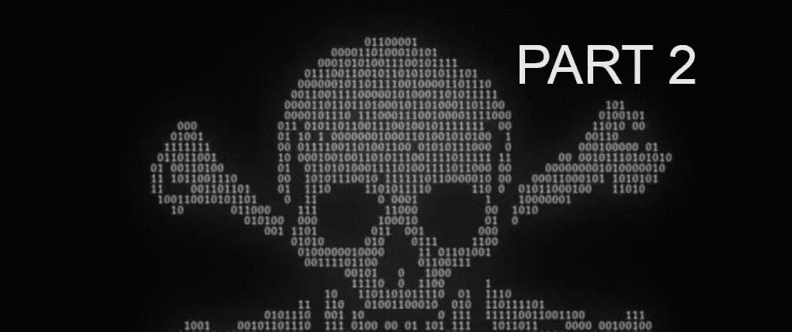

# 使用 JavaScript 和网络音频 API 保护音频资产

> 原文：<https://blog.devgenius.io/protecting-audio-assets-with-javascript-and-web-audio-api-a8e3a04d2bb6?source=collection_archive---------8----------------------->



在我们的[上一篇文章](https://dev.to/codr/protecting-audio-and-music-assets-with-node-and-javascript-2p92)中，我们研究了如何使用 HTML5 `<audio>`标签来保护在客户端浏览器上播放的音频资产。缺点是，通过简单地使用属性`src` location，仍然可以很容易地下载底层音轨。在本帖中，我们将关注另一种策略。

另一个现代但不太为人所知的播放声音的方法是 **Web Audio API** ，它被所有现代浏览器所支持(当然 IE 除外)。这个 API 有很多有趣的特性，比如多重播放、声音生成器、转换等等。而且能够播放来自二进制数据的声音，比如一个`arraybuffer`，这对于我们的目的来说非常有趣。

从服务器端的角度来看，我们不需要从我们之前的[帖子](https://dev.to/codr/protecting-audio-and-music-assets-with-node-and-javascript-2p92)中修改任何代码。

客户端只有一点点变化:

```
let source = null;
let oReq = new XMLHttpRequest();
oReq.open("GET", 'http://localhost:3007/audio', true)
oReq.responseType = "arraybuffer"oReq.onload = function(oEvent) {
  webapi()
};
oReq.send()async function webapi() {
  // obtain and decrypt the audio data
  const arr = oReq.response
  let byteArray = new Uint8Array(arr)
  let key = byteArray[byteArray.length - 1] 
  byteArray = byteArray.map(x => x ^ key).map(x => ~x)
  byteArray[0] = key // Web Audio API
  // use the decrypted audio data as input
  const context = new AudioContext();
  const buffer = await context.decodeAudioData(byteArray.buffer)
  source = context.createBufferSource()
  source.buffer = buffer
  source.connect(context.destination)
}// use 'source.start()' in some click event
```

这种方法的优点是我们不再为用户留下容易下载音频数据的足迹。换句话说，我们不再有一个`<audio>`标签，它的`src`值可以被复制/下载。

为了窃取音频内容，黑客/盗版者有三种选择:

1.  想办法解密音频。
2.  导出数组缓冲区的内容。
3.  播放时录制音频。

当然，可能有更先进的方法，但它确实为大多数新手提高了窃取你的内容的门槛。

缺点是网络音频 API 还不完善，对我来说，在 Firefox 中播放 mp3 格式似乎并不总是有效，但在 Chrome 中却有效。它会抛出以下异常:
`Uncaught (in promise) DOMException: The buffer passed to decodeAudioData contains an unknown content type.`
我没有测试过 ogg 和 wav 等其他格式，但我确实记得 ogg 在 Safari 中是不工作的。可能 wav 是三者中最好的？

# 最后的话

**为了最大限度地利用这种保护技术，我们必须尽可能地进行静态分析。**

首先，确保总是混淆和缩小您的 JavaScript 代码，出于安全和性能原因，总是推荐这样做。

第二，尽量使加密/解密代码看起来尽可能复杂，同时保持其高性能。如果黑客使用 Node/JS，他们可以直接复制粘贴函数，但是很多业余黑客可能会使用 Python/Java/C#等非 JavaScript 代码来编写他们的 bot/scraper/downloader。拥有一个看起来复杂的解密函数将迫使他们完全理解并将其翻译成他们选择的语言，这可能不是那么微不足道的(*除非使用翻译工具*)。