# Swift 编程中的协议

> 原文：<https://blog.devgenius.io/protocols-in-swift-programming-43571793d96a?source=collection_archive---------2----------------------->

> IOS 开发和软件工程。

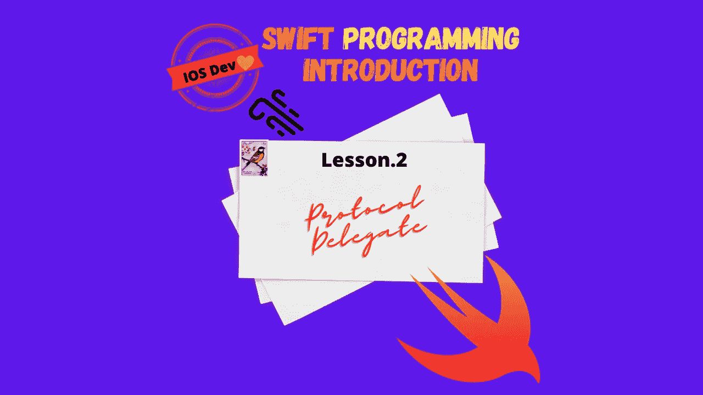

Swift 中的协议是我们作为开发人员和程序员必须了解的一个重要话题。但是什么是协议，它是如何工作的？因此，让我们把一切都分解开来，这样不管你是不是程序员，你都能完全理解什么是协议。

# **证书**

每天人们都要参加考试以获得特定领域的证书。一个例子就是拿你的 Comp Tia Security plus。Security plus 认证告诉任何人，你可以完全理解日常信息安全专业人员面临的基本安全实践，包括访问控制列表、防火墙、病毒、网络攻击和其他直接接触的领域。

我们将从创建一个名为 Analyst 的类开始。

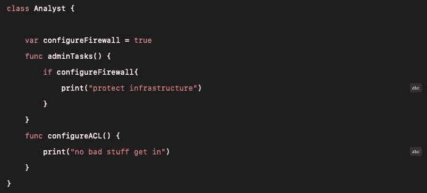

我们首先创建了一个名为分析师的类。

**var configure Firewall = true**~这将是我们的变量，一个存储真值的布尔数据类型。

1.  **func adminTasks()** ~我们接下来声明一个保存 if 语句的函数，如果变量“配置防火墙”为真，它将执行下面列出的 print 语句。
2.  **func configureACL()** ~我们在 Analyst 类中声明另一个函数，在函数体中使用 print 语句。

每个功能都代表安全分析师在我们的分析师类中每天执行的一个操作。类是基于引用的，所以我们将声明另一个引用分析师类的类。这将为下一个类提供我们将创建的与分析师类相同的属性。

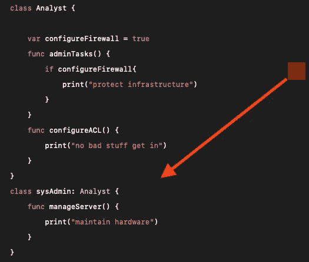

创建一个名为 sysAdmin 的新类，并继承所有分析师属性。

1.  如我们所见，sysAdmin 被列在 sysAdmin 类的旁边。这是什么意思？类是基于引用的，所以除了 sysAdmin 类之外声明 Analyst 类将允许 Analyst 类固有的所有属性。
2.  **func manageServer()** ~在我们的 sysAdmin 函数中，我们声明了一个打印字符串值“maintain hardware”的 print 语句。

您可能会问自己，Swift 中的类与协议有什么关系？当我们创建另一个名为 helpDesk 的类时，请仔细看看下面的例子。

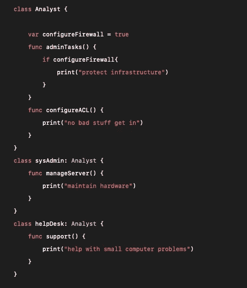

帮助台从分析师类别继承属性。

> 你看到什么奇怪的东西了吗？我们创建了一个名为 helpDesk 的新类，因为类是基于引用的，所以它获得了 Analyst 类的所有属性。据我所知，帮助台人员不应该担任涉及管理安全任务的支持角色！

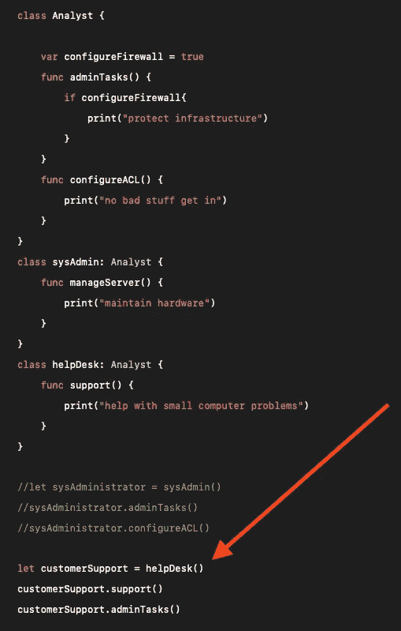

1.  **let customer support = help desk()**~创建名为“ **customerSupport** ”的常量，并链接到类“ **helpDesk()** ”
2.  **customer support . support()**~客户支持类调用支持函数并执行打印语句“帮助解决小型计算机问题”
3.  **customer support . admin tasks()**~**customer support**常量我们后来使用 helpDesk 类声明，它现在能够调用 **adminTasks()** 函数并执行打印语句“保护基础架构”。由于分析师类的固有属性，当我们声明我们的帮助台类时

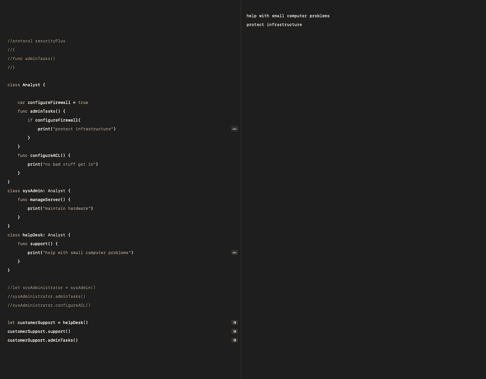

> **我们的帮助台人员现在能够执行只有分析师才能完成的管理任务！**

这是为什么我们需要 Swift 编程语言*中的协议的完美例子。*协议限制了使用结构或类时谁可以做什么。因此，当我们利用协议时，增加代码库漏洞的用户错误和打字错误不太可能发生。

协议可以被描述为认证。

正如我在本课开始时解释的那样，将协议视为权威证书。所以，为了简化我的描述，我希望所有涉及管理任务的工作都通过安全认证。

让我们首先创建一个名为 **securityPlus** 的协议，它代表谁是 securityPlus 认证的。

1.  **func adminTasks()** ~任何符合 **securityPlus** 协议的类都必须能够访问 func **adminTasks()**

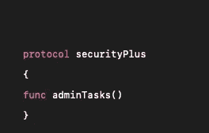

我们创建了名为 SecurityPlus 的协议

*   接下来，我们将在我们希望使用 **securityPlus** 协议的类旁边标注 **securityPlus** 。
*   我们的分析师类现在仅限于 **securityPlus** 协议，表示任何可以执行 AdminTasks 的人都必须拥有**security plus**认证。
*   不要太紧张。它可能看起来像很多代码，可能有点混乱，但它会走到一起。

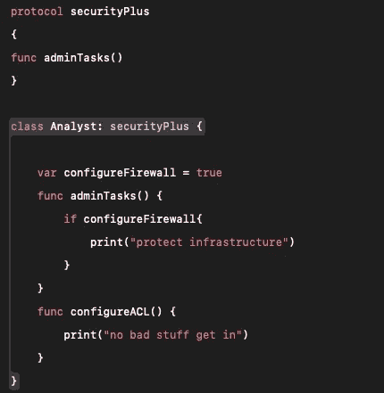

在分析师类旁边标注 securityPlus 协议。

> 正如您在代码片段中看到的，我在我们的代码库中添加了两个结构，分别名为 penTester 和 redTeamAndBlueTeam。

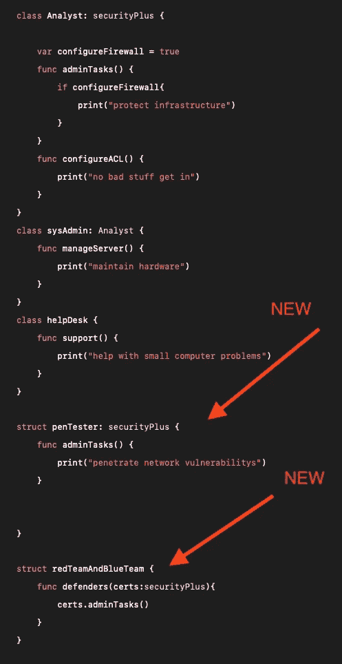

*   ***r*edteamandblueam**和 **penTester** 。但是，当然，协议也可以应用于结构。所以让我们分解我们的结构正在做什么！

我们的安全团队包含 **penTester** ，他也遵守 securityPlus 协议。我们允许他执行证书授予结构的管理任务。

> 接下来，我们创建了一个表示 **redTeamAndBlueTeam** 的结构。
> 
> 在我们的结构**redteamandlueteam**中，我们创建了一个函数，它带有一个名为“cert”的参数。我们的数据类型部分将包含协议安全 plus。

该行代码明确了 **redTeamAndBlueTeam** 将只允许证书 **securityPlus** 个人在团队中操作并执行**管理任务**。

我们将最终确定我们的团队使用常量变量，并将它们链接到它们指定的类和结构。

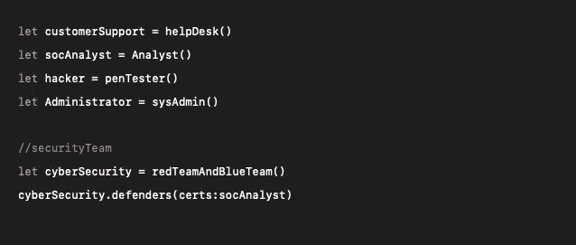

1.  **让 customerSupport = helpDesk()**~我们声明常量变量并将 customer support 分配给 help desk 类。
2.  **设 socAnalyst = Analyst()** ~我们声明一个常量变量，将 socAnalyst 赋给分析师类。
3.  **let hacker = penTester()**~我们声明常量变量，将 hacker 赋给 penTester 结构。
4.  **let Administrator = sysAdmin()**~我们声明常量变量，将 Administrator 赋给 sysAdmin 类。
5.  **let cyberSecurity = redteamandbluteam()**~我们声明常量变量，将 cyber security 赋给 redteamandbluteam 结构。

**cyber security . defenders(certs:)**~当执行并采用我们创建的任何后续常量变量的数据类型时，我们的最终块代码将只允许符合 **securityPlus** 协议的特定类或结构被执行。如果类或结构没有 **securityPlus** 协议，IDE 会抛出错误并对你大喊！

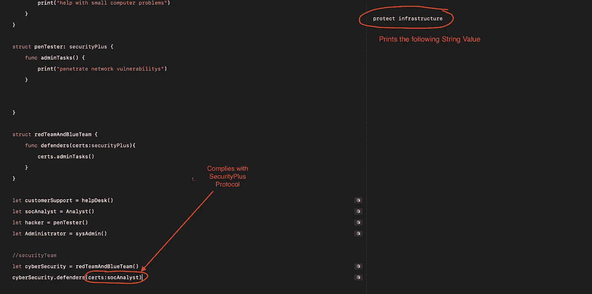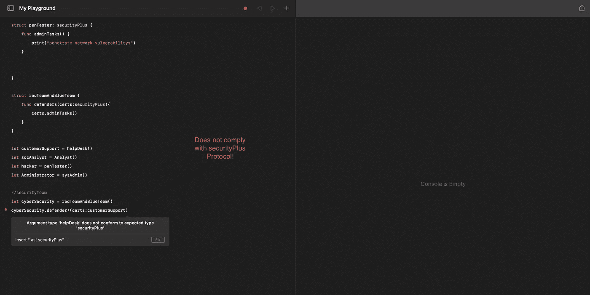

我们的纵深防御和访问控制是安全的，不允许客户支持团队在没有他们的 security plus 证书的情况下执行管理类！协议在 swift 中至关重要，并在 Swift 编程中增加了许多声明类和结构的安全方式。编码快乐！

# Linkedin 帐户:

 [## Michael Balsa -数据专家-美国海军陆战队| LinkedIn

### 经验丰富的数据专家，负责监督维护美国的飞机数据和信息管理…

www.linkedin.com](https://www.linkedin.com/in/michael-balsa-9474431b0/)