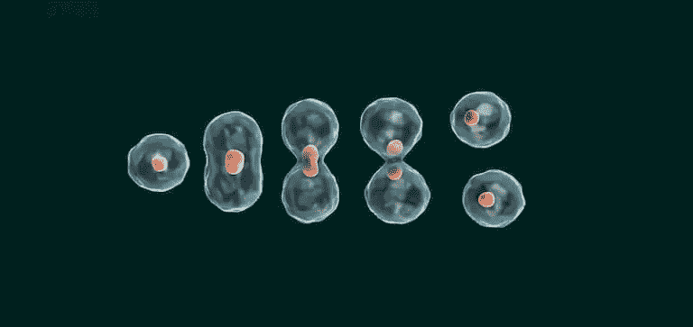

# 现代 C++中的原型设计模式

> 原文：<https://blog.devgenius.io/prototype-design-pattern-in-modern-c-49a27cbf4b1?source=collection_archive---------37----------------------->


原型设计模式是一种创造性的设计模式， ***使用单独的方法或多态类*** 帮助原型化(廉价地创建/复制)一个对象。在构建实际对象之前，您可以将原型视为对象的[模板](http://www.vishalchovatiya.com/c-template-a-quick-uptodate-look/)。在这篇关于创造性设计模式的文章中，我们将看看为什么我们需要 C++中的原型设计模式，即动机、原型工厂&利用原型设计模式来实现[虚拟复制构造器](http://www.vishalchovatiya.com/7-advanced-cpp-concepts-idiom-examples-you-should-know/#Virtual-Constructor)。

> */！\:这篇文章最初发表在我的博客上。如果你有兴趣接收我的最新文章，* [*请报名参加我的简讯*](http://eepurl.com/gDNybv) *。*

顺便说一句，如果你还没有看过我关于创造性设计模式的其他文章，那么下面是列表:

1.  [**工厂**](http://www.vishalchovatiya.com/factory-design-pattern-in-modern-cpp/)
2.  [**建造者**](http://www.vishalchovatiya.com/builder-design-pattern-in-modern-cpp/)
3.  [**原型**](http://www.vishalchovatiya.com/prototype-design-pattern-in-modern-cpp/)
4.  [**单胎**](http://www.vishalchovatiya.com/singleton-design-pattern-in-modern-cpp/)

您在这一系列文章中看到的代码片段是简化的，而不是复杂的。所以你经常看到我不使用像`override`、`final`、`public`(同时继承)这样的关键字，只是为了让代码紧凑&可消耗(大部分时间)在单一标准屏幕尺寸。我也更喜欢`struct`而不是`class`，只是为了节省代码行，有时不写`public:`，还会故意忽略[虚拟析构函数](http://www.vishalchovatiya.com/part-3-all-about-virtual-keyword-in-c-how-virtual-destructor-works/)，构造函数[，复制构造函数](http://www.vishalchovatiya.com/all-about-copy-constructor-in-cpp-with-example/)，前缀`std::`，删除动态内存。我也认为自己是一个务实的人，希望用尽可能简单的方式，而不是标准的方式或使用术语来传达一个想法。

***注:***

*   如果你是在这里被直接绊倒的，那么我建议你浏览一下[什么是设计模式？](http://www.vishalchovatiya.com/what-is-design-pattern/)一、哪怕是鸡毛蒜皮的小事。相信会鼓励你对这个话题进行更多的探索。
*   您在本系列文章中遇到的所有这些代码都是使用 C++20 编译的(尽管我在大多数情况下使用了 C++17 之前的现代 C++特性)。因此，如果你无法获得最新的编译器，你可以使用已经预装了 boost 库的[https://wandbox.org/](https://wandbox.org/)。

# 目的

> **借助一个已经构造好的或预先初始化的存储对象，廉价地创建一个新对象。**



*   原型提供了廉价创建复杂对象的灵活性。这个概念是复制一个现有的对象，而不是从头开始创建一个新的实例，这可能需要很高的操作成本。
*   现有对象充当原型&新复制的对象只有在需要时才可以改变相同的属性。这种方法节省了昂贵的资源和时间，尤其是当对象创建是一个繁重的过程时。
*   所以从本质上来说，原型只是一个部分或完全初始化的对象，你可以复制它。然后你为了你自己的利益进行变化。

# 动机

```
struct Office {
    string         m_street;
    string         m_city;
    int32_t         m_cubical; Office(string s, string c, int32_t n):m_street(s), m_city(c), m_cubical(n){}
};struct Employee {
    string      m_name;
    Office        m_office; Employee(string n,  Office o):m_name(n), m_office(o){}
};int main() {
    Employee john{ "John Doe", Office{"123 East Dr", "London", 123} };
    Employee jane{ "Jane Doe", Office{"123 East Dr", "London", 124} };
    Employee jack{ "jack Doe", Office{"123 ORR", "Bangaluru", 300} };
    return EXIT_SUCCESS;
}
```

*   这不是正确的方法，因为你必须再次写下主要办公室的地址&再次写下每个员工的详细信息。这很麻烦&当您想要创建一个员工列表时，这就更麻烦了。此外，考虑当您的主办公室搬到另一个地址时的情况。

# C++中的原型设计模式示例

*   更实用的方法应该是这样的:

```
struct Employee {
    string          m_name;
    const Office*   m_office;        Employee(string n,  Office *o):m_name(n), m_office(o){}
};static Office   LondonOffice{"123 East Dr", "London", 123};
static Office   BangaluruOffice{"RMZ Ecoworld ORR", "London", 123};int main() {
    Employee john{ "John Doe", &LondonOffice };
    Employee jane{ "Jane Doe", &LondonOffice };
    Employee jack{ "jack Doe", &BangaluruOffice };
    return EXIT_SUCCESS;
}
```

*   上述解决方案适合我们的用例，但有时我们希望自定义办公室地址。当涉及到指针&引用和任何类型的间接寻址时，使用操作符 equals 的普通复制根本不起作用。
*   实现这一点的标准方法是通过实现[复制构造函数](http://www.vishalchovatiya.com/all-about-copy-constructor-in-cpp-with-example/)

# 原型工厂

*   所以在原型设计模式的前一个例子中，我们基本上有一个用于办公室地址的全局[对象](http://www.vishalchovatiya.com/memory-layout-of-cpp-object/)，并使用它们的地址来创建原型。
*   现在，这对于你的 API 的消费者来说不是特别方便，因为你可能想给他们一个原型来使用。你应该足够明确地让人们知道，只有一种统一的方式，他们可以通过这种方式从原型创建实例，这样他们就不能自己创建单独的实例。
*   在这种情况下，你要建造的是一个原型工厂:

```
struct Office {
    string      m_street;
    string      m_city;
    int32_t     m_cubical;
};class Employee {
    string      m_name;
    Office*     m_office; // Private constructor, so direct instance can not be created except for `class EmployeeFactory`
    Employee(string n, Office *o) : m_name(n), m_office(o) {}
    friend class EmployeeFactory;public:
    Employee(const Employee &rhs) : m_name{rhs.m_name}, m_office{new Office{*rhs.m_office}} 
    { } Employee& operator=(const Employee &rhs) {
        if (this == &rhs) return *this;
        m_name = rhs.m_name;
        m_office = new Office{*rhs.m_office};
        return *this;
    } friend ostream &operator<<(ostream &os, const Employee &o) {
        return os << o.m_name << " works at " 
        << o.m_office->m_street << " " << o.m_office->m_city << " seats @" << o.m_office->m_cubical;
    }
};class EmployeeFactory {
    static Employee     main;
    static Employee     aux;
    static unique_ptr<Employee> NewEmployee(string n, int32_t c, Employee &proto) {
        auto e = make_unique<Employee>(proto);
        e->m_name = n;
        e->m_office->m_cubical = c;
        return e;
    }public:
    static unique_ptr<Employee> NewMainOfficeEmployee(string name, int32_t cubical) {
        return NewEmployee(name, cubical, main);
    }
    static unique_ptr<Employee> NewAuxOfficeEmployee(string name, int32_t cubical) {
        return NewEmployee(name, cubical, aux);
    }
};// Static Member Initialization 
Employee EmployeeFactory::main{"", new Office{"123 East Dr", "London", 123}};
Employee EmployeeFactory::aux{"", new Office{"RMZ Ecoworld ORR", "London", 123}};int main() {
    auto jane = EmployeeFactory::NewMainOfficeEmployee("Jane Doe", 125);
    auto jack = EmployeeFactory::NewAuxOfficeEmployee("jack Doe", 123);
    cout << *jane << endl << *jack << endl;
    return EXIT_SUCCESS;
}
/*
Jane Doe works at 123 East Dr London seats @125
jack Doe works at RMZ Ecoworld ORR London seats @123
*/
```

*   这里要注意的微妙之处是`Employee` & `friend EmployeeFactory`的私有构造函数。这就是我们如何强制客户端/API 用户仅通过`EmployeeFactory`创建`Employee`的实例。

# 利用原型设计模式实现虚拟复制构造器

*   在 C++中，Prototype 对于在不知道具体类型的情况下创建对象的副本也很有用。因此，它也被称为虚拟复制构造函数。

## 问题

*   C++使用基类的[虚拟析构函数](http://www.vishalchovatiya.com/part-3-all-about-virtual-keyword-in-c-how-virtual-destructor-works/)支持多态对象析构。缺少对创建和复制对象的等效支持，因为с++不支持虚拟构造函数&虚拟复制构造函数[。](http://www.vishalchovatiya.com/all-about-copy-constructor-in-cpp-with-example/)
*   此外，除非知道对象的静态类型，否则无法创建对象，因为编译器必须知道它需要分配的空间量。出于同样的原因，复制一个对象也需要在编译时知道它的类型。
*   将以下示例视为问题陈述:

```
struct animal {
    virtual ~animal(){ cout<<"~animal\n"; }
};struct dog : animal {
    ~dog(){ cout<<"~dog\n"; }
};struct cat : animal {
    ~cat(){ cout<<"~cat\n"; }
};void who_am_i(animal *who) { // not sure whether dog would be passed here or cat
    // How to `create` the object of same type i.e. pointed by who ?
    // How to `copy` object of same type i.e. pointed by who ?
    delete who; // you can delete appropriate object pointed by who, thanks to virtual destructor
}
```

*   只是没有想到[动 _ 投< >](http://www.vishalchovatiya.com/cpp-type-casting-with-example-for-c-developers/) ，其码闻。

## 解决办法

*   虚拟构造函数/复制构造函数技术通过使用虚拟方法将创建和复制对象的动作委托给派生类，从而允许 C++中对象的多态创建和复制。
*   下面的代码不仅实现了虚拟的[复制构造函数](http://www.vishalchovatiya.com/all-about-copy-constructor-in-cpp-with-example/)(即`clone()`)，还实现了虚拟的构造函数(即`create()`)。

```
struct animal {
    virtual ~animal() = default;
    virtual std::unique_ptr<animal> create() = 0;
    virtual std::unique_ptr<animal> clone() = 0;
};struct dog : animal {
    std::unique_ptr<animal> create() { return std::make_unique<dog>(); }
    std::unique_ptr<animal> clone() { return std::make_unique<dog>(*this); }
};struct cat : animal {
    std::unique_ptr<animal> create() { return std::make_unique<cat>(); }
    std::unique_ptr<animal> clone() { return std::make_unique<cat>(*this); }
};void who_am_i(animal *who) {
    auto new_who = who->create();// `create` the object of same type i.e. pointed by who ?
    auto duplicate_who = who->clone(); // `copy` object of same type i.e. pointed by who ?    
    delete who; 
}
```

# 原型设计模式的好处

1.  当对象实例化很昂贵时，原型是有用的，因此避免了昂贵的“从头创建”，并支持预先初始化的原型的廉价克隆。
2.  这个原型提供了创建高度动态系统的灵活性，它通过 object [composition](https://stackoverflow.com/questions/50113353/differentiating-composition-and-aggregation-programmatically) &在实例化时为对象的数据成员指定值来定义新的行为，这与定义新的类不同。
3.  您可以通过更方便地生成复杂的对象来简化系统。
4.  尤其是在 C++中，原型设计模式有助于在甚至不知道对象类型的情况下创建对象的副本。

# 常见问题汇总

**问:使用原型设计模式有什么意义？**

*   通过克隆预先配置的对象来快速创建对象。
*   有用的删除一堆样板代码。
*   在不知道对象类型的情况下处理对象。
*   当您使用[命令设计模式](http://www.vishalchovatiya.com/command-design-pattern-in-modern-cpp/)时，原型设计模式是一个显而易见的选择。例如，在 HTTP 请求中大多数时候页眉&页脚内容保持不变，变化的都是数据。在这种情况下，您不应该从头开始创建对象。而是利用原型设计模式。

**问:原型设计模式真的只是克隆吗？**

结合[工厂设计模式](http://www.vishalchovatiya.com/factory-design-pattern-in-modern-cpp/)就不是了。

**问:当创建成本很高时使用原型设计模式，但是我们确实在克隆中创建。**

你一定想知道，在我们上面展示的原型工厂中，我们在复制构造函数中创建实例。那不是很贵吗？是的，它是。但是想想 HTTP 请求，它的头包括版本、编码类型、内容类型、服务器类型等等。最初，您需要使用各自的函数调用找出这些参数。但是一旦你得到了这些，这些将不会改变，直到连接关闭。所以反复调用函数来提取这些参数是没有意义的。这里让我们付出代价的不是参数，而是它们提取价值的功能。

[有什么建议，查询或者想说](http://www.vishalchovatiya.com/contact-2/) `[Hi](http://www.vishalchovatiya.com/contact-2/)` [？减轻压力，只需点击一下鼠标。](http://www.vishalchovatiya.com/contact-2/) 🖱️