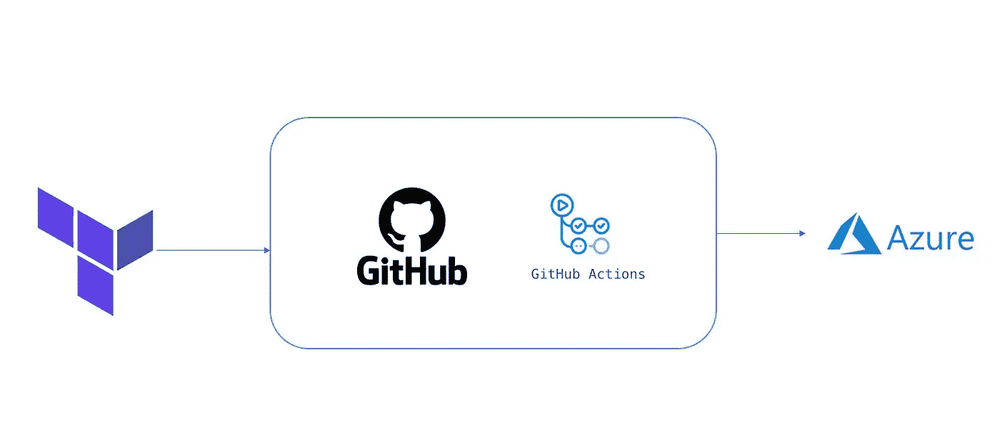
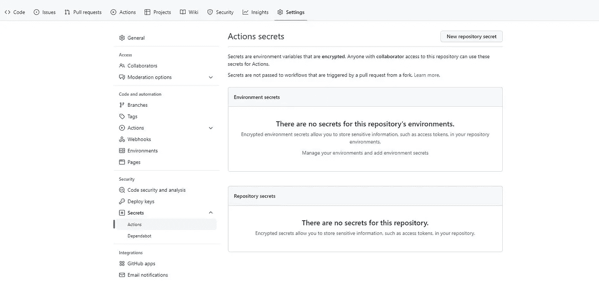
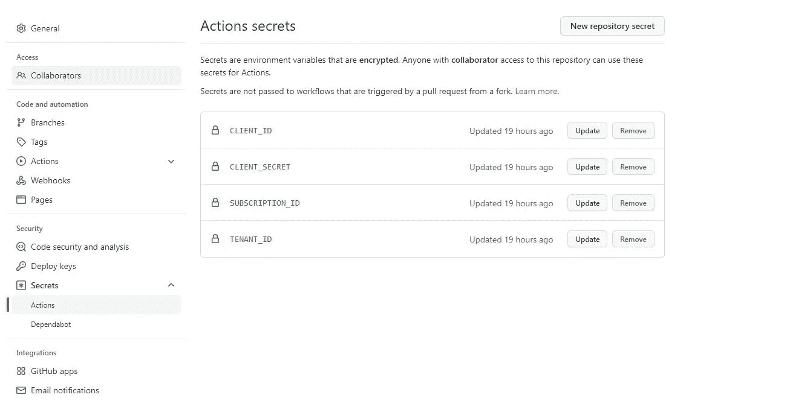
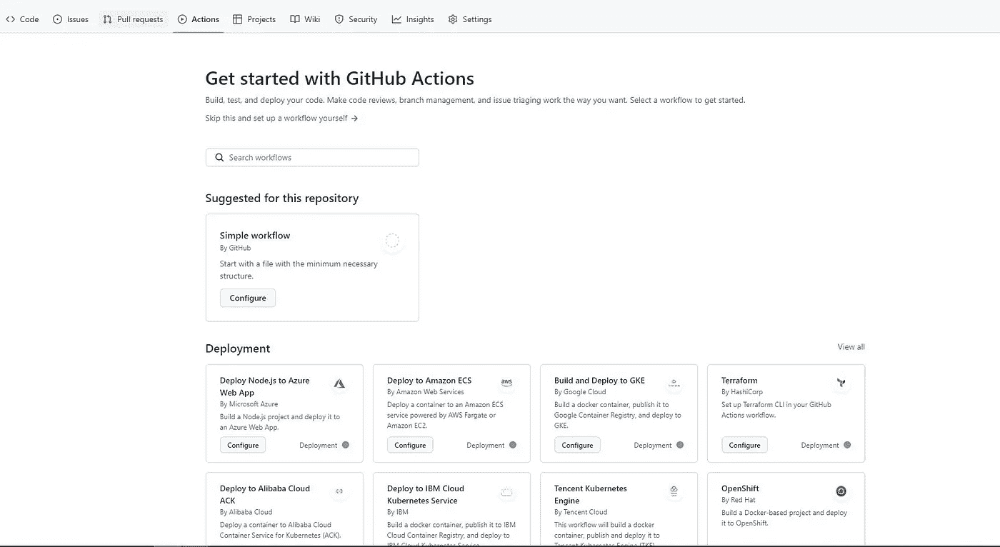
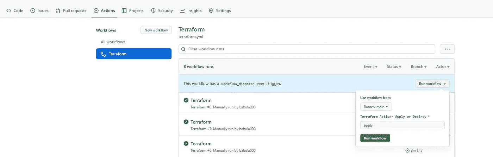
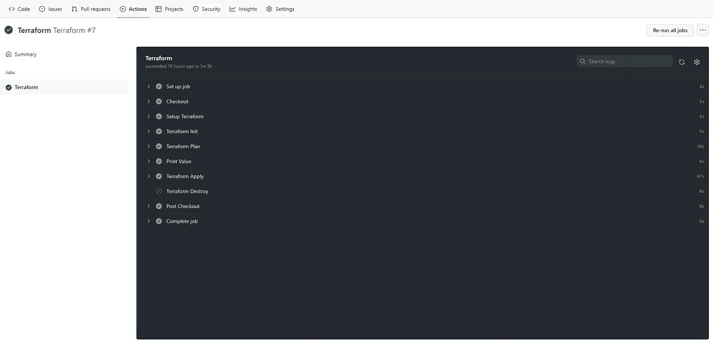

# 使用 Terraform 和 GitHub 操作提供 Azure 基础架构

> 原文：<https://blog.devgenius.io/provision-azure-infrastructure-with-terraform-and-github-action-b36f7e55345f?source=collection_archive---------0----------------------->



工作流程

在这篇文章中，我将解释如何通过 GitHub Action 使用 Terraform 提供 Microsoft Azure 资源。

**先决条件:**

1.  你有一个带有地形代码的 GitHub Repo
2.  您拥有有效的 Azure 订阅
3.  您已经在本地计算机中配置了 Azure CLI

**安装 Azure CLI:** 按照[安装 Azure CLI](https://docs.microsoft.com/en-us/cli/azure/install-azure-cli) 中提供的说明来设置您的 Azure CLI 环境。

# 步骤:

1.  使用以下命令创建服务主体并保存信息

```
az ad sp create-for-rbac --name myServicePrincipalName --role Contributor --scopes /subscriptions/mySubscriptionID
```

2.创建 GitHub 秘密

进入你的 GitHub Repo →设置→秘密



秘密屏幕

单击 New repository secret，并使用之前创建的服务主体的值添加以下机密



秘密

3.创建 GitHub 工作流

转到您的 GitHub Repo →操作

点击**自行设置工作流程**



工作流程

**工作流配置详情:**

> 工作流名称

```
name: 'Terraform'
```

> Trigger —在这种情况下，我仅使用输入参数启用了手动触发

```
on:
  workflow_dispatch:
    inputs:
      TFAction:
        description: "Terraform Action- Apply or Destroy"     
        required: true
        default: "apply"
```

> 乔布斯— ${{机密。CLIENT_ID }}正在使用在机密和环境变量下创建的机密，以便在整个作业中使用

```
jobs:
  terraform:
    name: 'Terraform'
    runs-on: ubuntu-latest
    environment: dev
    env:
      ARM_CLIENT_ID: ${{ secrets.CLIENT_ID }}
      ARM_CLIENT_SECRET: ${{ secrets.CLIENT_SECRET }}
      ARM_SUBSCRIPTION_ID: ${{ secrets.SUBSCRIPTION_ID }}
      ARM_TENANT_ID: ${{ secrets.TENANT_ID }}
      TerraformBackendStorageAccount: "mystgacount"
      TerraformBackendResourceGroup: "myrg"
      TerraformBackendStorageContainer: "state"
```

## 步伐

> 检验

```
- name: Checkout
  uses: actions/checkout@v3
```

> 安装地形

```
- name: Setup Terraform
  uses: hashicorp/setup-terraform@v1
```

> 地形初始化

```
- name: Terraform Init
  run: terraform init -backend-     config=storage_account_name=$TerraformBackendStorageAccount -backend-config=container_name=$TerraformBackendStorageContainer -backend-config=key=dev.tfstate -backend-config=resource_group_name=$TerraformBackendResourceGroup -backend-config=subscription_id="$ARM_SUBSCRIPTION_ID" -backend-config=tenant_id="$ARM_TENANT_ID" -backend-config=client_id="$ARM_CLIENT_ID" -backend-config=client_secret="$ARM_CLIENT_SECRET"
```

> 地形图

```
- name: Terraform Plan
      run: terraform plan -out=plan.tfplan -input=false -var="location=eastus" -var="resource_group_name=tfdemo" -var="storage_account_name=tfdemoabcxxyg" -var="storage_account_tier=Standard" -var="virtual_network_name=myvnet"
```

> Terraform 应用-基于 TFAction 输入参数

```
- name: Terraform Apply
      if: ${{ inputs.TFAction == 'apply'}}  
      run: terraform apply -input=false -auto-approve plan.tfplan
```

> Terraform Destroy -基于 TFAction 输入参数

```
- name: Terraform Destroy
      if: ${{ inputs.TFAction == 'destroy' }} 
      run: terraform destroy -input=false -auto-approve
```

## 完整的 yaml 配置

```
name: 'Terraform'
on:
  workflow_dispatch:
    inputs:
      TFAction:
        description: "Terraform Action- Apply or Destroy"     
        required: true
        default: "apply"permissions:
  contents: readjobs:
  terraform:
    name: 'Terraform'
    runs-on: ubuntu-latest
    environment: dev
    env:
      ARM_CLIENT_ID: ${{ secrets.CLIENT_ID }}
      ARM_CLIENT_SECRET: ${{ secrets.CLIENT_SECRET }}
      ARM_SUBSCRIPTION_ID: ${{ secrets.SUBSCRIPTION_ID }}
      ARM_TENANT_ID: ${{ secrets.TENANT_ID }}
      TerraformBackendStorageAccount: "mystgacount"
      TerraformBackendResourceGroup: "myrg"
      TerraformBackendStorageContainer: "state"           

    defaults:
      run:
        shell: bashsteps:
    - name: Checkout
      uses: actions/checkout@v3

    - name: Setup Terraform
      uses: hashicorp/setup-terraform@v1- name: Terraform Init
      run: terraform init -backend-config=storage_account_name=$TerraformBackendStorageAccount -backend-config=container_name=$TerraformBackendStorageContainer -backend-config=key=dev.tfstate -backend-config=resource_group_name=$TerraformBackendResourceGroup -backend-config=subscription_id="$ARM_SUBSCRIPTION_ID" -backend-config=tenant_id="$ARM_TENANT_ID" -backend-config=client_id="$ARM_CLIENT_ID" -backend-config=client_secret="$ARM_CLIENT_SECRET"- name: Terraform Plan
      run: terraform plan -out=plan.tfplan -input=false -var="location=eastus" -var="resource_group_name=tfdemo" -var="storage_account_name=tfdemoabcxxyg" -var="storage_account_tier=Standard" -var="virtual_network_name=myvnet"- name: Terraform Apply
      if: ${{ inputs.TFAction == 'apply'}}  
      run: terraform apply -input=false -auto-approve plan.tfplan- name: Terraform Destroy
      if: ${{ inputs.TFAction == 'destroy' }} 
      run: terraform destroy -input=false -auto-approve
```

4.触发工作流



引发

示例工作流结果



结果

用于本演示的配置可在[这里](https://github.com/babula000/TF)找到

**其他资源:**

[](https://docs.github.com/en/actions) [## GitHub 操作文档- GitHub 文档

### 使用 GitHub Actions 在您的存储库中自动化、定制和执行您的软件开发工作流。你…

docs.github.com](https://docs.github.com/en/actions) [](https://github.com/babula000/TF) [## GitHub - babula000/TF

### 此时您不能执行该操作。您已使用另一个标签页或窗口登录。您已在另一个选项卡中注销，或者…

github.com](https://github.com/babula000/TF) 

我希望你喜欢阅读这篇文章，随时添加你的评论、想法或反馈，不要忘记在 linkedin 上保持联系。