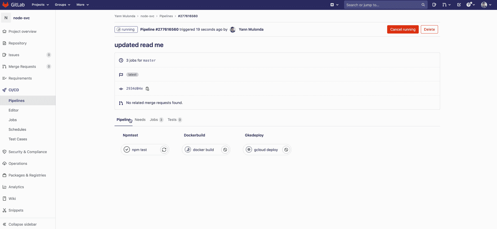

# 使用 Terraform 进行供应和配置管理

> 原文：<https://blog.devgenius.io/provisioning-vs-configuration-management-with-terraform-4bf07b9c79db?source=collection_archive---------1----------------------->

以代码形式介绍地形和基础设施

我信奉的格言之一是阿尔伯特·爱因斯坦说的:“如果你不能简单地解释某件事，你可能还不够理解它”。

时不时会有新概念、新方法或新方式的引入，这些概念、方法或方式彻底改变了 it 行业，并推动 IT 向前发展。这些词很好地概括了它:版本控制、敏捷、CI/CD、DevOps、站点可靠性工程、云计算、虚拟化、容器化、编排、基础设施即代码等。

现在，有了这些新的概念、方法和做事的方式***——来了很多工具*** 。它们被构建来为 IT 专业人员提供媒介，以便为他们的组织实现那些新概念、方法或过程。下面是一个例子:


来源: [jamesbowman.me](http://www.jamesbowman.me/post/continuous-delivery-tool-landscape/?utm_content=bufferb129e&utm_medium=social&utm_source=twitter.com&utm_campaign=buffer)

*   Terraform 是**基础设施即代码最流行的工具之一。**


来源: [terraform.io](https://www.terraform.io/)

正如您可能知道的那样，市场上有各种其他工具可供您使用，来实现所有这些新概念、方法和做事的方式，而决定选择哪一个可能会很麻烦。

在选择这些工具时，了解以下细节并在决策中加以考虑是非常重要的:

> -配置管理与供应
> -程序性与声明性
> -可变与不可变基础设施
> -主控与无主
> -代理与无代理
> *哪些工具拥有大型社区与小型社区—工具文档等

在本文中，我将探讨配置管理与供应。它们如何不同，但又相互关联，并展示了一个小演示。

# 配置管理与配置

> **什么是准备金？**
> 
> 资源调配是设置 IT 基础架构的过程。它还可以指管理对数据和资源的访问并使它们对用户和系统可用所需的步骤。一旦**配置好**，下一步就是**配置**。

CloudFormation、Terraform、Ansible、Salt、流浪者、木偶、码头工人等是可以用于**供应的工具。**

这些工具旨在配置所需的基础架构，如服务器(虚拟机)、负载平衡器、数据库、网络配置等。将配置工作留给配置管理及其工具。

> **什么是配置管理**？
> 
> 配置管理是一个系统工程过程，用于建立和维护计算机系统、服务器和软件，使其处于期望的、一致的性能状态。管理 IT 系统配置包括定义系统的期望状态——比如服务器 **c** 配置——然后构建和维护这些系统。

厨师，木偶，Ansible，章鱼部署，团队，竹子，地形等。也可以作为**的配置管理工具。**

在这种情况下，它们被设计或设置为在现有基础设施上安装软件包或软件、管理软件和配置。到目前为止，您一定已经注意到，用于配置的工具也可以用于配置管理。这是因为:

> P ***供应和配置管理并不相互排斥。大多数配置管理工具可以进行某种程度的配置，反之亦然。***

但是请记住，其中一些工具将更适合某些类型的任务。这需要考虑您的 IT 组织设置和您想要实现的目标。也就是说，在大多数情况下，一个好的替代方法是同时使用配置管理和供应工具。

例如，使用 **Terraform** 进行配置，同时运行 **Chef** 来配置您的基础架构，或者使用 **Ansible** 来配置您的基础架构，同时运行 **Chef** 进行配置管理或任何适合您的工作。

在决定使用哪种工具时，理解工具的用途是很重要的。在你选择了要使用的工具后，你可以对如何使用做更多的研究或培训。

最重要的是，理解**为什么**我们首先使用这些工具或者按照我们的方式做事是为你的组织实现一个非常酷和成功的 IT 基础设施的关键。

理想情况下，当实施新的解决方案或对您的基础架构进行更改时。尝试简单地定义并与组织中的其他人交流，如下所示:

> 我们有一个难题或问题 X——我们可以用概念或技术 Y 来解决——使用工具或平台 Z

要了解更多信息，请查看 [DPBoK](https://pubs.opengroup.org/dpbok/standard/DPBoK.html) 上一些非常有见地的阅读材料

# **平台式陈列柜**

对于这个展示演示，我们正在研究一个演示 Nodejs 项目，这个项目的全部内容是由 [Charles Betz](https://www.stthomas.edu/gradsoftware/about/faculty/charles-betz.html) 教授为[圣托马斯大学](https://www.stthomas.edu/gradsoftware/)(明尼苏达州圣保罗)的 [SEIS 664 IT 交付课程](https://www.coursicle.com/stthomas/courses/SEIS/664/) —研究生院级别编写和设计的。请随意查看 Gitlab repo、[课程内容](https://gitlab.com/charlestbetz/dp-course)和[演示项目](https://gitlab.com/charlestbetz/node-svc)以了解更多信息。

*   本项目托管在 [***Google 云平台***](https://cloud.google.com/) 上并设置使用:

> **容器化的 Docker**:容器允许你创建独立的环境来运行你的应用程序。在实现不可变的基础设施模型方面，它们比虚拟机有一些显著的优势

> 协调的库贝内特斯:大规模运行容器是完全不同的，一种被称为**协调器**的特殊工具被用于这项任务。这就是 Kubernetes 的用武之地。

Kubernetes 部署清单

然后可以使用下面的 ***kubectl*** 命令在 Kubernetes 集群中创建部署对象:

```
$ kubectl apply -f deployments.yaml
```


来源: [kubernetes.io](https://kubernetes.io/docs/tutorials/kubernetes-basics/explore/explore-intro/)

大规模运行应用程序意味着运行分布在多个虚拟机上的多个容器。这可能会导致诸如所有这些应用程序容器之间的负载平衡问题，以及定义连接到应用程序的单一入口点。这就是 ***Kubernetes 服务清单*** 出现的地方，看起来像这样:

Kubernetes 服务清单—用于我的 Nodejs 演示项目

> **用于供应的 Terraform&配置管理** : Kubernetes 集群可以使用 terra form 进行描述，以便通过代码进行管理。
> 
> 我们正在使用 Terraform 代码创建一个 Kubernetes 集群；应创建的集群。使用 Terraform [输入变量](https://www.terraform.io/intro/getting-started/variables.html)来参数化集群的创建允许你轻松地改变配置参数。这按如下方式完成:

`main.tf`保存关于应该创建的集群的所有信息

使用 Terraform [输入变量](https://www.terraform.io/intro/getting-started/variables.html)对集群创建进行参数化，这允许您轻松更改配置参数:

现在，可以通过运行以下脚本来重建 Terraform 集群:


使用 Terraform 进行配置的屏幕截图

> **用于源代码管理的 git lab—CI/CD 管道**:下面是这个项目的一个 [Gitlab CI/CD](https://docs.gitlab.com/ee/ci/quick_start/index.html) 脚本的样子:

我们已经创建了集群，并配置了应用运行所需的资源基础架构，现在让我们来看看目前为止我们都有什么:


现在你可以注意到它们不是正在运行的吊舱。这是因为构建和部署需要通过自动化的 Gitlab CI/DC 管道运行:



搞定了。😎🥳:这样，我现在可以通过代码来管理我的应用程序的各个方面，这是 infratcure as code 的基础。通过运行以下 terraform 脚本，可以简单地销毁或"*"取消调配所有创建的资源:*

**

*使用 terraform 取消配置的 ***屏幕截图。****

> **如果你喜欢这个，你可能也会喜欢:* [Github Actions:如何将 Angular App 部署到 Firebase 主机](https://blog.bitsrc.io/github-actions-how-to-deploy-angular-app-to-firebase-hosting-89a93f9c4fe1)*

> *干杯！！！*