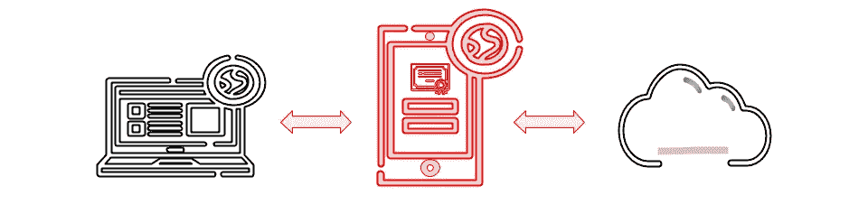

# 现代 C++中的代理设计模式

> 原文：<https://blog.devgenius.io/proxy-design-pattern-in-modern-c-95134970d82?source=collection_archive---------9----------------------->



在软件工程中，结构设计模式处理对象之间的关系，即对象/类如何以适合情况的方式交互或建立关系。结构设计模式通过识别关系来简化结构。在这篇关于结构设计模式的文章中，我们将看看 C++中的代理设计模式，它的 ***决定了你访问对象*** 的方式。

> */！\:本文已原创发表于我的* [*博客*](http://www.vishalchovatiya.com/proxy-design-pattern-in-modern-cpp) *。如果你有兴趣接收我的最新文章，* [*请报名参加我的简讯*](http://eepurl.com/gDNybv) *。*

如果你还没有检查过其他的结构设计模式，那么下面是列表:

1.  [**适配器**](http://www.vishalchovatiya.com/adapter-design-pattern-in-modern-cpp/)
2.  [桥**桥**桥](http://www.vishalchovatiya.com/bridge-design-pattern-in-modern-cpp/)
3.  [**复合**](http://www.vishalchovatiya.com/composite-design-pattern-in-modern-cpp/)
4.  [**装饰者**](http://www.vishalchovatiya.com/decorator-design-pattern-in-modern-cpp/)
5.  [**立面**](http://www.vishalchovatiya.com/facade-design-pattern-in-modern-cpp/)
6.  [**飞锤**](http://www.vishalchovatiya.com/flyweight-design-pattern-in-modern-cpp/)
7.  [**代理**](http://www.vishalchovatiya.com/proxy-design-pattern-in-modern-cpp/)

您在这一系列文章中看到的代码片段是简化的，而不是复杂的。所以你经常看到我不使用像`override`、`final`、`public`(同时继承)这样的关键字，只是为了让代码紧凑&可消耗(大部分时间)在单一标准屏幕尺寸。我也更喜欢`struct`而不是`class`，只是为了节省代码行，有时不写`public:`，还会故意忽略[虚拟析构函数](http://www.vishalchovatiya.com/part-3-all-about-virtual-keyword-in-c-how-virtual-destructor-works/)，构造函数[，复制构造函数](http://www.vishalchovatiya.com/all-about-copy-constructor-in-cpp-with-example/)，前缀`std::`，删除动态内存。我也认为自己是一个务实的人，希望用尽可能简单的方式，而不是标准的方式或使用术语来传达一个想法。

***注:***

*   如果你是在这里被直接绊倒的，那么我建议你浏览一下[什么是设计模式？](http://www.vishalchovatiya.com/what-is-design-pattern/)一、哪怕是鸡毛蒜皮的小事。相信会鼓励你对这个话题进行更多的探索。
*   您在本系列文章中遇到的所有这些代码都是使用 C++20 编译的(尽管我在大多数情况下使用了 C++17 之前的现代 C++特性)。因此，如果你无法获得最新的编译器，你可以使用已经预装了 boost 库的[https://wandbox.org/](https://wandbox.org/)。

# 目的

> **访问特定资源的界面** *。*

*   代理充当特定资源的接口，该特定资源可能是远程的、构建起来很昂贵或者需要一些额外的功能，如日志记录或其他。
*   但是代理的关键是它的接口看起来就像你实际尝试访问的对象的接口。该接口可以是方法、重载操作符或不同/本地类的另一个[对象](http://www.vishalchovatiya.com/inside-the-cpp-object-model/)。

# C++中的代理设计模式示例

*   C++中代理设计模式的一个非常复杂的例子是[智能指针](http://www.vishalchovatiya.com/understanding-unique-ptr-with-example-in-cpp11/)(如 [std::unique_ptr](http://www.vishalchovatiya.com/understanding-unique-ptr-with-example-in-cpp11/) ， [std::shared_ptr](http://www.vishalchovatiya.com/move-constructor-assignment-operator-with-shared-ptr/) 等)。)从标准库

```
// Ways to access object through pointer
ptr->print();
*ptr = 5;
```

*   所以让我给你一个解释，为什么智能指针会是一个代理。仅仅通过上面的代码片段，你不能决定 ptr 是原始指针还是智能指针。
*   因此，智能指针是代理，因为它们满足代理的条件

1.  提供访问资源的接口。
2.  接口看起来就像对象的接口。

*   有许多不同种类的代理可用，如远程代理、虚拟代理、保护代理、通信代理。我们将在这里看到其中的一些。

# 财产代理

*   正如你可能知道的，其他编程语言如 C#也有这种属性概念。可能只不过是一个字段加上该字段的 getter & setter 方法。让我们假设我们想在 C++中获得属性，所以我们把`Property`类写成:

```
template<typename T>
struct Property {
    T   m_value; Property(const T initialValue) { * this = initialValue; }
    operator T() { return m_value; }
    T operator = (T newValue) { return m_value = newValue; }
};struct Creature {
    Property<int32_t>   m_strength{10};
    Property<int32_t>   m_agility{5};
};int main() {
    Creature creature;
    creature.m_agility = 20;
    cout << creature.m_agility << endl;
    return EXIT_SUCCESS;
}
```

*   但是看到上面的代码，你可能会奇怪为什么我们不直接把`strength` & `agility`声明为`int32_t`。现在让我们假设，出于某种原因，您实际上想要 ***来“拦截”或“必须记录”分配以及对这些字段*** 的访问。所以你想要一个作为`Property`有效的东西，而不是为所有属性设计 getter & setter 方法。

# 虚拟代理

*   因此，在某些时候，你肯定会遇到的另一种代理是所谓的虚拟代理。现在，一个虚拟代理 ***给你一种与你习惯使用的同一个对象一起工作的感觉，即使这个对象可能还没有被创建*** 。

```
struct Image {
    virtual void draw() = 0;
};struct Bitmap : Image {
    Bitmap(const string &filename) : m_filename(filename) {
        cout << "Loading image from " << m_filename << endl;
        // Steps to load the image
    }
    void draw() { cout << "Drawing image " << m_filename << endl; } string      m_filename;
};int main() {
    Bitmap img_1{"image_1.png"};
    Bitmap img_2{"image_2.png"}; (rand() % 2) ? img_1.draw() : img_2.draw(); return EXIT_SUCCESS;
}
```

*   正如你在上面看到的，`Bitmap`图像是从具有多态行为的`Image`接口派生出来的，如`draw()`。`Bitmap`急切地将图像加载到其构造函数中。
*   乍一看，这似乎没问题，但这个`Bitmap`的问题是，在绘图代码启动之前，我们并不真正需要加载图像。因此，在构造时将这两个图像都加载到内存中是没有意义的。
*   现在让我告诉你如何在不改变`Bitmap`的情况下改进上面的代码。当你使用第三方库&想要写一个包装器来提高性能时，这种技术非常有用。

```
struct LazyBitmap : Image {
    LazyBitmap(const string &filename) : m_filename(filename) {}
    void draw() {
        if (!m_bmp) m_bmp = make_unique<Bitmap>(m_filename);
        m_bmp->draw();
    } unique_ptr<Bitmap>      m_bmp{nullptr};
    string                  m_filename;
};LazyBitmap img_1{"image_1.png"};
LazyBitmap img_2{"image_2.png"};
```

*   如你所见，我们直到需要时才使用`Bitmap`。相反，每当有人想要绘制图像时，我们只是缓存文件名来创建`Bitmap`。因此，如果没有人想画图像，从文件中加载图像是没有意义的。

# 通信代理(C++中直观的代理设计模式)

*   通信代理是你可能遇到过的 C++中最常见和直观的代理设计模式。通信代理的一个直接例子是下标操作符重载。考虑以下用户定义类型的示例，即`arr2D`，其工作方式与原始类型 2 维数组完全相同:

```
template <typename T>
struct arr2D {
    struct proxy {
        proxy(T *arr) : m_arr_1D(arr) {}
        T &operator[](int32_t idx) {
            return m_arr_1D[idx];
        } T   *m_arr_1D;
    }; arr2D::proxy operator[](int32_t idx) {
        return arr2D::proxy(m_arr_2D[idx]);
    } T   m_arr_2D[10][10];
};int main() {
    arr2D<int32_t> arr;
    arr[0][0] = 1;  // Uses the proxy object
    return EXIT_SUCCESS;
}
```

# 代理设计模式的好处

1.  该代理为复杂的数据安排提供了一个漂亮而简单的接口。
2.  代理设计模式尤其是虚拟代理也提供了性能改进，正如我们在上面的惰性图像加载案例中看到的。
3.  属性代理提供了记录对对象属性的访问的灵活性，而客户端甚至不知道。

# 常见问题汇总

**装饰者&代理设计模式是一样的吗？**

它们有点类似(因为两者都使用合成)，但用于不同的目的。例如，如果您考虑上面的例子，代理通常管理生命周期&对对象的访问，而装饰者是具有更多功能的原始对象的包装。

**适配器、装饰器&代理设计模式的区别？**

— ***适配器*** 提供了不同/ ***兼容的接口*** 给被包装的对象
— ***代理*** 提供了有些相同或 ***轻松的接口***
— ***装饰器*** 提供了 ***增强的接口***

**代理设计模式有哪些用例？**

—当您的对象消耗资源并且您将它们的大部分时间存储在磁盘上时，您可以使用代理来充当占位符(就像我们在上面的惰性图像加载中所做的那样)。
—当您想要添加访问限制时，如对象以只读方式访问，或在真正执行操作之前进行基于用户的访问控制(例如，如果用户被授权，则执行操作，否则，抛出访问控制异常)