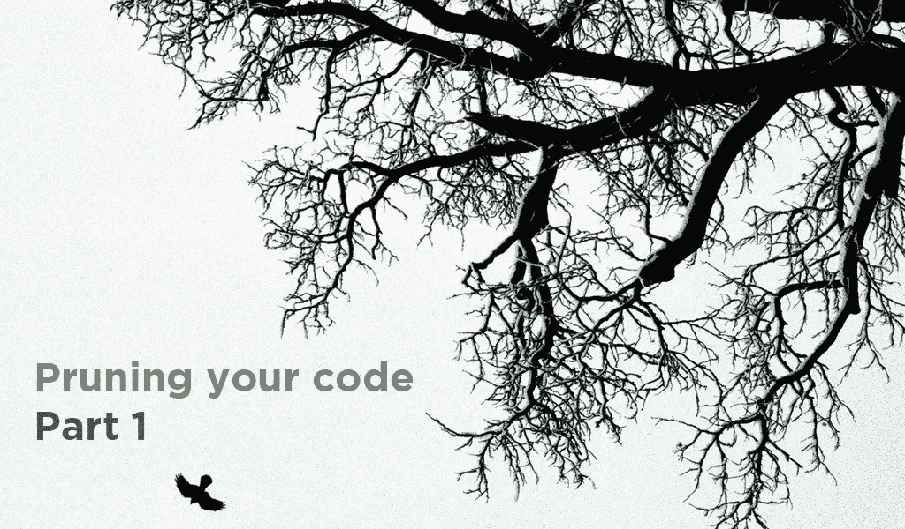
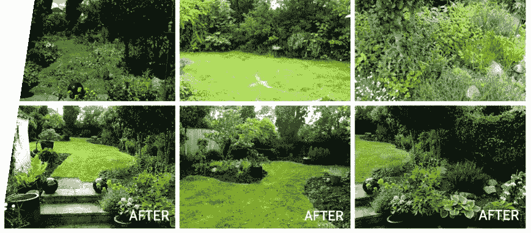
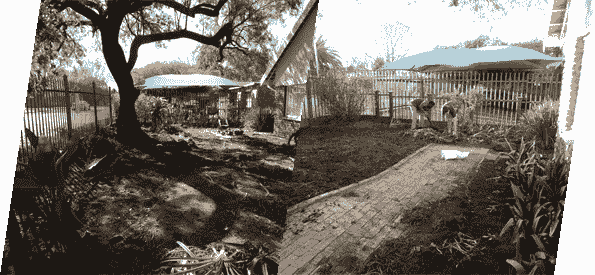
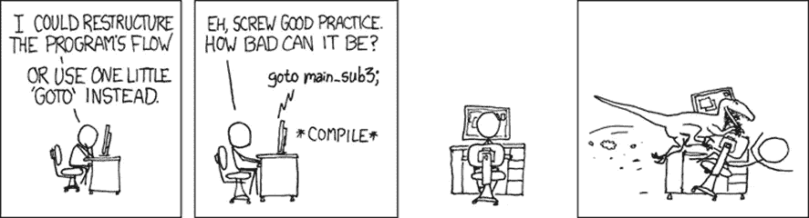
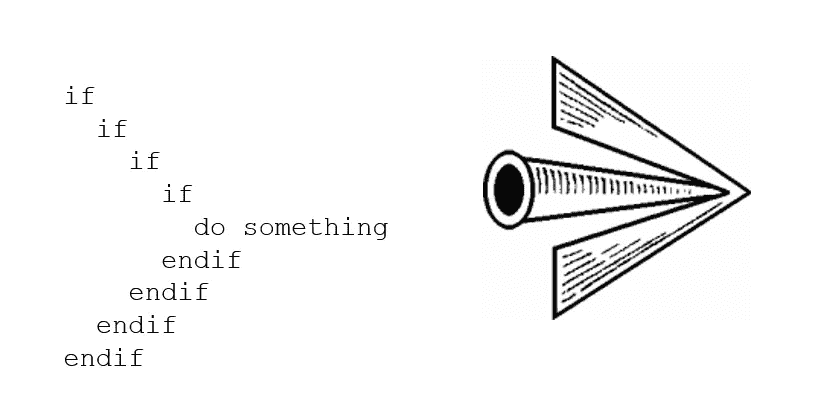

# 修剪代码—第 1 部分

> 原文：<https://blog.devgenius.io/pruning-your-code-part-1-8ec0d27536db?source=collection_archive---------18----------------------->

我喜欢园艺。我还记得我种下第一张床时的感觉有多好。尽管我不得不等了整整一年才等到花开，但这仍然是非常值得的。



你很快就会上瘾。我很快开始添加越来越多的植物，最终我的床都满了，基本上变得无法维护。直到我再也无法区分不同的植物。

这最终导致以后的季节几乎没有花。我需要建议。

我的祖母被请来会诊，她有十个绿手指。

那天她的建议改变了我对如何打理花园的整个看法。

> ***“对你的花园最好的投资就是修剪掉那些不需要的东西。”——菲娅·文特尔奶奶。***

这让我开始思考。当然，我在网上看过花园改造前后的照片，一直认为关键是重做。但是她的话在我的脑海中，我意识到你可以通过移除过度生长和重组你所拥有的来清理混乱。

我开始在网上搜索图片，发现了这个花园。



很快我就把这个建议应用到我自己的花园里，拿出我所有的植物，砍掉三分之二，重新种上同样的植物，然后等一年过去。

结果令人震惊。



重组


一年后

我同样的花草，突然有了新的生命。

## 发生了什么事？

*   修剪鼓励了我的植物生长，这导致了更多的花朵。
*   维护我的花园现在更容易了——例如，发现枯叶更容易了。
*   提高了我花园的整体美感。
*   我的植物的形状得到了改善。
*   我的花园的布局和视野现在很清楚，也更容易理解。

这让我开始思考。

# **修剪与软件开发有什么关系？**

我开始意识到，对于软件开发来说，以下是正确的:

*   我们忘记了“修剪”我们的代码。
*   我们允许我们的代码自由分支。
*   我们需要删除不必要的分支。
*   随着时间的推移，维护变得越来越复杂。
*   布局和设计变得不清楚。

但是为什么会这样呢？

# 后藤去了哪里？

GoTo 是一个允许将控制单向转移到另一行代码的语句。与将返回控件的函数调用不同。跳转位置通常是某种形式的标签或行号。



信用: [**xkcd**](http://xkcd.com/)

这可以认为是分支。通过实现 GoTo 语句，您已经为代码创建了一个新的执行路径。

## 为什么这样不好？

使用 GoTo 会导致程序极难理解和分析。这可能导致不确定的行为，并增加代码的刚性。

今天，许多程序员会争辩说，我们今天没有使用 GoTo 语句，因为许多编程语言不再支持它，所以为什么还要谈论它呢？

让我们考虑下面的代码片段。尝试查找 GoTo 语句:

```
**private boolean** processTransaction(**Transaction** trans) {
// do some session security checking
**User** user = trans.user;
log("security check for user " + user.name);if ( user.loggedIn() == false)
**return** false;if ( user.sessionTimeout() == true )
 **return** false;**boolean** success = true;// process transaction here
**return** success;}
```

条件语句中， **IF** 和 **SWITCH** 应该被认为是 GoTo 语句。

```
**IF** *condition* **THEN goto****SWITCH** *expression* **CASE goto**
```

我们过度使用了条件语句。

# 为什么分支不好？

## **分支在 CPU 上开销很大。**

*   当处理器看到分支指令出现在它的流水线中时，它需要想出如何继续填满它的流水线。
*   为了弄清楚程序流中分支之后是什么指令，它需要知道两件事:
*   如果树枝被拿走了
*   分支的目标。

搞清楚这个就叫做 ***分支预测*** ，是一个很有挑战性的问题。如果处理器正确猜测**，程序继续全速运行。相反，如果处理器错误地猜测了*，它只是花费了一些时间来计算错误的东西。***

***它现在必须刷新其流水线，并从正确的执行路径重新加载指令。***

***一句话:巨大的性能成功。***

## *****分支会导致箭头反模式。*****

***嵌套的条件语句很难调试和维护。***

******

# ***我如何修剪我的代码？***

***在[下一部分](https://medium.com/@frikkievanbiljon/pruning-your-code-part-2-d32a2ef27e37)中，我们将看看如何通过删除大多数条件语句来修剪代码。我们将研究编写函数的替代方法，使之更简洁、更简短、更少 IF。***

***改变旧习惯很难。尤其是当你开始爱他们的时候。用条件句解决问题成了我们的第二天性。就像 Dijkstra 说的:***

> ***囚犯爱上了他的锁链。***

***我们将通过删除 **IF-** 和 **SWITCH-** 语句来重做一些代码，并考虑修剪代码是否会产生更好的结果。***