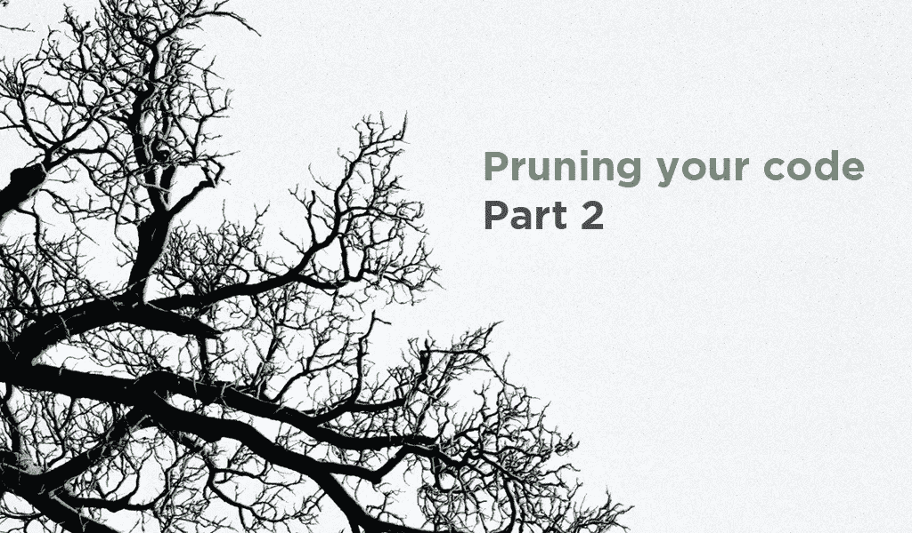
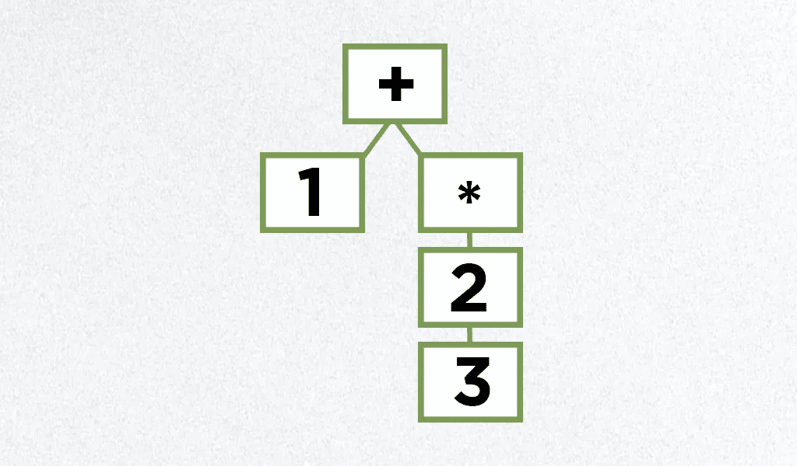

# 修剪代码—第 2 部分

> 原文：<https://blog.devgenius.io/pruning-your-code-part-2-d32a2ef27e37?source=collection_archive---------12----------------------->

在[系列的第一部分](https://medium.com/dev-genius/pruning-your-code-part-1-8ec0d27536db)中，我们讨论了修剪代码的好处。我们还了解到过度修剪对你的软件有害。

在第 2 部分中，我们将看一些条件的例子，以及如何用 OOP 设计和 JavaScript 来解决它们。

对于 OOP，我们也会看到我们的解决方案如何让我们更接近 **S.O.L.I.D 原则**。

*   单一责任原则
*   开/关原则
*   利斯科夫替代原理
*   界面分离原理
*   依赖注入原理



# 何时修剪代码？

然而，挑战在于如何发现需要修剪的分支——哪些条件语句应该被剪掉。

我喜欢根据两个标准来考虑修剪:

*   基于状态的行为
*   重复条件

# 基于状态的行为

基于状态的行为属于基于对象的*类型*或*值*选择行为的代码片段。

让我们考虑以下任务:

## **型号 1 + 2 * 3**



我们现在将通过首先使用*条件*然后通过*多态*来对此建模。

**用条件句建模:**

```
**class** Node{
 **char** operator;
 **double** value;
 **Node** left;
 **Node** right; **double** evaluate(){
   **switch**(operator){
    case '#':return value;
    case '+':return left.evaluate() + right.evaluate();
    case '*':return left.evaluate() * right.evaluate();
    case ... //All other operators.
   }
 }
}
```

**用多态性建模:**

```
**abstract class** Node{
    **abstract double** evaluate();
}**class** ValueNode **extends** Node{
    **double** value;
    **double** evaluate(){
        **return** value;
    }
}**abstract class** OpNode **extends** Node{
    **Node** left;
    **Node** right;
    **abstract double** evaluate();
}**class** AdditionNode **extends** OpNode{
    **double** evaluate(){
        **return** left.evaluate() + right.evaluate();
    }
}**class** MultiplicationNode **extends** OpNode{
    **double** evaluate(){
        **return** left.evaluate() * right.evaluate();
    }
}
```

## 另一个例子:

存在三种鸟类，欧洲蓝、非洲蓝和挪威蓝。对于每种类型的鸟，你需要计算当前的速度。每种类型在计算速度的方式上都有所不同。

**让我们考虑一个利用*开关的解决方案——语句:***

```
class Bird {
  //...
  double getSpeed() {
    switch (type) {
      case EUROPEAN:
        return getBaseSpeed();
      case AFRICAN:
        return getBaseSpeed() - getLoadFactor() * numberOfCoconuts;
      case NORWEGIAN_BLUE:
        return (isNailed) ? 0 : getBaseSpeed(voltage);
    }
    throw new RuntimeException("Should be unreachable");
  }
}
```

**使用多态性解决:**

```
**abstract class** Bird {
  //...
  **abstract double** getSpeed();
}**class** European **extends** Bird {
  **double** getSpeed() {
    **return** getBaseSpeed();
  }
}
**class** African **extends** Bird {
  **double** getSpeed() {
    **return** getBaseSpeed() - getLoadFactor() * numberOfCoconuts;
  }
}
**class** NorwegianBlue **extends** Bird {
  **double** getSpeed() {
    **return** (isNailed) ? 0 : getBaseSpeed(voltage);
  }
}// When speed is required
speed = bird.getSpeed();
```

## 但是去掉条件句的意义是什么？

要理解在这种情况下删除条件的好处，应该考虑以下几点:

*   您现在可以在没有源代码的情况下添加新的行为
*   添加新功能不会导致每次都重新编译
*   因为关注点是分离的，所以可测试性和可读性得到了提高

# 重复条件

重复条件是指那些在代码中出现不止一次的条件语句。

## 重复条件示例

```
**class** Update(){
    execute(){
        **if**(FLAG_i18n_ENABLED){
            //DO A
        }**else**{
            //DO B
        }
    }

    render(){
        **if**(FLAG_i18n_ENABLED){
            //render A
        }**else**{
            //render B
        }
    }
}
```

通过用重复的 IF 语句解决问题，很明显测试解决方案并不那么简单。所有代码都将对 **FLAG_i18n_ENABLED** 具有全局依赖性。

```
**void** testExecuteDoA{
    FLAG_i18n_ENABLED = true;
    **Update** u = **new** Update();
    e.execute();
    assertX();
}**void** testExecuteDoB{
    FLAG_i18n_ENABLED = false;
    **Update** u = **new** Update();
    e.execute();
    assertX();
}
```

## 我们如何解决这个问题？

我们可以通过以下方法轻松回避这个问题:

*   用多态设计替换条件句
*   行为由对象的类型决定
*   将条件的每个分支移动到重写方法或子类。使原来的方法变得抽象。

## 用多态设计解决问题:

```
**abstract class** Update{//..}
**class** I18NUpdate **extends** Update{
    execute(){
        // Do A}
    render(){
        // Do A}
}
**class** NonI18NUpdate **extends** Update{
    execute(){
        // Do B
    } 
    render(){
        // Do B
    }
}
```

测试代码的各个方面现在已经大大简化了:

```
**void** testExecuteDoA{
    **Update** u = **new** I18NUpdate();
    u.execute();
    assertX();
}**void** testExecuteDoB{
    **Update** u = **new** NonI18NUpdate();
    u.execute();
    assertX();
}
```

显而易见，现在每条可能的路径都是独立的，可以单独测试。

但是 IF 语句发生了什么变化呢？

在这种情况下，条件句是不能完全避免的。我们仍然需要知道要实例化该类的哪个版本。

我们的好处是 IF 语句可以远离内联。此外，我们还开放了代码来利用依赖注入。

## 要理解这一点，必须从两方面考虑您的应用:

*   一堆**物品**
*   桩**施工**

**对象堆**负责你的业务逻辑、领域逻辑和抽象。

构建的**堆**负责构建对象，构建对象图(所有组件如何一起工作来解决定制问题)

**工厂模式**是一个对象的例子，它可以构造(构建)其他对象，让它与其他对象一起工作来解决问题。

在本例中，工厂模式将用于集中 IF 语句:

```
**class** Factory{
    **Consumer** build(){
        **Update** u = FLAG_i18n_ENABLED ? **new** I18NUpdate() : 
                   **new** NonI18NUpdate();
        **return** u;
    }
}
```

## 有什么好处？

*   所有的条件现在都在一个地方
*   删除了条件重复，从而产生了更可预测的代码
*   关注点现已分离
*   移除了全局依赖，使得代码更易测试
*   打开你的代码进行扩展，关闭它进行修改

# 一些额外的例子

## 示例 1

***我们来数一下这个数组里有多少个整数是奇数:***

```
**const** arrayOfIntegers = [1, 4, 5, 9, 0, -1, 5];**let** counter = 0;
arrayOfIntegers.forEach((integer) => {
    **const** remainder = Math.abs(integer % 2);
    if (remainder === 1) {
        counter++;
    }
});
console.log(counter);
```

这个例子可以改写如下:

```
**const** arrayOfIntegers = [1, 4, 5, 9, 0, -1, 5];**let** counter = 0;
arrayOfIntegers.forEach((integer) => {
    **const** remainder = Math.abs(integer % 2);
    counter += remainder;
});
console.log(counter);
```

## 示例 2

*编写一个函数，它接受一个日期对象参数(比如 new Date())并返回字符串“周末”或“工作日”。*

```
**const** weekendOrWeekday = (inputDate) => {
    **const** day = inputDate.getDay();
    if (day === 0 || day === 6) {
        **return** 'weekend';
    }
    **return** 'weekday';
};console.log(weekendOrWeekday(**new** Date()));
```

这个例子可以改写如下:

```
weekendOrWeekday.labels = {
    0: 'weekend',
    6: 'weekend',
    default: 'weekday'
};
**const** weekendOrWeekday = (inputDate) => {
    **const** day = inputDate.getDay();
    **return** weekendOrWeekday.labels[day] ||   weekendOrWeekday.labels['default'];
};console.log(weekendOrWeekday(**new** Date()));
```