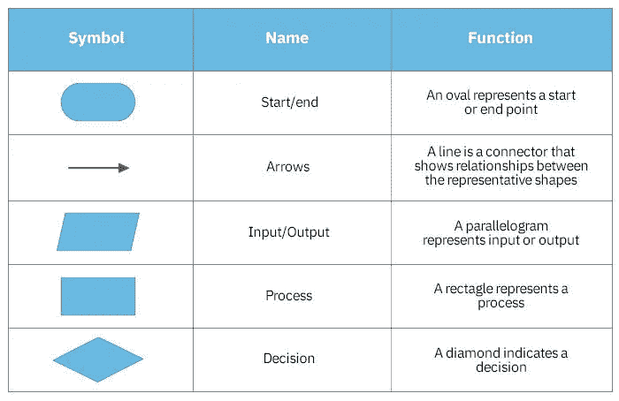
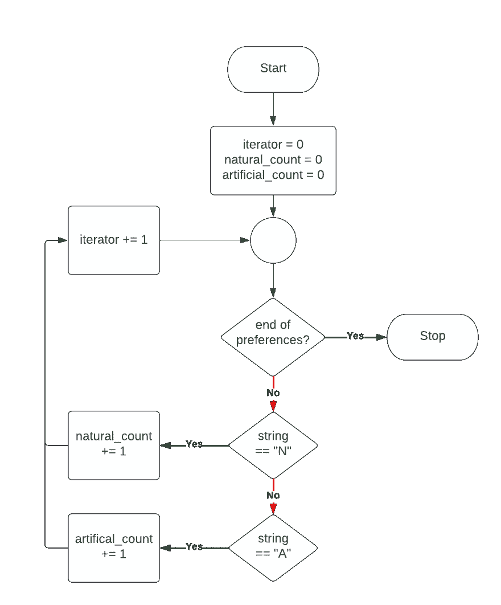

# 解决问题的伪代码和流程图

> 原文：<https://blog.devgenius.io/pseudo-code-for-problem-solving-e2e6cc18caac?source=collection_archive---------6----------------------->


亚历山大·辛恩在 [Unsplash](https://unsplash.com?utm_source=medium&utm_medium=referral) 上的照片

编程代码是给机器写的，不是给人类写的。你是在为译员写作，这意味着你必须非常精确。如果你犯了一个小小的语法错误，它就不会工作。像丢失逗号或额外括号这样简单的事情都会导致整个程序中断。

> "伪代码就像是在阅读它的人的头脑中运行的代码."
> 
> ——瑞安·帕克。

# 伪代码

问题是编写代码的人不容易理解编程代码。这就是伪代码的由来。伪代码是给人类阅读的。它不需要被解释器解析，所以对严格的语法精度的需求消失了。人类的思维远比任何编程语言解释器或编译器更强大和灵活(至少在涉及非结构化信息时)，这给了我们编写伪代码时更多的回旋余地。

## 高级伪代码

考虑以下示例问题:

爱丽丝拥有一个柠檬水摊位，她在那里出售两种不同类型的柠檬水，一种是用天然糖加甜的，另一种是用人工甜味剂加甜的。她想确定这两个食谱中哪一个销量最大，从而为她的柠檬水摊位带来最大的利润。为了做到这一点，她做了一个实验:每次顾客走近她的柠檬水摊位购买饮料时，她都会写下他们是想要天然的还是人工加糖的。

这样做了一周之后，Alice 获得了以下数据集:

向爱丽丝购买柠檬水的前十名顾客的样本。

她可以在一张纸上计算所有的值，然后就完成了，但是 Alice 认为这是一个练习编码技能的机会，并决定为她写一个脚本来完成这项工作。

她首先编写了以下问题的高级伪代码:

```
Given a collection of stringsStarting with a count of zero for both "N" and "A".
- Iterate through the collection one by one.
  - if the current string is an "N"
    - add one to the count for "N"
  - Otherwise, if the current string is an "A"
    - add one to the count for "A"
- After iterating through the entire collection, return the counts for both "N" and "A".
```

以上是*高级伪代码的例子。*这样做的目的是将问题加载到我们的大脑中。我们希望更好地理解问题的输入、过程和期望的输出。

当你第一次处理一个问题时，确保你很好地理解它是很重要的。这有时很简单，但更多的时候需要付出相当多的努力。如果你经常有语法问题打断你的思路，事情会变得更加困难。我们在这个阶段真正想做的是理解问题的逻辑，并开始综合一个解决路径。

幸运的是，那些讨厌的语法错误很少与底层逻辑有任何关系，这意味着我们可以在开始时简单地忽略它们，并专注于将问题加载到我们的大脑中。

您可以想象编程解决问题的过程有两个层次:

*   逻辑问题领域层
*   语法编程语言层

你可以试着同时做这两件事，如果你是一个熟练的程序员，你可能会在简单的问题上侥幸过关。然而，随着问题复杂性的增加，一次记住所有的程序逻辑和语法变得极具挑战性，如果不是几乎不可能的话。

伪代码帮助我们专注于逻辑层本身，不受我们选择的语言语法的干扰和语义的影响。

然而，伪代码的问题是它实际上不是编程代码。这意味着我们没有办法验证伪代码的逻辑。例如，上面的伪代码似乎是正确的。但是我们怎么能确定呢？为了验证我们的伪代码的逻辑，我们需要将其翻译成编程代码并运行它。

## 低级伪代码

在将我们的高级伪代码翻译成编程代码之前，作为一个可选的附加步骤，我们可以先将其翻译成低级伪代码。

低级伪代码就像是我们高级伪代码和编程代码的中间物。它仍然是用英语编写的，没有严格的语法规则，但我们通过添加特殊的关键字来帮助将逻辑分解为具体的命令，从而使它稍微形式化。

我们可以使用任何我们喜欢的关键字，但出于演示的目的，我们将使用以下关键字:

*   开始=程序的开始
*   SET =设置稍后使用的变量
*   PRINT =向用户显示输出
*   IF / ELSE IF/ ELSE =显示逻辑中的条件分支
*   WHILE =显示循环逻辑
*   END =程序结束

我们可以使用上面的关键字将我们早先的高级伪代码转换成低级伪代码:

```
START# Given a collection of strings called "preferences"SET iterator = 1
SET natural_count = 0
SET artifical_count = 0WHILE iterator <= length of preferences
  SET current_string = value withing preferences at space "iterator"
  IF current_string = "N"
    increment natural_count by 1
  ELSE IF current_string = "A"
    increment artificial_count by 1 iterator = iterator + 1PRINT natural_count liked sugar
PRINT artificial_count like sweetenerEND
```

请注意，这个翻译看起来更像实际的编程代码。它有更多的结构，允许我们在更详细的层次上思考。这可以帮助我们识别逻辑问题。例如，我们可以看到我们的程序无法处理不是“N”或“A”的值。因此，如果我们不小心为其中一个值输入了“n ”,我们的程序就会错过这个值，计数就会出错。

即使在这个更详细的层次上，我们仍然不用担心问题所需的精确语法。虽然更加详细，但这段伪代码仍然存在与以前相同的问题，逻辑不可验证。

# 编程语言代码

最后一步是将我们的伪代码翻译成正式的编程语言代码。但是，既然我们已经确定了程序的逻辑，我们就可以解放思想，只关注实际代码的语法，而不用担心底层的逻辑

这是一个简单的例子，但在实践中，你面临的问题可能要复杂得多。因此，试图将整个问题的逻辑编写成一组伪代码并不是一个好主意。伪代码最终只是猜测什么样的逻辑可以解决问题。如果我们将整个解决方案建立在我们的假设之上，那么一个错误很容易波及到我们的整个程序，使它变得毫无用处。

对于更复杂的程序，最好将问题分解成块，编写伪代码，然后一点一点地将其翻译成程序代码。这有一个额外的好处，允许我们在每个阶段验证逻辑，并防止错误蔓延。

你不需要为每一段代码都写伪代码。为你写的每一个方法都写出来会很痛苦。然而，当问题很复杂，你不能马上找到解决方案时，它可以成为一个不可思议的工具，帮助你将问题分解成更容易处理的部分。

# 流程图

另一种直观地描绘出可能的解决方案的逻辑的方法是使用流程图。在这里，我们将尝试描绘出前面显示的同一解决方案的逻辑，但首先，让我们看看流程图的各个组成部分。



使用这些组件，让我们看看前面的解决方案的流程图会是什么样子



柠檬水问题的流程图。

请注意，箭头显示了逻辑的“流程”,并且我们正在煞费苦心地特别画出迭代逻辑。这有助于我们规划出程序解决这个问题所需的一步一步的逻辑。这被称为解决问题的*命令式*或*程序式*方式。在许多高级编程语言中，基本概念(例如，迭代集合)被封装到一个方法中。例如，在 Ruby 中，我们有一个方便的`each`方法，允许我们迭代数组集合。使用`each`是解决问题的*声明式*方式。

我们并不总是能够在一个流程图中捕捉到整个流程的逻辑，但是在这些情况下，我们可以简单地将复杂的流程分解为具有各自流程图的子流程。