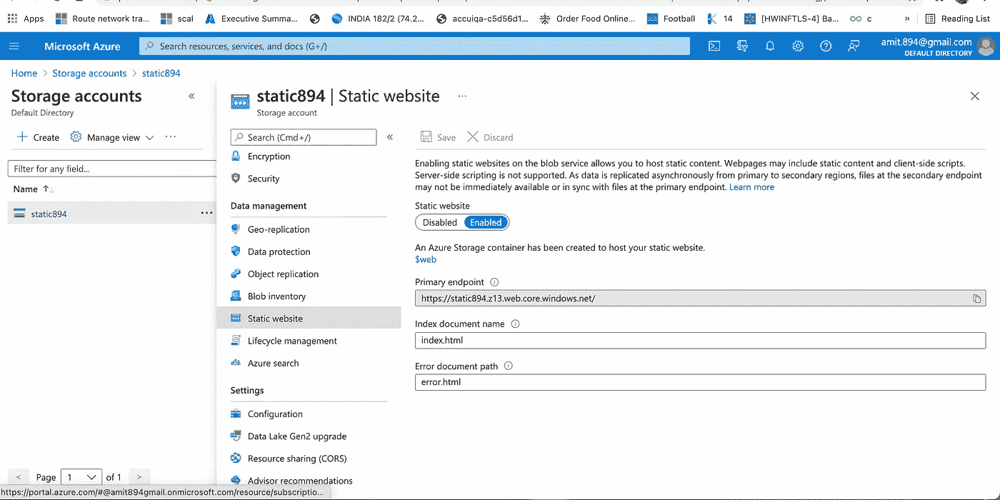

# 公共云:第一个静态网站

> 原文：<https://blog.devgenius.io/public-cloud-first-static-website-7d6f7c6f794?source=collection_archive---------3----------------------->


这篇博客是我们从零开始讨论 **Devops** 概念的系列文章的一部分，面向的是入门知识有限的读者。从初级初学者的角度概括这个系列的前两个概念。我们将增加其他级别和文章，因为我们建立了这个系列。

[ansi ble](https://amit894.medium.com/ansible-hello-world-8d37627758a9)

[**宋承宪**](https://amit894.medium.com/ssh-what-not-to-do-92c266ca430f)

# 静态网站

静态网站基本上是一个网页，其内容是固定的，不会根据各种条件而改变，如*认证、用户流量等*。这种情况下的动态功能需要在客户端处理，因此这些功能用于非常简单的业务用例。

# 云存储

每个云提供商都有自己的托管产品，有助于存储可在云架构的多种使用情形中使用的内容。

*   **AWS S3-** 亚马逊的简单存储服务用于将各种内容类型存储为桶。使用正确的访问策略，这些桶可以作为静态网站在公共互联网上公开。
*   **Azure Storage Account-**Azure Storage Account 提供通用的存储容器，可以存储 *Blob、表格、文件*等，然后作为简单的静态网站公开。
*   **谷歌云存储-** 谷歌使用云存储，进而可以存储 *json、html、blob* 和其他标准二进制/非二进制内容，这些内容可以作为静态网站托管。

**注意** -出于初级水平的目的，我们不会将**负载平衡**和**证书管理**作为本博客平台模块的一部分

# 创建静态网站

出于学习 blob 的目的，我们将使用配置管理工具 **Terraform** ，它是云竞争工具，用于创建和扩展基础架构。有一些工具，如 Azure ARM 模板、AWS 云形成模板，可以独立用于创建相同的模板

*   **安装 Terraform —** Terraform 可以使用预编译的进行安装，也可以根据本 [**指南**](https://learn.hashicorp.com/tutorials/terraform/install-cli) **中给出的源代码进行编译。**安装完成后，运行以下命令验证安装是否成功-

```
terraform -version**Output**Terraform v1.0.11on darwin_arm64
```

*   **配置帐户—** 为了使用 terraform cli 创建基础架构，客户端(mac/windows)需要通过给定 AWS/Azure/GCP 帐户的身份验证。使用以下命令也可以达到同样的效果

```
**Azure**az login**AWS**aws configure**GCP**gcloud auth application-default login
```

*   **创建模块—** Terraform 模块主要由三个主文件 **main.tf、variables.tf 和 output.tf 组成***main . TF*用于定义需要作为模块的一部分创建的资源和提供者， *variables.tf* 用于将变量传递给 *main.tf* 和 *output.tf* 用于输出作为模块的一部分创建的资源的名称

**AWS S3 示例**

*   **构建基础设施-** 为了创建在最后一步中已经构建好模块的基础设施，我们应该按顺序使用以下 terraform 步骤。

```
**Initialising Modules**terraform init**Planning Modules**terraform plan**Applying Modules**terraform apply
```

*   **访问静态网站** -发布网站已经创建，可以从 Chrome/默认客户端浏览器查看。https://static894.z13.web.core.windows.net/

**天蓝色斑点示例**



*   **破坏基础设施-** 一旦网站可用，就可以使用删除基础设施

```
**Destroying Modules**terraform destroy
```

# 额外资源

*   **AWS—**[https://github . com/Amit 894/multi cloud-static-website/tree/main/modules/AWS-basic](https://github.com/amit894/multicloud-static-website/tree/main/modules/aws-basic)
*   **Azure—**[https://github . com/Amit 894/multi cloud-static-website/tree/main/modules/Azure-basic](https://github.com/amit894/multicloud-static-website/tree/main/modules/azure-basic)
*   **GCP—**[https://github . com/Amit 894/multi cloud-static-website/tree/main/modules/GCP-basic](https://github.com/amit894/multicloud-static-website/tree/main/modules/gcp-basic)