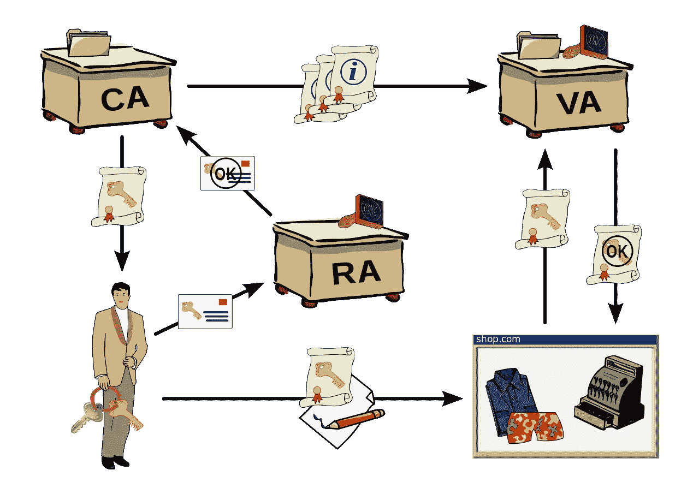
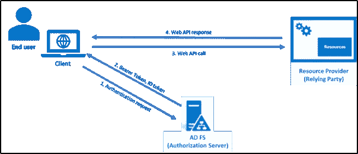

# 公钥基础设施(PKI)

> 原文：<https://blog.devgenius.io/public-key-infrastructure-pki-d0d513ba8819?source=collection_archive---------5----------------------->

亚采克·迪拉格在 [Unsplash](https://unsplash.com?utm_source=medium&utm_medium=referral) 上的照片

## 它是一组角色、策略、硬件、软件和程序，有助于一系列网络活动(如电子商务、网上银行、即时转账和机密电子邮件)中信息的安全电子传输。用户名和密码不足以验证用户的身份。

> [如果你觉得我为你贡献了价值，请支持我！](https://ko-fi.com/jinlowmedium)

过去 5 个月，我越来越难达到我想要的收入，但如果我停下来，我会为我推荐的会员感到难过。

你可以阅读我的文章来更好地理解。

 [## Cookies、会话、令牌

### HTTP 是一种无状态协议。为了知道哪个设备发起请求，cookie、会话和令牌是 2…

medium.com](https://medium.com/geekculture/cookies-session-token-d9f068cccdc6)  [## 计算机网络—加密和解密算法

### 数据签名和加密是前端和后端开发中经常使用的技术。的…

medium.com](https://medium.com/thedevproject/computer-network-encryption-decryption-algorithm-5281f03e512c)  [## 系统设计基础知识(十)——一致性散列

### 它是一种分布式哈希方案，独立于分布式环境中的服务器或对象的数量运行

medium.com](https://medium.com/interviewnoodle/the-fundamental-knowledge-of-system-design-10-consistent-hashing-18fcefbfd749)  [## 系统设计基础知识——(1)

### 今天我就来分享一下系统设计的基础知识。

medium.com](https://medium.com/interviewnoodle/the-fundamental-knowledge-of-system-design-1-84a2cc8a3a8d)  [## Cookie、会话和令牌之间的区别

### Cookie —维护服务器和客户端会话之间的活动状态—记录服务器和客户端会话…

blog.devgenius.io](/the-difference-between-cookie-session-and-tokens-79b62df6f860)  [## JSON Web 令牌

### 它是目前最流行的跨域认证解决方案。

jinlow.medium.com](https://jinlow.medium.com/json-web-token-9bd75630b06a)  [## 麻省理工学院开发的安全认证系统

### “Kerberos”一词来源于古希腊神话中的“Cerberus”一词，代表三头犬…

jinlow.medium.com](https://jinlow.medium.com/kerberos-efbbe680624d) 

人与人之间的识别很简单，就是通过外貌、体型、声音、眼睛的颜色、发型等。但是随着贸易的交换，鉴定的成本逐渐开始增加。有时，双方可能对彼此的了解都很少。因此，如何建立人与人之间的信任是一个重要的问题。过去，互联网世界很少考虑安全性。因此，核心通信协议本身就不安全。所以，如何认证对方的身份对****网络安全至关重要。**认证技术是保护信息安全的第一道屏障。其基本思想是在允许访问系统或网络资源之前验证用户或设备。**

**[**公钥基础设施**](https://en.wikipedia.org/wiki/Public_key_infrastructure) **(PKI)** 是一种典型的密码应用技术，在各种各样的应用中提供公钥加密和数字签名服务，以建立可信赖的网络环境。所以，这是一个组织的网络安全架构。它包括软件、加密技术和服务，能够在 Internet、Intranets 和 extranets 上实现安全交易。**

**在该系统中，认证机构(CA)发布数字证书，并将用户的身份信息(用户名、电话号码、地址等)链接到公钥。每个用户的身份必须是唯一的。每个用户都有一对公钥和一个私钥。**

> **发送方使用接收方的公钥加密要传输的数据。**
> 
> **接收方使用它持有的私钥来解密数据**

****其主要服务****

1.  ****认证** —验证用户的身份**
2.  ****完整性** —数据没有被其他用户有意或无意地篡改。保证数据完整性的两种技术:数字签名和消息认证码([**DES-CBC-MAC**](https://en.wikipedia.org/wiki/CBC-MAC)**或**[**HMAC-MD5**](https://learn.microsoft.com/en-us/dotnet/api/system.security.cryptography.hmacmd5?view=netframework-4.8)**)****
3.  ****保密性** —向用户保证他们是解密数据的唯一接收者**
4.  ****不可否认性** —确保向信息发送者提供递送证明，并向接收者提供发送者的身份证明，因此任何一方都不能否认对信息进行了处理。**

****PKI 组件****

****

**图片来源: [**百科**](https://en.wikipedia.org/wiki/Public_key_infrastructure)**

**PKI 管理加密密钥和数字证书的发行，并提供密钥管理(密钥更新、密钥恢复、密钥委托等)、证书管理(证书生成、更新、撤销等)和策略管理。因此，组织可以通过证书级或直接交叉认证与其他域建立信任关系。在实际应用中，它将硬件系统、软件系统和一套安全策略结合起来，形成一个完整的安全机制，使用户能够使用数字证书作为基础。**

1.  ****认证机构(CA)** —它是 PKI 系统的核心组件。它确认申请数字证书的用户的身份，并生成带有公钥的数字证书。因此，建立了一对公钥和私钥之间的对应关系。**
2.  ****注册中心(RA)** —接收用户的申请，检查用户的真实身份，只接受符合发放数字证书条件的用户**
3.  ****中央目录** —它是已颁发证书和公钥的集中存储。用户可以方便地查询所有已颁发的证书和其他相关信息。**
4.  ****验证机构(VA)** —当用户身份发生变化、解密密钥丢失或证书超过有效期时，将生成新的数字证书，旧证书将被撤销。因此，检查证书是否超过有效期是 PKI 系统中不可缺少的一部分。如果有，VA 通知 CA 启动续订程序以生成新证书并撤销过期的证书。**
5.  ****证书管理系统** —这是管理系统的另一个核心特性。系统可以备份加密密钥并将其存储在中央目录中。当解密密钥丢失时，认证机构为用户恢复密钥。**
6.  ****应用接口** —为用户提供安全服务，以满足 PKI 系统各种功能的实现。**
7.  **公钥——一份签名的电子记录将所有者的身份联系在一起**
8.  ****证书撤销列表(CRL)**—它们通常由同一个发布实体签署。当公钥的所有者丢失私钥或更改用户的身份信息时，必须吊销证书**
9.  ****依赖方** —接收包括证书和签名在内的信息，使用公钥对客户端进行认证和授权，并与客户端建立保密通信的个人或组织**
10.  ****最终用户** —需要访问资源的安全主体(用户、应用程序、服务、防火墙和组)**

****

**图片来源: [**微软**](https://learn.microsoft.com/en-us/windows-server/identity/ad-fs/development/ad-fs-openid-connect-oauth-concepts)**

****流程****

****1 级—数据加密****

**要保证数据传输的机密性，简单有效的方法就是对传输的数据进行加密。不管用什么加密算法，只要能最大化保证只有双方能看懂就行。**

1.  ****对称加密****

*   **加密密钥=解密密钥**
*   **缺陷:如何传输加密密钥？有被偷的风险。此外，它也无法验证服务器的身份信息**
*   **常见的算法有 DES，3DES，AES，TDEA，河豚，RC4，RC5，SM1，SM4，IDEA**

**2.**不对称加密****

*   **需要两个密钥:一个公钥和一个私钥**
*   **建立一对公钥和私钥之间的对应关系**
*   **如果数据是用公钥加密的，那么相应的私钥只能用来解密数据**
*   **它是为了实现机密信息的交换。发送方使用公钥加密要传输的数据，接收方使用私钥解密数据。换句话说，发送方使用接收方的公钥对机密信息进行签名，接收方使用自己的私钥来验证数据签名**
*   **常见的非对称加密算法:RSA，Elgamal，背包算法，Rabin，DH，椭圆曲线加密算法(ECC)**
*   **缺陷:可以解决被盗的问题，但还是不能**
*   **验证服务器的身份信息**

**事实上，这两种方法只要合理使用，一般都能完成加密和解密过程。只要密钥不被截获，就可以在一定程度上保证数据的机密性。只要有传播，就不难看出过程中有一个致命的问题，那就是拦截的风险。非对称加密可以解决密钥在传输过程中容易被截获的风险。由于不传输私钥，可以降低被拦截的风险。但是这种传输仍然存在问题。如果第三方更改或删除密文，甚至用公钥替换新的加密数据，该怎么办？没办法分辨。**

**不对称加密看似安全，但非常耗时耗资源。实际上，对称加密仍然被使用。两种算法都能达到安全目的和标准。对称加密用于传输大量数据，非对称加密用于传输对称加密密钥。此外，非对称加密可用于小数据传输。**

****二级**——**单向加密数据****

**要保证数据的完整性，最简单的方法就是利用单向加密的特性。由于单向加密是不可逆的，因此加密的密文是唯一的，即称为摘要。密文和摘要同时发送给接收者。密文不会立即被解密。相反，密文用同样的单向加密方法加密，得到一个摘要。接收器比较两个摘要。如果一致，说明数据还没有被修改。如果不一致，说明数据可能被篡改或出错。**

**数据完整性的问题是可以解决的，但是在解决完整性的过程中还有一个问题。双方必须检查他们使用的哈希值，因为黑客可以用相应的数据替换哈希值。所以在哈希值比较过程中，可以对单向加密做一点优化，保证算法的完整性。因此，每次使用哈希算法生成摘要时，可以在单向加密之前将固定字符串添加到字段中，但固定字符串不会被传输。接收者还添加固定字符串来解密摘要以进行验证。可以称之为消息认证码(MAC)。只要不泄露固定字符串，消息认证码就是安全有效的。当然，它并不完美。它仍然有 MAC 传输的问题。发送方可以拒绝接收方发送的 MAC。此外，接收者可以向发送者发送欺诈信息。**

****第三级—数字签名****

> **对称和非对称加密—数据机密性**
> 
> **单向散列—数据完整性**
> 
> **数字签名—数据可靠性**

**它是一种验证从固定字符串消息、公钥或私钥生成的签名的真实性的机制。它使用加密散列函数来计算消息的散列值，并使用发送方的私钥来加密散列值。这个过程就像发件人在邮件上签上自己的名字。接收者可以验证由发送者签名的消息的真实性。接收方拥有发送方的公钥，并用公钥解密数据签名以获得消息的哈希值。接收方使用哈希值计算哈希值并比较结果。只有结果一致，消息才能被认证。**

****第 4 级—数字证书****

**证书由证书和注册机构颁发。它包含普通信息和发送者的签名。权威机构知道它与正确的用户通信，并且交换的消息在消息传递之后不会改变。**

****版本** —标识用于该证书的标准版本，该版本会影响证书中可指定的信息。**

****序列号** —为证书分配一个序列号，以区别于其他证书**

****签名算法标识** —用于标识 CA 签署证书所使用的算法**

****发行机构** —它是一个认证机构(CA)。**

****有效期** —期限以开始日期和结束日期表示。**

****主题名称** —证书可以识别其公钥的实体的名称**

****公钥信息** —算法标识符指定了密钥所属的公钥以及所有相关的密钥参数。**

****签名值** —认证机构的签名**

****参考文献****

** [## AD FS OpenID 连接/OAuth 概念

### 适用于 AD FS 2016 和更高版本的最终用户这是安全主体(用户、应用程序、服务和组),他们…

learn.microsoft.com](https://learn.microsoft.com/en-us/windows-server/identity/ad-fs/development/ad-fs-openid-connect-oauth-concepts)  [## 证书撤销列表-维基百科

### 在密码学中，证书撤销列表(或 CRL)是“已经被…撤销的数字证书的列表”

en.wikipedia.org](https://en.wikipedia.org/wiki/Certificate_revocation_list)  [## 公钥基础设施:一个增强的验证框架

### 公钥基础设施(PKI)是一个全面的信息安全框架，用于提供安全的信息和…

www.scirp.org](https://www.scirp.org/journal/paperinformation.aspx?paperid=103117)  [## Ldapwiki:公钥基础设施

### 公钥基础设施(PKI)是一个由数字证书、认证机构和其他注册机构组成的系统

ldapwiki.com](https://ldapwiki.com/wiki/Public%20Key%20Infrastructure)  [## 公钥基础设施-维基百科

### 公钥基础设施(PKI)是一组角色、策略、硬件、软件和过程，用于创建…

en.wikipedia.org](https://en.wikipedia.org/wiki/Public_key_infrastructure)  [## 什么是 PKI？公钥基础设施权威指南

### 按照今天的标准，对称加密是一种简单的加密算法，然而，它曾经被认为是…

www.keyfactor.com](https://www.keyfactor.com/resources/what-is-pki/)  [## 什么是 PKI？以及它如何保护网上的一切

### 公钥基础设施(PKI)是用于建立和管理公钥加密的所有东西的总称…

www.csoonline.com](https://www.csoonline.com/article/3400836/what-is-pki-and-how-it-secures-just-about-everything-online.html)  [## 什么是 PKI？

### 公钥基础设施(PKI)是一组硬件、软件、策略、流程和程序，用于…

cpl.thalesgroup.com](https://cpl.thalesgroup.com/faq/public-key-infrastructure-pki/what-public-key-infrastructure-pki)  [## 公钥基础设施

### 公钥基础设施(PKI)最显著的特点是它使用一对密钥来实现基础的…

www.tutorialspoint.com](https://www.tutorialspoint.com/cryptography/public_key_infrastructure.htm)  [## 什么是 PKI(公钥基础设施)？

### 公钥基础设施(PKI)是一种在数字世界中对用户和设备进行身份验证的技术。基本的…

www.ssh.com](https://www.ssh.com/academy/pki#:~:text=Public%20Key%20Infrastructure%20%28PKI%29%20is,a%20particular%20user%20or%20device.)  [## 公钥基础设施-极客论坛

### 公钥基础设施(PKI)是发布数字证书的管理机构。它有助于保护…

www.geeksforgeeks.org](https://www.geeksforgeeks.org/public-key-infrastructure/)  [## 密码学:公钥基础设施(PKI)

### 数据安全和隐私保护是大多数互联网用户关心的核心问题。加密是一项基本的…

freemanlaw.com](https://freemanlaw.com/pki-cryptography/) 

[https://www . vena fi . com/education-center/PKI/how-do-PKI-work](https://www.venafi.com/education-center/pki/how-does-pki-work)

 [## PKI |什么是 PKI？| PKI 管理|证书在 PKI 中的作用

### 1.1 什么是 PKI？PKI(公钥基础设施)是一个框架，支持公钥加密和…

www.appviewx.com](https://www.appviewx.com/education-center/pki/) 

***如果你发现我的任何文章有帮助或有用，那么请考虑给我一杯咖啡，帮助支持我的工作或给我赞助😊，通过使用*中的**

[**Patreon**](https://www.patreon.com/jinlowmedium)

[**Ko-fi.com**](https://ko-fi.com/jinlowmedium)

[buymeacoffee](https://www.buymeacoffee.com/jinlowmedium)

*最后但同样重要的一点是，如果你还不是灵媒会员，并打算成为灵媒会员，我恳请你使用以下链接。我将收取你的一部分会员费，不增加你的额外费用。*

 [## 用我的推荐链接金加入媒体

### 作为一个媒体会员，你的会员费的一部分会给你阅读的作家，你可以完全接触到每一个故事…

jinlow.medium.com](https://jinlow.medium.com/membership)**