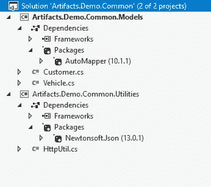
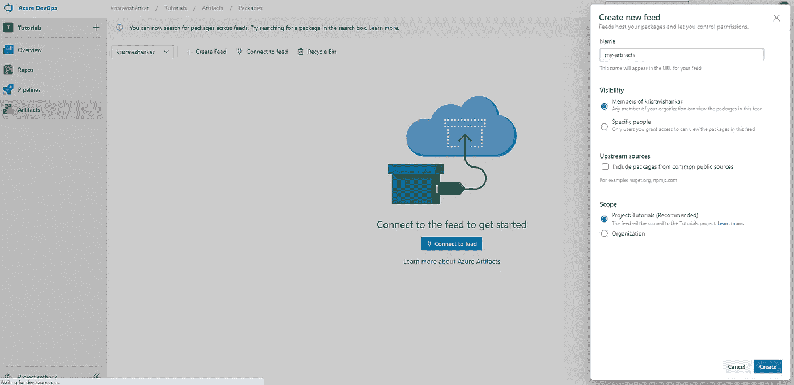
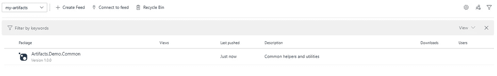
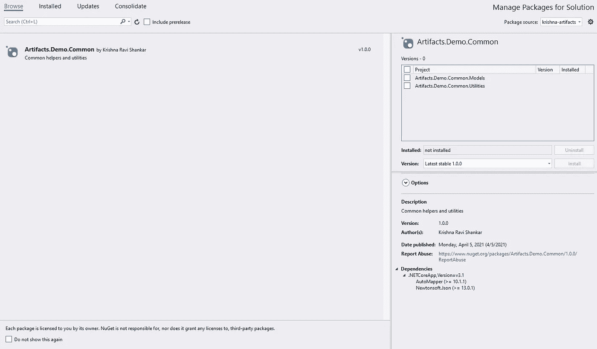
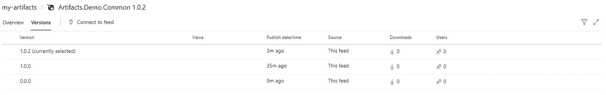

# 将 NuGet 包发布到 Azure 工件

> 原文：<https://blog.devgenius.io/publish-a-nuget-package-to-azure-artifacts-8a829ae5c062?source=collection_archive---------0----------------------->


礼貌[undraw.co](https://undraw.co/)

在本文中，我们将了解如何使用 NuGet 将包发布到 Azure 工件提要。

让我们来定义问题陈述:

*   我有一个公共类库。NET 核心项目，需要在我的组织中的不同项目中使用
*   我的组织将我们的私有包存储在 Azure 工件提要中
*   我想将我的公共库发布到 Azure Artifacts feed，以便其他团队可以在他们的项目中使用这个库
*   额外收获:我希望我的包被版本化

***注意:我在构建过程中使用 Azure 管道。***

要求:

*   Azure Artifacts feed——如果你没有 Azure DevOps 账户，你可以在 https://dev.azure.com[注册。](http://dev.azure.com/)[免费层](https://azure.microsoft.com/en-in/pricing/details/devops/azure-devops-services/)为您提供 1 个每月 1800 分钟的 CI/CD 微软托管作业和 1 个每月无限分钟的自托管作业，我认为这非常酷。哦，还有 2 件艺术品！
*   可视化工作室
*   。NET Core —如果您正在使用。NET 框架，您只需要在。nuspec 和构建管道
*   熟悉 Azure DevOps

源代码[可在这里](https://github.com/krisravishankar/artifacts-demo)获得。如果你想继续的话，你可以克隆它。

## 步骤 1:创建您的库项目

我跳过这一步，因为这只是你的项目的基本创建。让我们假设我们已经创建了一个名为**工件的解决方案。两个项目的通用演示**

*   **神器。演示.常见.模型**
*   **神器**。**演示。常用工具**



注意我们有依赖包:Models 项目中的 AutoMapper 和 Newtonsoft。公共事业项目中的 Json。我之所以强调这一点，是因为我们希望通过消费项目来加载这些依赖项。

## 步骤 2:创建一个. nuspec 文件

的。nuspec 文件是一个包含包元数据的 XML 清单。它基本上提供了关于软件包的信息，包括名称、版本号、描述、作者、引用的 dll 和其他依赖项。

打开 Git Bash 并导航到包含您的解决方案的文件夹(。sln)文件。对我来说，它存在于工件中——demo/src。创建。nuspec 文件使用*触摸*命令。如果没有 touch，[可以从这里安装](https://www.npmjs.com/package/touch-for-windows)。

```
touch Artifacts.Demo.Common.nuspec
```

这将创建一个空的。nuspec 文件。在编辑器中打开文件并粘贴以下内容:

我想在这里提出三点:

*   版本—这是您的软件包版本
*   依赖项—您希望指定已导入到项目中的所有依赖项，以便使用应用程序能够正常工作
*   文件——您将在构建过程中生成的 dll 发布到 lib 文件夹中，以便在 NuGet 打包项目时可以提取这些 dll

您还可以使用出色的 [NuGet Package Explorer](https://github.com/NuGetPackageExplorer/NuGetPackageExplorer) 工具来创建。nuspec 文件。

## 步骤 3:创建 Azure 工件提要

登录到你的 Azure DevOps 帐户(在 dev.azure.com)，转到**工件**(如果你还没有从你的项目设置中启用工件)，并创建一个如下所示的 feed:



我正在创建一个名为**我的工件**的 feed。我取消了“包含来自公共资源的包”的选择，因为我不想让公共包成为我的 feed 的一部分。单击 Save，您的提要就准备好了。

## 步骤 4:为项目设置 Azure 管道

现在点击 **Pipelines** 菜单项(如果你还没有从你的项目设置中启用 Pipelines)并创建一个**新管道**。向导将要求您授权并连接到源代码管理中的项目。我的 repo 在 GitHub 上，所以我选择 GitHub 选项，授权我的帐户，然后选择我当前正在处理的存储库，即 **artifacts-demo** 。

在**配置您的管道**步骤中选择 ASP.NET 核心。

当编辑器打开时，清除 azure-pipelines.yml 的现有内容并粘贴以下内容:

管道将首先使用 ***dotnet build*** 构建项目，然后使用 ***nuget pack*** 打包项目，然后使用 ***nuget push*** 将项目发布到 feed。

## 步骤 4:运行管道

按下**保存并运行**按钮，这将自动触发流水线。等待几秒钟，等待构建完成。

## 第五步:完成！

您的包现在可以在您的 Azure Artifacts feed 中获得。Tada！



现在您想在您正在构建的其他项目中使用这个包。您需要从 Visual Studio 的 NuGet 包管理器连接到您的提要。更多信息请点击这里。

如果一切顺利，你可以从 NuGet 包管理器添加这个包，如下所示:



很酷，对吧？

## 奖励:包版本控制

看到你包装上的版本号了吗？上面写着 1.0.0，那是因为我们在。nuspec 文件。每次进行更改时，都可以在。nuspec 文件，但我肯定你想自动化。对于版本控制，我使用一个名为 [**NerdBank 的包。git versioning**T3。](https://github.com/dotnet/Nerdbank.GitVersioning)

通过运行以下命令安装该工具:

```
dotnet tool install -g nbgv
```

现在转到项目的根文件夹，运行以下命令

```
nbgv install -s [https://api.nuget.org/v3/index.json](https://api.nuget.org/v3/index.json)
```

这将创建您的初始 version.json 文件。它还会添加/修改您的目录。Build.props 文件。这些文件包含您的版本信息，您可以保持原样。

回到您的 Azure Pipelines，用以下内容替换您的 azure-pipelines.yml:

我们在这里只添加了几个额外的步骤来安装 ngbv 工具和设置版本号。我们还在第 33 行提到了版本控制方案。

保存并再次运行管道。当构建完成时，转到您的工件提要。您现在会看到构建号已经自动增加，并且您有了多个版本的包。



是不是很牛逼？

链接到 GitHub 来源:【https://github.com/krisravishankar/artifacts-demo 