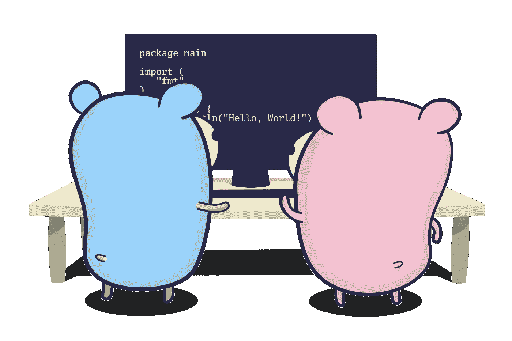
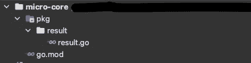
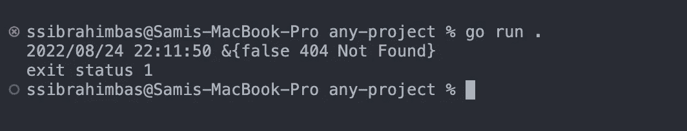

# 发布 Golang 私有包

> 原文：<https://blog.devgenius.io/publish-golang-private-package-by-logic-1c1cce6042f9?source=collection_archive---------9----------------------->

## 循序渐进和逻辑



# 包装逻辑介绍

如果你有一个坚实的基础设施，你知道不应该有两个类做同样的工作。如果你没有坚实的基础，你知道定义变量或定义函数的重要性。这些都是类似的东西。当需要编辑时，不要在一个地方重新输入和更新，这样可以节省时间。

我们运行可以在不同文件中作为函数使用的代码。如果我们在不同的文件中定义了可重用的函数，并且我们需要在不同的应用程序中使用这些函数，该怎么办？

如果你对这个话题做一些研究，你会发现你需要开发一个包并发送到服务器。如果您不知道这些包，请考虑理解这些包；创建函数是为了不同页面中某些代码块的可重用性，所以创建包是为了不同应用程序中函数的可重用性。

最常见的例子就是微服务。多个微服务可能需要相同的基础设施。例如，它可能需要相同的错误处理机制、身份验证方法或一些基本功能。将它们作为一个包发布比单独编写更有意义。

包由包服务保存在服务器上，并且可以与 cli 应用程序一起安装。打包服务提供商；如果使用 NodeJS，则为 npm，如果使用。Net 和…如果你用的是 golang？

# Golang 如何处理包？

Golang 处理外部包的逻辑不同于 NodeJS 或任何其他语言/框架处理包的逻辑。在 golang 中，我们用`go get`命令安装包。所以实际上外卖是在围棋本身。

```
go get xxx/yyy
```

另外，`go get`命令根据您输入的名称搜索 Git(在本例中是`xxx/yyy`)。这里 git 可以是任何使用 git 的应用程序(bitbucket、gitlab 或 github)。

也可以在 npm 中创建私有包，但是需要付费订阅。由于 golang 直接使用 git 系统，如果你授权 go，你可以免费使用任何私有回购。

我们将在这篇文章的后面看到如何做到这一点。

# 开发您自己的软件包

## 我们的方案能解决什么问题？

一个我们在开发 API 时应该注意的问题；我们所有的请求处理器都以相同的格式返回响应。现代 API 使用 JSON (JavaScript Object Notation ),在这个包示例中，我们将开发一个包含小结果类型和函数的核心包。

我们可以把它看作是我们微服务应用的一个通用包，以后再开发。所以结果只是我们包下的一个模块。

## Go 应用程序初始化和包名

包命名很重要。因为当用户或者我们调用我们的包时，我们用名字来称呼它。golang 有一个命名惯例。一般来说，我们像`go.mongodb.org/mongo-driver/mongo`一样把我们的包命名为`host/packagename`或`host/namespace/packagename`。

要启动我们的 Go 应用程序，我们将使用以下命令:

```
go mod init github.com/ssibrahimbas/micro-core
```

这里`github.com`是我们发布包的域名，`ssibrahimbas`是我的用户名(在这里输入你自己的用户名)，其中`micro-core`部分是我们包的名称(你可以更改自己的包名)。

当我们运行上面的命令时，我们的`go.mod`文件将被创建。当你打开这个文件时，你会看到这样的代码

```
**module** github.com/ssibrahimbas/micro-core
```

这是我们的模块名

## 文件夹结构

我们已经声明，在我们的包下将有一个名为 result 的文件夹。有一个由 Golang 社区设置并由包开发者实现的包结构。你可以在这里找到这个包结构[。](https://github.com/golang-standards/project-layout)

在开发这个包时，我们将受益于这个结构。因此，我们将转到如下图所示的文件夹。



文件夹结构

## 编码

现在让我们在`result.go`文件中编写以下代码:

```
**package** result

**type** Result **struct** {
   Success bool   `json:"success"`
   Code    int    `json:"code"`
   Message string `json:"message"`
}

**func** Success(m string, c int) *Result {
   **return** &Result{
      Success: *true*,
      Message: m,
      Code:    c,
   }
}

**func** Error(m string, c int) *Result {
   **return** &Result{
      Success: *false*,
      Message: m,
      Code:    c,
   }
}
```

这里需要注意的是，我们文件第一行的包名和我们的文件夹名是相同的。

## 将包上传到 GitHub

现在让我们创建一个与我们的项目同名的*私有* GitHub 存储库，并在命令行上运行以下代码

```
git init
git add .
git commit -m "first commit"
git branch -M main
git remote add origin https://github.com/ssibrahimbas/micro-core.git
git push -u origin main
```

别忘了把 origin 换成自己的！

然后让我们创建一个发布并发布它

```
git tag v0.1.0
git push origin v0.1.0
```

现在我们的存储库已经准备好了！现在我们将学习如何下载私人回购。

## 将私人回购下载到应用程序

出于安全原因，私人回购不能直接上传。如果您打开另一个项目并运行以下命令，您将得到如下错误

```
go get github.com/yourname/package
```

结果:

```
go get: module github.com/yourname/package: git ls-remote -q origin in /Users/yourname/go/pkg/mod/cache/vcs/2f8c...b9ea: exit status 128:
	fatal: could not read Username for 'https://github.com': terminal prompts disabled
Confirm the import path was entered correctly.
If this is a private repository, see https://golang.org/doc/faq#git_https for additional information.
```

现在让我们打开`~/.netrc`文件在 github 上授权 git

```
code ~/.netrc
```

这里代码是你的编辑器，如果你不全局定义它，你可能会得到一个错误。表情`~`。对应于您的家庭路径。因为我用的是 macOS `~`替我换了这个。

在这里，我们将输入以下代码

```
machine github.com login <your_username> password <your_github_access_token>
```

可以直接用空格粘贴。

你可以[按照官方的 github 说明](https://docs.github.com/en/authentication/keeping-your-account-and-data-secure/creating-a-personal-access-token)来创建`access_token`，这是不言自明的

最后运行以下命令

```
export GOPRIVATE=github.com/your_username/project
```

在这里，我们告诉 golang 我们的私人回购。如果你有一个以上的回购协议，你应该用逗号(`github.com/your_username/project,github.com/your_username/project2`)把它们分开。

现在关闭并重新打开您的终端/计算机/IDE 并运行命令

```
go get github.com/your_username/project
```

结果:

```
go: downloading github.com/your_username/project v0.1.0go: added github.com/your_username/project v0.1.0
```

## 测试包

现在我们已经从 github 下载了我们的包，放在我们开发的包之外的一个文件夹中，我们可以通过在新项目的`main.go`文件中编写以下代码来测试我们的包。

```
 package mainimport ("log""github.com/ssibrahimbas/micro-core/pkg/result")func main() { log.Fatal(result.Error("Not Found", 404))}
```

并使用以下命令运行

```
go run .
```



就是这样！我们的一揽子计划正在发挥作用。当我们用 JSON 输出时，我们会看到这一点。

```
{
   "success": false,
   "message": "Not Found"}
```

# 关闭

在这篇文章中，我们学习了为什么我们需要包，包服务是做什么的，golang 如何看待包系统，以及如何在 golang 中使用私有回购。

你可以在评论里指明我的缺点，要求或者任何东西。我一定会回答。

下一篇文章再见。