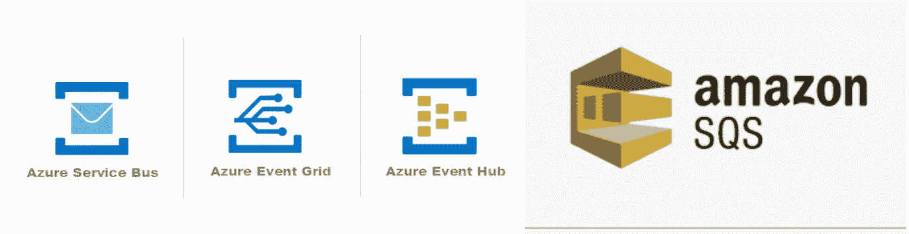
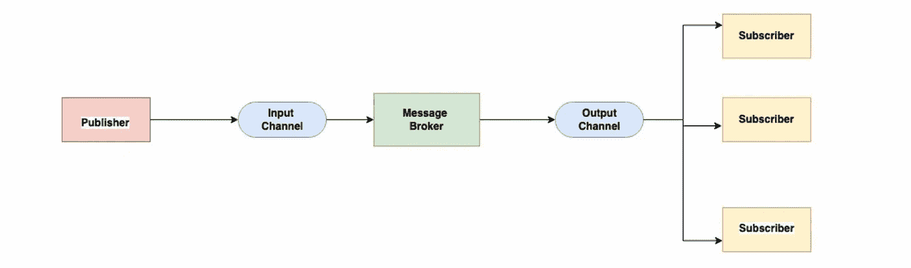
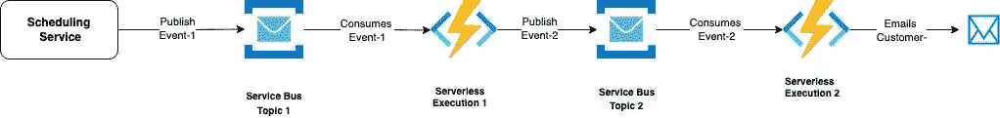

# 发布者-订阅者模式 101

> 原文：<https://blog.devgenius.io/publisher-subscriber-pattern-101-a0dd921025b9?source=collection_archive---------8----------------------->

这篇博客是我们从零开始讨论 101 个概念的系列文章的一部分，读者的入门知识有限。这篇文章属于*中级*系列，因为它涉及理解**消息传递设计原则的基础，**主要是异步通信中使用的基于发布者-订阅者架构的用例。

101 系列中的一些早期博客如下:

[**API 101**](/api-101-773ec501b485) [**异步通信 101**](/async-communication-101-b04d5c95333a)[**数据库 101**](/database-101-13d593ec4078)[**数据库设计 101**](/database-design-101-7c019d69b97f)

**云原生消息解决方案**

# 什么是 Pub-Sub？

在分布式架构的情况下，为了将事件生成源与事件接收源分离，并解除对大规模运行的端到端系统的阻塞，设计了*发布者-订阅者*消息传递模式。也称为发布者的发送者将消息作为事件以预定义的消息格式传输到中间层代理( **Kafka、EventHub、Service Bus 等**)中，单个/多个订阅者可以根据所选的订阅策略监听该中间层代理。

发布-订阅模型支持*单播* 以及*广播* 用例，而不像 [**消息队列模式**](https://badia-kharroubi.gitbooks.io/microservices-architecture/content/patterns/communication-patterns/message-queue-pattern.html) 只支持基于*单播*的用例。

# 常用术语

*   **发布者** —生成消息并将其在消息传递基础架构中排队的客户端。
*   **订户** —接收消息并在消息传递基础设施中将其出队的客户端。
*   **消息代理—** 处理来自不同客户端的消息发布和读取请求的中间层。它以主题的形式跨副本和分区在集群内复制数据。
*   **主题—** 代理中唯一的逻辑类别，该代理提供与特定应用程序/业务用例相关的消息/事件。
*   **分区—** 主题可以进一步划分为称为 [***分区***](https://medium.com/event-driven-utopia/understanding-kafka-topic-partitions-ae40f80552e8) 的逻辑单元，以实现消息的并行处理。每个分区包含由偏移量标识的唯一记录。
*   **QOS-** 发布者和订阅者之间的协议，告知实际消息要传递多少次- ***至少一次，最多一次，正好一次。***

**简单发布-订阅消息模式**

# 用例

发布者-订阅者模型用于需要生成大量事件并且即时消息保证不是最重要的应用程序用例。属于给定类别的应用程序很适合这种模式。

*   发送方和接收方之间的事件不需要 [**强一致性**](https://www.adservio.fr/post/consistency-and-completeness-in-apache-kafka) 并且数据/事件的排序不会产生业务影响的应用。这是一个最终一致的设计模式。
*   来自用户的实时响应对实际业务流程没有影响的应用。
*   属于不同主题的订阅者是独立的，可以有不同的可用性和正常运行时间指标。

# 设计考虑

为了将发布者-订阅者扩展到合适的可靠性和可用性 SLA，以服务于端到端业务用例，建议考虑以下设计事项。

*   **幂等用户-** 根据整个 QOS 集，在失败的情况下，多个用户可以不止一次地发送相同的消息。因此，要求订户保持 [***等幂***](https://www.cloudkarafka.com/blog/apache-kafka-idempotent-producer-avoiding-message-duplication.html) ，即，不处理重复的消息超过一次，并且不进行重复的消息处理。
*   **消息排序和优先级-** 消息可以在不同于其创建的时间线中进行处理，这取决于多个因素，例如分区、消费者群体。因此，每条消息在整个业务/应用程序流中都应该是独立的。
*   **死信队列—** 根据消息的 TTL 设置和消费者的可用性/错误处理，一些消息可能会在 [**死信队列**](https://en.wikipedia.org/wiki/Dead_letter_queue) 中结束。这些消息应该由发布者重新处理，以避免任何业务影响。
*   **安全性—** 消息代理上的不同主题应该是独立的授权策略，以确保客户不会意外地交换来自不同主题的信息。客户端证书和 [***相互 TLS***](https://www.cloudflare.com/en-in/learning/access-management/what-is-mutual-tls/) 是一些很好的安全策略。

# 蔚蓝海岸的酒馆

**多层发布-订阅模型**

# 摘要

Pub-Sub 是一种常见、简单的设计模式，用于基于 Aysnc 的分布式系统，因为它有助于为数百万客户进行扩展，而无需维护复杂的交付语义。然而，对于消息/事件需要动态路由模式的复杂用例，其他设计模式如**基于优先级队列、基于请求-回复、基于队列的负载均衡等**。我们将在即将到来的关于学习功能架构的 101 篇博客中讨论它们。

*如需反馈，请留言至****Amit[dot]894[at]Gmail[dot]com****或联系*[*https://about.me/amit_raj*](https://about.me/amit_raj)*的任何链接。*