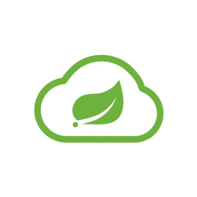
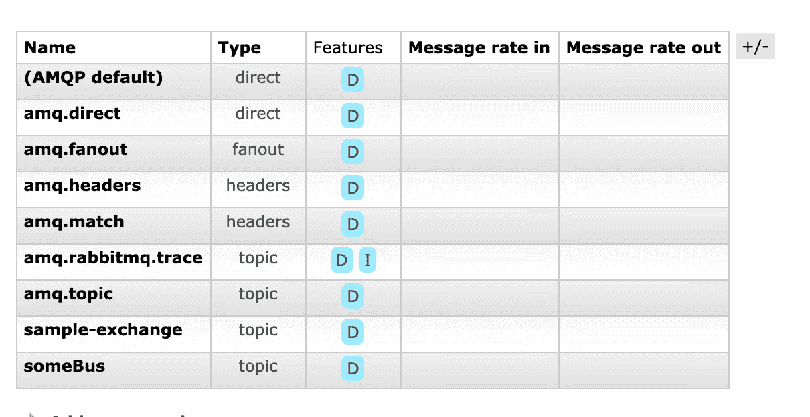

# 通过云总线将自定义事件发布到 Spring Boot 实例

> 原文：<https://blog.devgenius.io/publishing-custom-events-to-spring-boot-instances-via-cloud-bus-79baf962a96e?source=collection_archive---------4----------------------->



在上一篇[文章](https://medium.com/dev-genius/load-balancing-a-spring-boot-application-with-nginx-and-docker-e701f74c011d)中，我们介绍了如何在负载平衡器后面部署同一个 Spring Boot 应用程序的多个实例。在这个例子中，我们能够修改单个实例的状态，并观察响应的变化。

尽管这种方法可以适用于我们知道实例的精确坐标的简单情况；这在规模上是不方便。在大规模生产环境中:

*   同一服务可能有 10s 个实例，向每个实例发送命令可能并不实际。此外，实例的数量可能会根据负载动态变化。
*   如果实例部署在 Mesos Kubernetes 中，我们甚至可能不知道它们的确切坐标(IPs、端口)。

通常[配置服务器](https://cloud.spring.io/spring-cloud-config/reference/html/)是被认可的管理 Spring Boot 实例配置的解决方案。然而，在某些情况下，我们可能希望向实例发出事件/命令，而这些命令与应用程序配置无关。

使用情形示例可能包括:

*   使实例的本地缓存无效
*   清除本地队列
*   收集一些临时指标

对于这些情况，我们可以将 [Spring Cloud Bus](https://spring.io/projects/spring-cloud-bus) 与消息代理一起使用，以便将事件/命令分发到应用程序的每个实例。

在本文中，我们将浏览一个示例，演示为 Docker 环境部署 Spring Cloud Bus 以及向应用程序发送自定义事件的步骤。

# 春云巴士

Spring Cloud Bus 旨在通过消息代理链接应用程序的分布式节点，以便广播状态/配置更改和管理指令(这将是我们示例的主题)。Spring Cloud Bus 的功能相当于一个分布式的 Actuator a，同时也是应用程序之间的通信通道。在这个例子中，我们将使用 Spring Cloud Bus 为我们的应用程序创建和处理自定义事件。

消息代理是这种集成的重要部分。Kafka 任何符合 AMQP 标准的经纪人，比如 RabbitMQ，都是由 Spring Cloud Bus 现成支持的。在这个例子中，我们将使用 RabbitMQ 作为我们的消息代理。

# 投资机会:RabbitMQ

RabbitMQ 是一个轻量级的开源消息代理，它实现了 AMQP 协议。RabbitMQ 在分布式系统和微服务中非常流行，以便于呈现可伸缩性和易用性的应用之间的异步通信。

在我们的示例中，RabbitMQ 将作为我们的代理，在我们的实例之间传递事件。

# 示例的范围

这个例子是我们之前的负载均衡器的扩展版本。这一次，我们将在 Docker Compose 环境中执行以下操作:

*   部署 RabbitMQ 消息代理
*   配置一个负载平衡器，向我们的应用程序发送读取和更新请求
*   通过 Spring Cloud Bus 创建一个与 RabbitMQ 集成的简单 Spring Boot 应用程序，并将其扩展到 3 个实例
*   通过一个 HTTP 请求更新应用程序状态，并观察到更改被发布到所有的应用程序实例

# RabbitMQ 部署

您可以在下面的 docker-compose 代码片段中看到我们的 RabbitMQ 配置。

我们已经部署了一个 RabbitMQ 实例。RabbitMQ 映像还包含用于管理和监控的管理控制台。我们已经暴露了端口 5672 和 15672。5672 是 RabbitMQ 使用的端口，部署在 Docker 环境中的应用程序不需要这个端口，但是在本地机器上进行开发时可能会很方便。15672 是运行管理控制台的端口。我们已经暴露了那个来监视我们本地的经纪人。

# 负载平衡器配置

这与我们的负载平衡器示例的配置大致相同，只是增加了一项。这次我们为 3 台服务器配置 Nginx。为了示例的完整性，您可以找到下面的配置。

我们的负载平衡器将监听端口 9090，并将流量转发到端口 8080 上的服务器。

# 我们的 Spring Boot 应用程序

# 属国

下面你可以看到 out *build.gradle.kts.* 中的依赖部分

我们为应用程序添加了三个依赖项:

*   *Spring-boot-starter-actuator*用于监控和管理，Spring Cloud Bus 非常依赖。
*   *spring-cloud-starter-bus-amqps*是我们这里的关键依赖。它通过 AMQP(例如 RabbitMQ)实现了云总线集成。
*   最后，我们增加了*杰克逊模块-科特林*。春云事件发布为 JSON。Jackson Kotlin 模块用于 JSON 序列化/反序列化。

# 云总线和事件相关代码

看了一堆无聊的配置后，现在是实际代码运行的时候了。在下面的代码片段中，您可以看到我们的云总线相关代码。

首先我们添加了一个 *BusConfig* 。这是一个标记组件，用于放置类似于*@ RemoteApplicationEventScan*的注释。*@ RemoteApplicationEventScan*是一个注释，表示要扫描事件的包。默认情况下，它递归地检查当前包(及其子包);但是可以定制。

然后，我们将自定义事件类定义为 *UpdateDataEvent* 。这是一个类似 POJO 的类，扩展了 Spring Cloud Bus 的 *RemoteApplicationEvent* 。请将整数*字段*新数据*作为节点，这是我们将通过事件分发的实际有效载荷。远程应用程序事件的关键点是使数据 JSON 可序列化。*

在底部，您可以看到 *ApplicationListener* 实现，它处理我们的自定义 *UpdateDataEvent* 。在接收到 *UpdateDataEvent 后，*会打印一个日志行，并更新名为 *State* 的组件的数据。

*State* 顾名思义是一个有状态组件，定义如下。

我想提醒的是，在 Spring Beans 中存储状态并不是一个好的做法；但我们将仅用于演示目的。

# REST 控制器和发布事件。

最后，我们的应用程序通过 REST 控制器公开了它的 API，并公开了两个方法。

[https://gist . github . com/itasyurt/d 00 BBB 1 e 74 c 48 e 91 fa 2 ee 3 fdfba 34373](https://gist.github.com/itasyurt/d00bbb1e74c48e91fa2ee3fdfba34373)

*getResult* 方法返回存储在 *State* 组件中的数据，没有什么太花哨的地方。

然而，updateData 有点棘手。它通过 put 请求获取客户端输入。但是它不是直接更新状态，而是创建一个 *UpdateDataEvent* 并将其发布到应用程序上下文。

在创建事件时，我们需要在事件中包含 id originService 这样应用程序实例就能够检测出来源是否是它自己。仅当事件的来源与实例相同时，事件才会发布到总线。可以从自动连接到 REST 控制器 bean 的 BusProperties 的 id 中检索实例的唯一 id。

# 应用程序属性

下面您可以看到我们的应用程序属性:

前三行是配置执行器端点，与我们的示例没有太大关系，云总线配置行在最后两行。

*   *spring . cloud . bus . destination*是 RabbitMQ 上的交易所名称。默认情况下，它的名称是样本交换；但是对于我们的用例来说，覆盖它是很好的。
*   spring.rabbitmq.host 是我们 rabbitmq 居住的地方。因为我们已经在 docker 组合中将 RabbitMQ 服务定义为 *rabbit* ，所以我们必须将该属性设置为 *rabbit* 。

# Docker 配置

你可以在下面看到我们的应用文档。那里没什么有趣的事。

在 docker 组合中，我们可以如下配置我们的三个应用服务器:

请注意，我们没有向主机公开端口 8080。与应用程序的所有通信都将通过端口 9090 上的负载平衡器。

# 运行示例

# 重述我们的 docker-compose.yml

在上面的部分中，docker 组合的各个部分显示在相关部分中。下面你可以看到完整的 docker-compose.yml

在这里，您可以在一个地方看到负载平衡器、rabbit 和应用程序服务。

# 构建和运行 Docker 环境

```
docker-compose builddocker-compose up
```

完成我们的 docker 作文后；您可以看到我们的 Docker 环境有 5 个容器(3 个应用程序实例、1 个负载平衡器和 1 个 RabbitMQ)。

# RabbitMQ 管理控制台

我们的 RabbitMQ 容器提供了一个 web 管理 UI，可以通过我们的 web 浏览器在 [http://localhost:15672](http://localhost:15672) 上访问。我们可以使用用户名/密码组合 *guest/guest* 登录。

在“交换”选项卡中，我们将看到我们为应用程序属性设置的目的地 *someBus* :



# 访问我们的应用程序

我们可以通过负载平衡器配置中定义的 [http://localhost:9090](http://localhost:9090) 访问我们的应用程序。

`curl -XGET localhost:9090/api`

将返回 *10* 作为响应。

现在，我们可以通过以下命令更新数据

`curl -XPUT localhost:9090/api?newData=34`

这将启动 UpdateDataEvent 并在总线上发布。

我们将看到每个应用程序的以下日志行:

```
service1_1  | 2020-06-28 21:56:39.211  INFO 1 --- [nio-8080-exec-2] o.i.lbsandbox.UpdateDataEventListener    : event received
service3_1  | 2020-06-28 21:56:39.214  INFO 1 --- [dmTIOj1L6CsEQ-1] o.i.lbsandbox.UpdateDataEventListener    : event received
service2_1  | 2020-06-28 21:56:39.219  INFO 1 --- [8SvK26XvYyeAg-1] o.i.lbsandbox.UpdateDataEventListener    : event received
```

这意味着我们发布的事件被每个实例接收。现在我们可以通过相同的旋度再次检查我们的数据。

`curl -XGET localhost:9090/api`

这里我们将看到响应为 *34*

# 结论

在这个例子中，我们已经为 Spring Cloud Bus 配置了我们的应用程序，并与 RabbitMQ 消息代理进行了集成。通过这种集成，我们能够向应用程序实例发送定制事件，并更新实例。你可以在这里访问源代码[。](https://github.com/itasyurt/lbsandbox/tree/cloud-bus-example)

请注意，自定义事件对于特别管理操作来说非常方便，但是尝试管理应用程序配置，这不是最好的方法。Spring 的 Config Server 为应用配置管理提供了更方便的媒介。