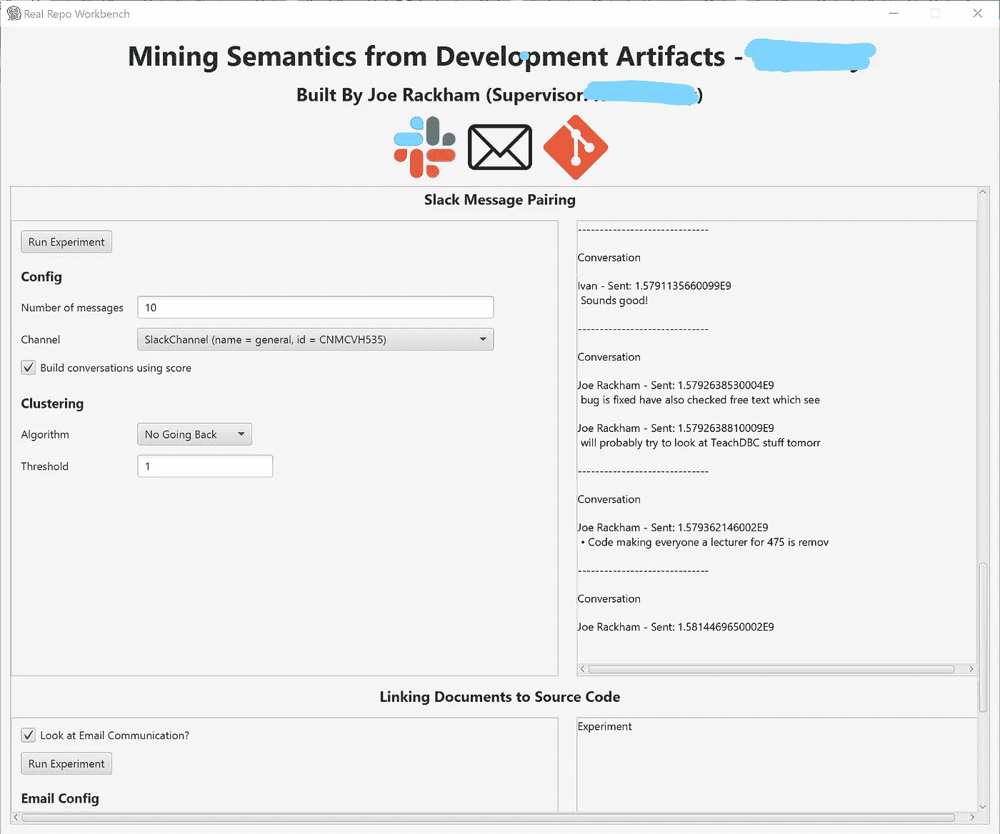
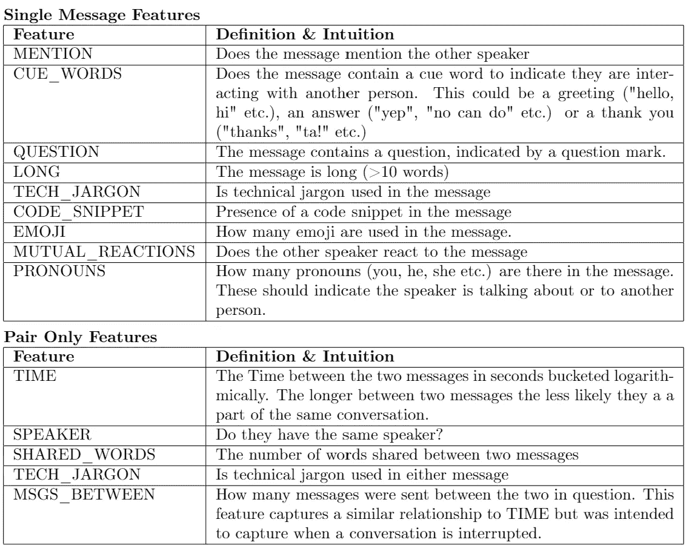
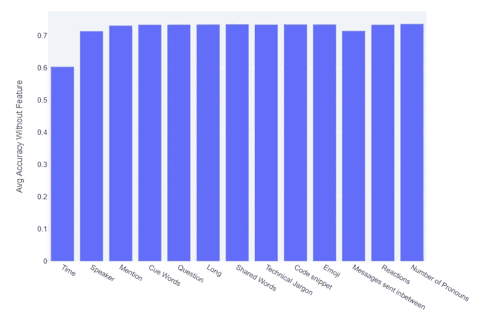
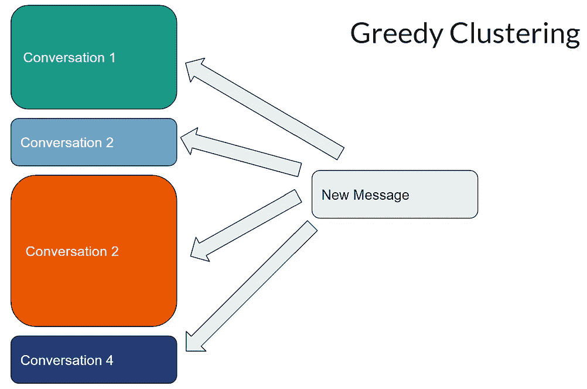
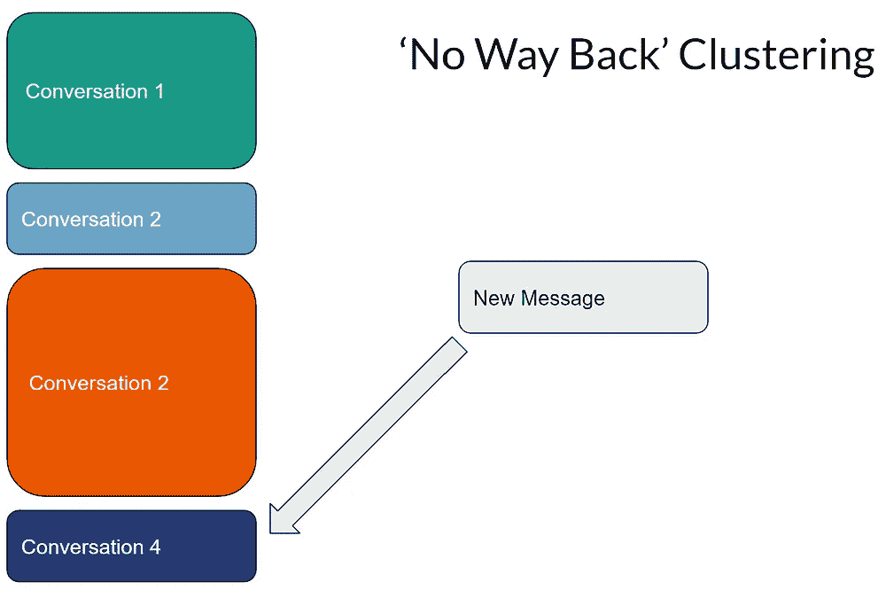

# 用逻辑回归模型拉开松散的对话

> 原文：<https://blog.devgenius.io/pulling-apart-slack-conversations-with-a-logistic-regression-model-c282d247161?source=collection_archive---------3----------------------->

## 你能分辨出谁在和谁说话吗？

在 [Unsplash](https://unsplash.com?utm_source=medium&utm_medium=referral) 上由 [Austin Distel](https://unsplash.com/@austindistel?utm_source=medium&utm_medium=referral) 拍摄的照片

在一个松弛信道中，多个不同的会话可能会相互重叠。虽然对于人类读者来说，将它们分开通常很简单，但对于计算机来说，这可不是小事。这在自动分析来自 Slack 的文本的道路上设置了障碍。在本文中，我详细介绍了一些现有的方法，一些我自己提出的扩展，并讨论了使用这两种方法所取得的结果。

埃尔斯纳和查尔尼亚克在他们 2008 年的论文[“你在和我说话吗？会话解缠的语料库和算法"](https://aclanthology.org/P08-1095/)。逻辑回归模型根据从成对消息中提取的一组特征来训练，以确定它们是否来自同一对话。该功能集包括聊天特定的信息，如消息之间经过的时间，以及与语言内容相关的信息(一条消息包含一个问题吗？一个是问候吗？).

在 2019 年的论文[“slack Q 的探索性研究& A chats 作为软件工程工具的挖掘源”](https://dl.acm.org/doi/10.1109/MSR.2019.00075)中，这种方法被扩展为专门针对 Slack。Chatterjee 等人扩展了功能集，以反映在 Slack 中使用表情符号、反应和代码存根的能力。作者使用了来自几个开放的软件开发主题 Slacks 的带注释的消息对的语料库，并报告了高水平的准确性。

当然，仅仅有一个模型来确定消息对是否属于一起是不够的；需要使用这种模型将渠道划分为不同的对话。寻找最佳的整体分区是一个 NP 问题，所以两组作者都求助于简单的贪婪搜索。

实验'工作台'

我想看看这些方法对我自己有什么效果，也想看看我是否能做得更好。为了方便我的实验，我用 TornadoFx 编写了一个带有前端“工作台”的 Kotlin 应用程序。可用特性集包括两篇论文中的所有特性以及我自己添加的一些特性。背景文献中的几个特征组合了对每个消息独立计算的结果(例如，任一消息是否包含问题)。在工作台中，我还展示了在可能的情况下将这些作为两个独立的特性来处理的选项。

我最初使用与 Chatterjee 等人相同的数据集来评估该模型。几种特征配置生成的模型达到了 90%以上的准确性。最佳配置是使用特征[时间、演讲者、提及、提示词、长词、共享词、代码剪辑、MSGS 插入、反应]，而不是拆分消息特征。这实现了 91.8%的准确度。不出所料，最有用的特征是两条消息之间的时间间隔。然而，在背景文献中讨论过，在不同的工作空间之间，谈话之间的平均时间是最易变的特征之一。如果时间不是可用的特征，那么通过特征[说话者、提及、问题、MSGS _ 中间、反应]也没有被分离，获得的最佳准确度是 71.4%。点击此处可获得一个交互式仪表盘来进一步了解这些结果[。](https://message-dissentangle.herokuapp.com/)

特定功能关闭时达到的平均精确度

为了将消息聚集到不同的对话中，工作台提供了一系列选项。可以使用来自 LR 模型的二进制分类输出或实数输出来构建聚类。除了贪婪方法之外，还可以使用一种我称之为“无法返回聚类”的方法来对会话进行聚类，在这种方法中，新消息只能加入之前的会话。

为了正确地评估这个输出，我将这些方法用于我在大学时参与的几个项目。这有一个额外的好处，让我看到这些方法是如何公平对待小的封闭式宽松裤，而不是更大的社区。配对消息时的高准确度并不十分普遍，但是在我手工注释的消息子集上，最好的模型仍然达到了 68%的准确度。

我形成对话的初始配置是使用带有贪婪聚类的二进制类输出。这导致了许多过长的对话，因为一个错误的预测会将两个不相关的对话融合在一起。使用“无路可退”聚类，并在出现不合适的消息时放弃聚类，性能会更好。很少出现过大的集群，只有少数情况下会话被分成多个集群。最好的输出来自于使用“无路可退”聚类和模型的实数输出，这里低价值的正面预测可能会被忽略，这在很大程度上解决了过大聚类的问题。有一些对话被分成几个部分，但这被认为比把不相关的内容分组更好。

这些项目和模型被训练的开源项目之间的一个区别是参与者的数量。在较大的宽松裤中，不同的对话几乎总是由不同的人进行，并且是重叠的。在参与者较少的情况下，更多的是确定来自同一个人的两条消息是否是关于不同主题的问题。

## 讨论

许多自然语言技术要求以不同文档的形式提供文本。因此，松弛的本质和内部更有机的对话流对有效的分析提出了挑战。然而，正如我们刚刚看到的，像逻辑回归分类这样的机器学习方法在处理这个问题上可以取得一定的成功。

未来工作的一个有趣方向是看看替代模型是否更适合这项任务，或者是否可以从 WhatsApp 团体或 Discord 服务器上获得类似的结果。

乔·拉克姆，2021