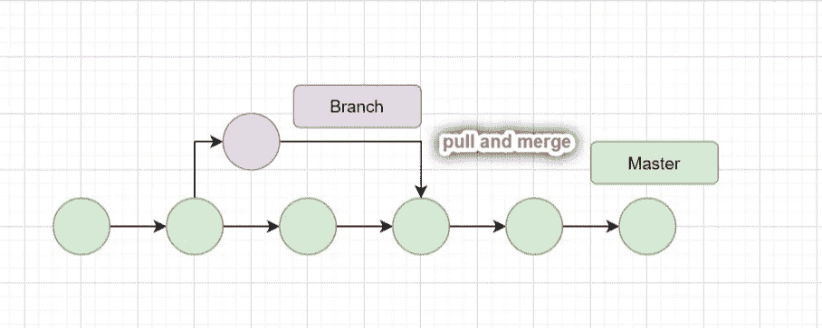
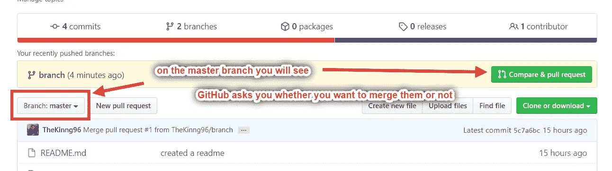
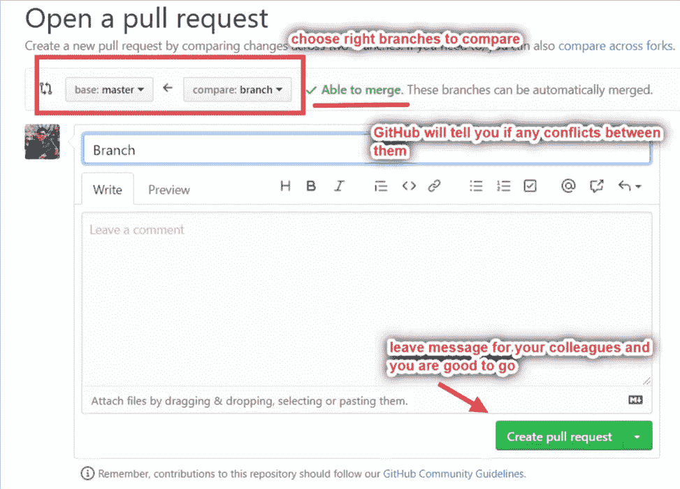
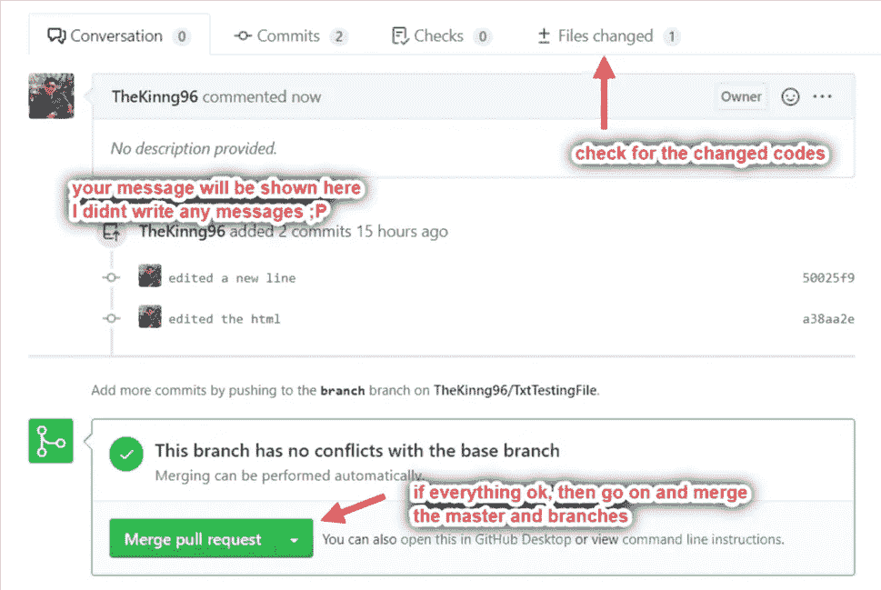
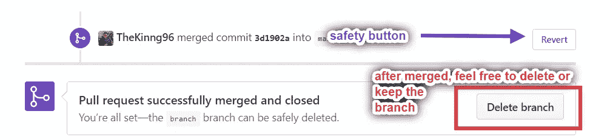

# 拉动 Git

> 原文：<https://blog.devgenius.io/pulling-on-git-327e6aaafc88?source=collection_archive---------42----------------------->

## GitHub 初学者指南

## 第 5 部分:提取、合并和提取请求

由 Kinng 创建

[在我们的第一个 GitHub repo 实践](https://medium.com/dev-genius/how-to-git-5ee5a325a8b5)中，我们使用`git push`用本地机器 Git 项目文件更新我们的 GitHub repo。本文将分享拉动如何在个人项目和团队项目中帮助编码人员。

# 拉动对单个项目有什么帮助？

对于大多数单独的项目，`git pull`总是不必要的，因为所有的文件都在同一台机器上。然而，有一个例外，人们可能有不止一台机器，要在不同的机器上继续编码同一个项目，`git pull`对保持本地文件最新是至关重要的。

此外，当您想要同步主分支和本地机器上不同文件夹上的分支时，您可以在同一台本地机器上使用`git pull`。我知道很难说那些例外。留下你如何在个人项目中使用`git pull`的评论。

# 那么 Git 如何在团队项目中提供帮助呢？

假设有两个程序员，*你和 John* ，他们正在进行同一个项目，很可能在不同的机器上工作。约翰告诉你，他昨晚已经更新了一些代码到主分支机构，他要求你完成项目的另一部分。

为了让您的本地机器项目保持最新，您需要`git pull`GitHub repo 上的主分支，并将您的代码添加到一个新分支中。

 [## GitHub 上的 Branch 是什么？

### 您现在必须熟悉基本的 Git。本文将介绍 Git 上的分支以及如何将它与您的…

medium.com](https://medium.com/dev-genius/what-is-branch-on-github-d3fea06e1702) 

# 为分支机构完成编码后，我们需要做什么？

通过简单的一个`git push`推到分支，记住通过`git status`检查你是在主节点还是分支节点。转到 GitHub repo，在 branch 部分留言，让 John 知道您做了哪些更改，并请求*拉取请求*。Pull-request 类似于 merge，但是我们只能合并自己拥有的分支，pull-request 就是要求别人将你创建的分支合并到他们的 masters 上。

# 示例会话:

我已经将 HTML 文件编辑为我的分支中的一个分支，我将向您展示如何在 GitHub repo 页面上进行拉取、合并和拉取请求(对于想在终端上进行拉取请求的朋友: [doc](https://git-scm.com/docs/git-request-pull) )。[不知道分支和主控如何切换？](https://medium.com/dev-genius/what-is-branch-on-github-d3fea06e1702)

## 在 GitHub repo 页面上:

您应该看到一个弹出窗口，告诉您检测到了一个分支，并询问您是进行合并还是什么都不做。

## 如果您想要合并:

单击按钮后，您应该会看到下面的内容。最重要的是看 GitHub 有没有给你发冲突的消息。如果是的话，不要担心，它会突出显示变化并询问您的意见。

## 成功合并后:

您可以决定是删除分支还是保留分支。此外，如果你后悔这样做，请随时点击恢复按钮。

## 感谢您的阅读！！！GitHub 是程序员分享和存储代码的平台之一。您现在能够处理编码之旅中的大多数情况。如果你想精通 Git，你可能需要继续阅读文档，但是我个人认为只要了解 80%就足够了，以防你面临更深层次的问题。

## 如果你熟悉 GitHub，我相信你很快就能处理 BitBucket。祝你旅途愉快，再见。