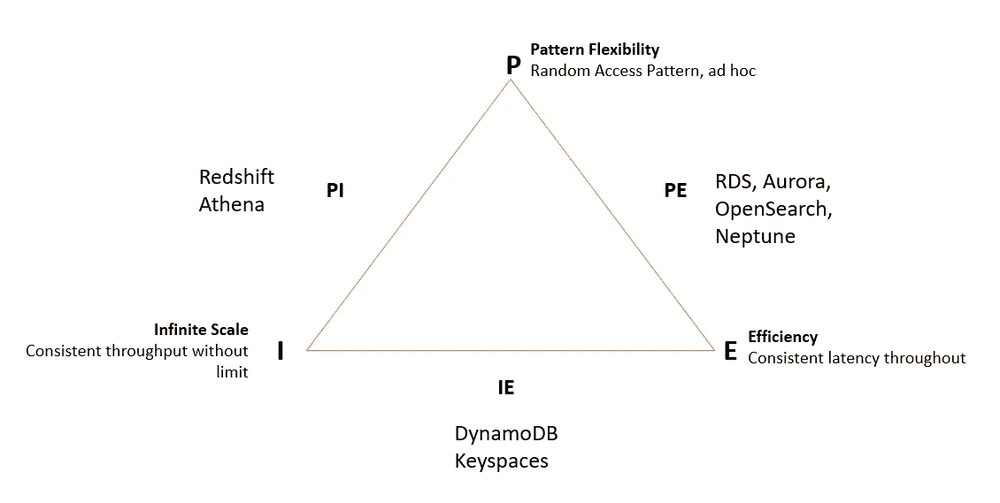

# AWS 上的专用数据库

> 原文：<https://blog.devgenius.io/purpose-built-databases-on-aws-7a384f868fd?source=collection_archive---------19----------------------->

维多利亚诺·伊斯基耶多在 [Unsplash](https://unsplash.com/s/photos/choice?utm_source=unsplash&utm_medium=referral&utm_content=creditCopyText) 上的照片

为您的工作负载选择合适的数据库

AWS 提供 15 种以上不同的数据存储选项，每一种都是专门构建的，适用于一系列使用案例。知道选择哪一个有助于我们建立长期的数据库解决方案。在决定合适的数据库时，我们应该考虑以下因素:

*   **数据类型** —结构化与非结构化
*   **用例** —实时、延迟&吞吐量、并发
*   **工作负载类型** —事务型与运营型与分析型与缓存型，读取密集型还是写入密集型
*   **数据访问模式** —通过关键字或其他属性、模糊、特定查询进行检索
*   **一致性** —最终与强大
*   **可扩展性需求** —数据增长率、平均对象大小和最大对象大小。
*   **数据持久性**
*   **当前团队在数据库管理方面的技能**
*   **DB 运营成本**
*   **安全性&可持续性**

# AWS 中的数据库产品

## 有关系的

当预先知道模式时，关系数据库通常是起点。关系数据库有两类。

## **交易/运营数据**

ACID 和参照完整性

> RDS —专有/成熟的数据库引擎
> Aurora —一致的数据库流量
> Aurora 无服务器—按需使用&数据 API (v1)

如果你的流量在一天中或多或少是一致的(像一个天气预报公司)，那么选择极光是有意义的。另一方面，如果您的工作负载突然激增，而在其他时间(食品交付应用程序)使用率中等或较低，那么选择 Aurora 无服务器是有意义的。如果您有 MySQL 和 Postgres 之外的许可证或引擎，或者您想要对数据库进行完全配置控制，那么 RDS 将是正确的选择。

*注意:Aurora 无服务器不需要任何容量预配置。此外，它提供了基于 HTTP 的数据 API，这意味着没有持久连接。但出于某种原因，他们删除了 v2 中的 API。*

## **分析型**

柱状、MPP 和 Pb 级

> 红移

Redshift 是一个面向列的 MPP 数据库。它将存储和计算系统分开，允许分别横向扩展计算和存储基础架构。在雪花发布之前，它最初是最受欢迎的云数据仓库。现在在功能上已经快赶上雪花了。

## 关键字值

用户搜索历史、产品目录、购物车和超个性化

> DynamoDB

DynamoDB 几乎可以在任何规模下提供一位数的毫秒级性能。

## 文件

内容管理、游戏用户档案、目录管理

> 文档数据库

Document DB 提供了 MongoDB APIs 的子集。

## 在记忆中

内存数据库将数据存储在计算机的随机存取存储器(RAM)上，而不是将其写入硬盘，如 HDD 或 SSD。由于对 RAM 的访问速度更快，它通常用于缓存。其他用例包括存储会话状态和排行榜。

> 弹性缓存
> MemoryDB (Redis)

Memory DB 支持复杂的数据结构，并提供现成的事务、复制和快照。

## 图表

社交网络、推荐、身份和知识图表以及高度关联的数据集

> 海王星

Neptune 是一个图形数据库，经过优化，可以存储数十亿条关系，并支持超快速查询。

## 时间序列

按时间排序的数据、运营指标收集、物联网和事件跟踪

> 时间流

Amazon Timestream 提供自我管理的汇总、保留、分层和数据压缩，以节省成本并提高效率。

## 宽栏

基于查询模式设计表模式。巨大的规模。没有连接。

> 密钥空间

它每秒可以处理数千个请求，吞吐量和存储几乎不受限制。它支持 CQL API 的子集。

## 搜索

基于文本的搜索

> OpenSearch

它提供了全文查询、自动完成、滚动搜索、可定制的评分和排名、ML 和 OpenTelemetry 集成以及异步搜索。

## 分类帐

不可变且可验证的历史、记录系统、供应链

> QLDB

QLDB 使用不可变的日志来跟踪表中的变化。这些期刊被编入索引以便快速查询。

AWS 还提供其他一些不属于数据库的查询服务。它们将存储和查询分开。这些服务为我们提供了一种使用 SQL 进行分析的方法。

> AWS Athena(由 Presto 提供动力)，
> 红移光谱
> Kinesis Analytics(由 Flink 提供动力)。

快乐阅读！！