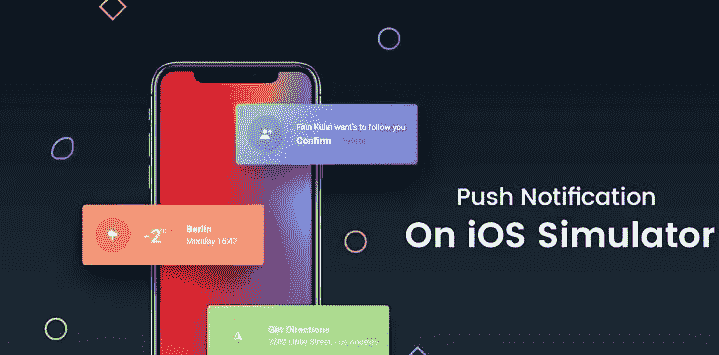

# 模拟器中的推送通知

> 原文：<https://blog.devgenius.io/push-notification-in-simulator-2528106cef03?source=collection_archive---------0----------------------->

推送通知是最受欢迎的方式之一 [**iOS 应用开发者**](https://www.rlogical.com/hire-dedicated-developers/hire-mobile-app-developer/) 让用户参与他们的应用。在 iOS 应用中，可以通过使用苹果**推送通知服务(APNs)来整合推送通知。**

然而，这并不像听起来那么简单，因为设置它需要做很多事情。另外，更糟糕的是，我们必须使用一个真实的设备来测试推送通知是否有效，因为推送通知在 **Xcode 的 iOS 模拟器中不被支持。**

但是现在 Xcode 11.4 测试版出来了，这个版本最好的部分是我们终于可以在 iOS 模拟器中测试推送通知了！

**我们是如何做到的？**

那么，现在，让我们我们怎么做呢？那么，现在，让我们看看如何使用 Xcode 11.4 beta 的这个新特性。为此，您显然需要 Xcode 11.4 beta 或更高版本。我目前有 Xcode 11.4 测试版。

现在，让我们创建一个新项目&命名为 Test Push Notifications，并选择用户界面作为 Storyboard。如果你愿意，你可以选择 **SwiftUI** 。只是为了让应用程序看起来更好(尽管它不会有什么帮助……)，我添加了一个 **UILabel** ，上面写着“ **Hello，world！”**在 **Main.storyboard** 的视图控制器中。我们可以使用 Xcode 11.4 beta 的这个新特性。为此，您显然需要 Xcode 11.4 beta 或更高版本。我目前有 Xcode 11.4 测试版。

现在，让我们创建一个新项目&将其命名为 **TestPushNotifications** ，并选择用户界面作为 Storyboard。如果你愿意，你可以选择 **SwiftUI** 。只是为了让应用程序看起来更好(尽管它不会有什么帮助……)，我添加了一个 **UILabel** ，上面写着“你好，世界！”在 **Main.storyboard** 视图控制器中。