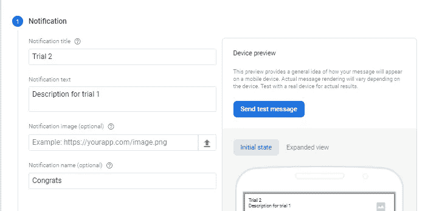
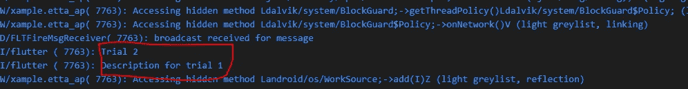
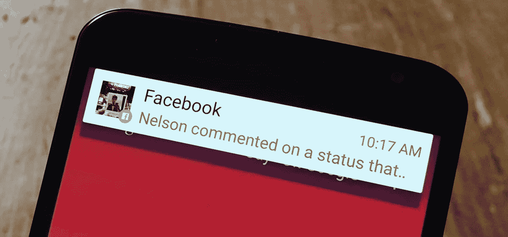
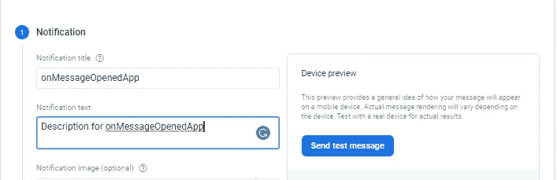
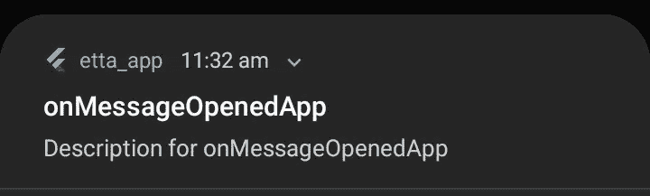
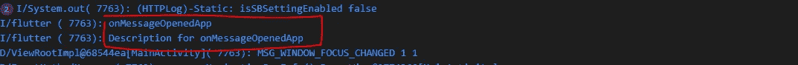
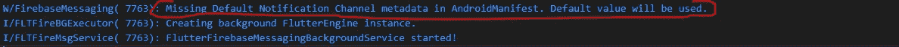
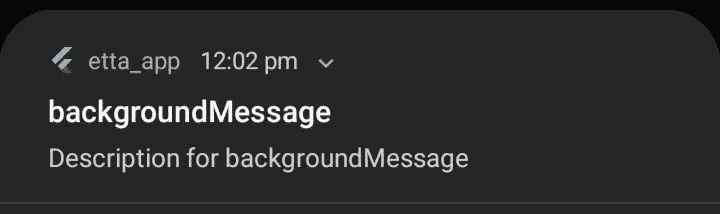
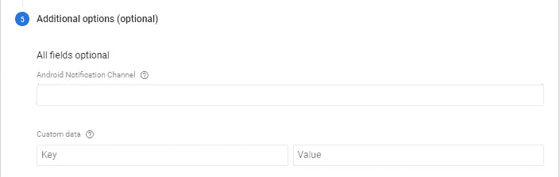
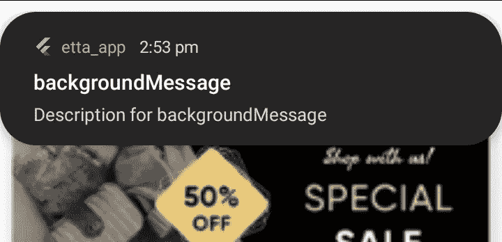

# android 上的推送通知

> 原文：<https://blog.devgenius.io/push-notifications-on-android-bff3cbe095c7?source=collection_archive---------4----------------------->


推送通知有点难以理解，尤其是如果你是初学者的话。在本帖中，我们将通过每一个步骤来访问我们在应用程序中收到的通知，所以请继续关注我。

首先，你需要建立一个 firebase 项目。将生成的 **google_services.json** 文件复制到 **android/app** 目录下，就可以按照下面的步骤进行了。

**main.dart** 小部件如下图所示。

我们将编写**回调(流)**，这将使我们对 initState 中的通知有更多的控制。

```
void main() async {
  WidgetsFlutterBinding.ensureInitialized();
  await Firebase.initializeApp();runApp(const MyApp());
}

class MyApp extends StatefulWidget {
  const MyApp({Key? key}) : super(key: key);[@override](http://twitter.com/override)
  State<MyApp> createState() => _MyAppState();
}class _MyAppState extends State<MyApp> {
  [@override](http://twitter.com/override)
  void initState() {
    super.initState();
     /// the code goes here
  }[@override](http://twitter.com/override)
  Widget build(BuildContext context) {
    return MaterialApp(
      title: 'Etta : Test your chance',
      debugShowCheckedModeBanner: false,
      theme: theme(),
      initialRoute: SplashScreen.routeName,
      routes: routes,
    );
  }
}
```

我们将要看到的第一个回调/流是 **onMessage** 流。

**onMessage** 流是 **RemoteMessage** 的流。基本上所有回调都是 **RemoteMessage** 的流。

RemoteMessage 是我们正在接收的全部消息。它可能包含其他数据或仅包含通知。

```
FirebaseMessaging.onMessage.listen((message) {
      print(message.notification?.title);
      print(message.notification?.body);
});
```

在这里，我们可以获得发送的消息。

当应用程序在前台时， **onMessage** 流将**仅**工作。

在尝试从 firebase 发送消息之前，继续在 onMessage 回调之前添加这一行。我们稍后将回到这个问题。

```
FirebaseMessaging.instance.getInitialMessage();
```

重启应用程序，并从 firebase **云消息服务**控制台发送通知，同时将应用程序保留在后台。



过了一会儿，我们收到通知，消息被打印出来。



这里需要注意的一点是，firebase 在默认情况下从不显示通知。发送的消息既不会出现在系统托盘上，也不会显示为抬头通知。

平视通知是那些显示在屏幕上的通知。



重要的是我们在 **onMessage** 流中获取消息。我们稍后将解决这个问题。

现在让我们看看 onMessageOpenedApp 流。

当我们在系统托盘上点击通知，想要做一些事情时，就会用到这个流。

为了使这个回调起作用，应用程序必须处于暂停状态，或者换句话说，最小化。它不应该被终止！

```
FirebaseMessaging.onMessageOpenedApp.listen((message) {
      print(message.notification?.title);
      print(message.notification?.body);
});
```

重新启动应用程序后，将其最小化，并从 firebase 发送通知。



通知出现在系统托盘上。



如果您单击通知，它将按预期打印到控制台。



需要记住的一点是调试控制台中的这个警告。我们稍后将回到这个问题。



app 终止的时候呢？

对于这种情况，正如您所猜测的，我们有另一个流。

我们不是在 initState 中注册这个流，而是在最开始的时候注册。

回调需要一个返回类型为 **future < void >** 的处理程序，并将 **RemoteMessage** 作为参数。

还有一点，这个处理程序应该是一个顶级函数。这意味着函数不能在任何类中。应该在一切的范围之外。这是因为后台消息处理程序在它自己的隔离(线程)中工作。它在应用程序范围之外工作。

```
Future<void> backgroundMessageHandler(RemoteMessage message) async {
  print(message.notification!.title);
  print(message.notification!.body);
}void main() async {
  WidgetsFlutterBinding.ensureInitialized();
  await Firebase.initializeApp();
  FirebaseMessaging.onBackgroundMessage(backgroundMessageHandler);
  runApp(const MyApp());
}
```

再次运行应用程序，使代码生效并终止它，然后从 firebase 发送通知。



当然，我们在终端上看不到日志，因为应用程序被终止了。但是，举例来说，我们可以在消息中发送数据，当通知被点击时，让应用程序做许多事情作为响应。

我们有另一个回调只是为了那种情况。我们一开始写的那个。 **getInitialMessage** 回调。

这个回调给你用户点击的消息，它也从终止状态打开应用程序。当它返回一个非空的东西时，这意味着用户点击了一个通知，它从终止状态打开了应用程序。

```
FirebaseMessaging.instance.getInitialMessage().then((message) {
  if (message != null) {
    // you have control over the message
  }
});
```

如果应用程序在未终止时收到通知，它将调用 **getInitialMessage** ，但是消息为空，因此检查消息是否为空是有用的。

就是这样！我们已经讨论了 firebase 消息中的所有回调/流。但是我们仍然有两个问题(让我们称之为问题)。

*   在后台时，通知仅显示在系统托盘上。我们没有收到任何提醒通知。我们可以通过 firebase 上的一些配置来解决这个问题。
*   而在前景中，它甚至没有给我们任何东西。

第一个原因是因为我们没有设置默认的通知通道。如果你还记得，当我们在后台发送通知时，我们一直收到这个警告。


为了解决这个问题，我们首先需要将这一行添加到 **android/app/src/main** 目录中的 **AndroifManifest.xml** 文件中。

```
<meta-data android:name="com.google.firebase.messaging.default_notification_channel_id" 
android:value="etta_channel"
/>
```

android 8 之后，指定频道 id 变得很有必要。因为它是你的应用程序通知的身份。

我们还可以在发送通知时将通知通道作为目标。



如果您现在尝试发送通知，它仍不会显示为提醒通知。我们仍然需要创建我们在 AndroidManifest.xml 文件中指定的通道。

为了创建一个通知通道，我们将使用一个名为[flutter _ local _ notifications](https://pub.dev/packages/flutter_local_notifications)的包。

创建一个名为 services 的文件夹，并在其中创建一个**local _ notification . dart**文件，我们将在其中编写创建通知通道的代码。

将下面的代码复制并粘贴到您的**local _ notification _ service**文件中。

然后我们在**主**函数中调用 initialize。

```
void main() async {
  WidgetsFlutterBinding.ensureInitialized();
  LocalNotificationService.initialize();
  await Firebase.initializeApp();
  FirebaseMessaging.onBackgroundMessage(backgroundMessageHandler);
  runApp(const MyApp());
}
```

第二件要做的事情是，如果你想在前台显示一个通知。在 **onMessage** 回调中调用 **display** 方法。

```
FirebaseMessaging.onMessage.listen((message) {
  LocalNotificationService.displayNotification(message);
});
```

这将允许我们在应用程序处于前台时获得抬头通知。



你不需要设置另一个东西。因为显示方法会自动创建一个通知通道，所以我们现在也可以在应用程序处于后台时接收到抬头通知。就是这样。我们解决了这两个问题。

感谢您的阅读。喜欢并分享更多。