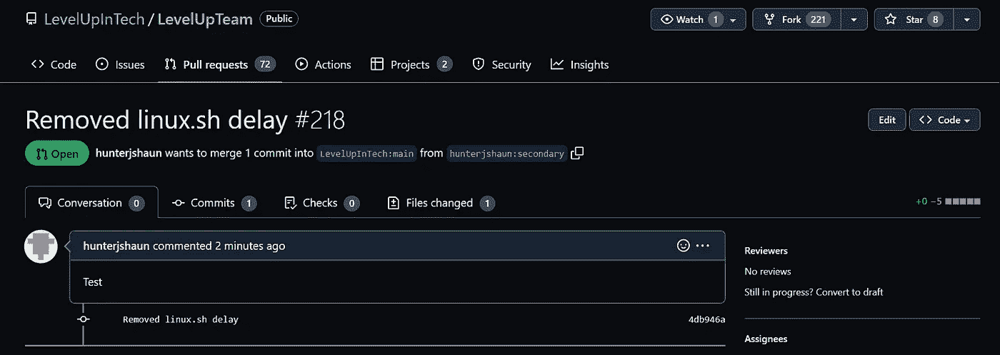

# 使用 GIT 和 GitHub 进行推、拉和合并

> 原文：<https://blog.devgenius.io/push-pull-and-merge-with-git-and-github-926067878f03?source=collection_archive---------9----------------------->


# 概观

今天我们将使用 Git 和 GitHub。Git 是一个免费的开源版本控制库系统。该系统是轻量级的，易于使用，允许用户创建、合并和删除他们正在工作的项目或任务的“分支”或迭代。通过扩展，GitHub 允许用户在线托管和管理他们的 Git 存储库。

# 方案

在技术团队报告中，您的任务是从您的级别编辑和更改代码。在做出更改之后，团队希望在将代码投入生产之前对其进行手动检查。

目标:

*   在科技仓库 [**这里**](https://github.com/LevelUpInTech/LevelUpTeam) 分等级
*   将分叉的 repo 克隆到您的 Linux 系统
*   使用 Vim，对存储库目录中的 linux.sh 文件进行修改
*   保存文件并添加到您的本地存储库中，然后提交文件
*   将文件推回到您自己的 GitHub repo 中
*   发送拉式请求，以便与技术生产报告中的上级合并

# 先决条件

*   [GitHub 账户](https://docs.github.com/en/get-started/signing-up-for-github/signing-up-for-a-new-github-account)
*   熟悉 Linux(我们将使用 CentOS 8)
*   拥有 sudo 权限的用户
*   访问互联网

# 内务工作

我们还需要在 Linux 系统上安装 Git，并创建一个 [GitHub 个人访问令牌](https://docs.github.com/en/authentication/keeping-your-account-and-data-secure/creating-a-personal-access-token)。这个访问令牌是为了将本地存储库上的更改推送到 GitHub。

*   [创建个人访问令牌](https://youtu.be/g83-Px2MulE)

> 一旦你有了一个令牌，把它保存在一个安全的地方，当你在 HTTPS 上执行 Git 操作时，你可以输入它来代替你的密码。

## 安装 Git

我们可以运行`sudo yum update`来更新我们的系统，然后运行`sudo yum install git`在我们的系统上安装 Git。

我们将使用以下命令来配置我们的用户名和电子邮件，这些命令将用于跟踪谁对存储库进行了更改，并且不用于登录。配置`core.editor`将允许我们为存储库设置一个默认的文本编辑器。在这种情况下，我们将使用 Vim。

```
git config --global user.email “Your E-mail"git config --global [user.name](http://user.name) “Your Username”git config --global core.editor “vim”git config -l 
```


使用 git config -l 来确认我们的设置

# 步骤 1:派生存储库

我们首先需要将技术库中的这个[级别分支到我们自己的 GitHub 帐户，这样我们就可以对库进行更改。](https://github.com/LevelUpInTech/LevelUpTeam)


导航到 LevelUpTeam 存储库并单击 fork 将其添加到 GitHub repo 列表中


使用右上角的下拉菜单导航到您的 repos。您应该看到它被成功地分叉了

# 第二步:克隆分叉回购

接下来，我们将使用`git clone`命令并利用分叉回购的 URL，将分叉回购克隆到我们的 Linux 系统中。这将在您的当前位置创建一个目录。

`git clone https://github.com/YOUR USERNAME HERE/LevelUpTeam.git`


该命令将创建 LevelUpTeam 目录[分叉 repo 的名称]。这将作为您的 git 存储库，并放在您当前的工作目录中。

# 步骤 3:使用 Vim 修改 linux.sh 文件

我们可以使用`cd LevelUpTeam`将文件移动到 **linux.sh** 所在的 LevelUpTeam 存储库中。

进入 LevelUpTeam 目录后，我们可以使用以下命令打开并编辑 linux.sh 文件。

`vim linux.sh`


在目前的形式下，linux.sh 内置了多个延迟[睡眠命令]。假设我们想修改脚本，使它运行得更快一些，命令一个接一个地执行，没有延迟。我们可以通过使用箭头键将光标放在包含睡眠命令的每一行的开头并按下`dd`来删除睡眠命令。


一旦我们对我们的更改感到满意，我们将输入`:wq`保存并退出文件。

# 步骤 4:添加并提交我们的更改

我们现在需要将我们的更改添加到临时区域。这是 Git 跟踪我们想要提交的更改的地方。使用以下命令添加要跟踪的 linux.sh。

`git add linux.sh`

我们可以使用`git status`来查看我们在暂存区中等待的所有更改，并确认我们的文件已被添加。


现在，我们可以使用下面的命令提交我们已经暂存的所有更改，并让它们反映在我们的存储库中。

`git commit -m “Your commit message here”`

> -m 用于设置 git 所需的提交消息。提交消息用于帮助识别对存储库做了什么更改，这在项目协作时特别有用。


git 日志

使用`git log`命令可以按时间顺序查看提交列表。我们可以在这里看到我们的提交消息，以及关于我们将变更提交到哪个“分支”的信息(由 head 指针表示)。我们已经将我们的变更提交到存储库的主要分支。然而，我们可以轻松地创建并提交一个“测试”分支，以确保我们的文件更改在与主文件合并之前有效地工作。

> 您还可以提交和推送单独的分支。

# 步骤 5:将我们的变更推送到分叉的存储库中

我们现在将推送我们在 Linux 系统上所做的更改，以更新我们 GitHub 帐户中的在线存储库。我们可以使用下面的命令来做到这一点。您将被要求输入您的 GitHub 用户名和密码。

`git push -u origin main`

**Origin** 仅仅是对我们克隆的远程存储库的 URL 的引用，而 **main** 用于引用我们想要推送的分支。


使用您的个人访问令牌作为密码


我们可以看到，我们的承诺反映在我们的分叉回购中

# 步骤 6:发送拉取请求

现在让我们说，我们认为我们对脚本所做的更改将极大地有利于升级团队。我们现在可以发送一个“拉取请求”。这将作为一个请求，在我们分叉的存储库上实现对主级别团队 repo 的更改。

> [跟随创建您的拉动式请求。](https://youtu.be/NUOfH0vzaYw)

*   首先导航到我们分叉的 LevelUpTeam 回购。
*   选择提取请求，然后选择新提取请求
*   选择创建拉式请求
*   然后，您将被带到一个屏幕，添加标题并为您的请求留下评论。当协作或处理具有多个请求的项目时，最好提供足够的文档。

您现在可以查看您的请求，并等待上级团队是否批准将您的更改与主回购合并。



> 我们现在已经从头到尾实现了 Git 和 GitHub 版本控制。虽然这是一个相对简单的用例，但是在许多不同类型的项目中，版本控制和协作的可能性是无穷无尽的。

[1]: Git About。

[https://git-scm.com/](https://git-scm.com/about)