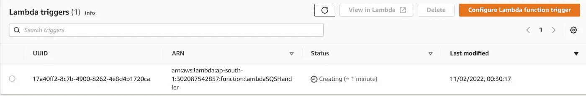
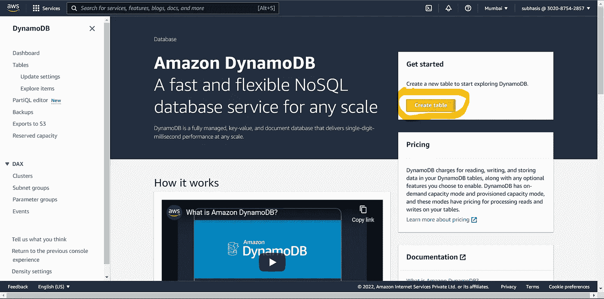

# 从亚马逊 SQS 向 DynamoDB 推送消息

> 原文：<https://blog.devgenius.io/pushing-messages-from-amazon-sqs-to-dynamodb-bf1c1fa5c2c3?source=collection_archive---------1----------------------->

亚马逊 SQS 是最受欢迎的托管消息队列服务之一。它用于分离组件，并在大型应用程序中实现异步流程。一些用例包括高吞吐量、系统到系统的消息传递、缓冲和批处理作业、请求卸载、收集应用程序日志和指标、触发 SMS/电子邮件服务、收集元数据等。SQS 与 Lambda 和 DynamoDB 等工具相结合，形成了一个强大的框架，可以轻松应对与此类操作相关的挑战。

在本文中，我将演示使用 AWS Lambda 从 SQS 异步收集数据并将其存储到 DynamoDB 的过程。这种设置在许多情况下都很有用，例如，在从电子商务网站到流媒体平台的各种应用程序中收集和存储元数据。

让我们假设一个应用程序想要收集用户的设备和位置信息作为元数据，并将其存储在 dynamoDB 表中。让我们先来看看系统的整体架构:

系统结构

这是一个实现起来相当简单的系统。主应用程序将消息推入消息队列(SQS)。队列反过来触发一个 lambda 函数，并将收到的消息作为有效负载发送出去。lambda 函数可以包含对接收到的数据执行各种操作的代码。在这种情况下，它将数据保存到 DynamoDB 表中，并将一些信息记录到 Cloudwatch 中。为了简单起见，我们将使用 AWS 控制台将消息推送到 SQS，而不是一个成熟的应用程序，因为它将服务于演示这个想法的目的。现在让我们来看一下这些步骤:

> **第一步:创建一个 SQS 队列**

1.  访问 SQS [控制台](https://console.aws.amazon.com/sqs/v2/home)，点击**开始**下的**创建队列**:

单击突出显示的按钮

2.选择队列'**类型**作为'**标准**，**输入队列名称**。为了简单起见，保留其他选项的默认设置。滚动到页面底部，点击'**创建队列'**，如下所示:

3.创建队列后，您将被重定向到队列的详细信息页面。这个控制台有许多选项，可以用来管理队列的所有方面。然而，我们只关心发送消息。点击'**发送和接收信息'**按钮(右二) :

4.在“**发送消息”**部分，在“**消息正文”**文本框中输入一条消息，然后点击“**发送消息**”按钮，如图所示:

要作为消息发送到队列中的字符串化 JSON 有效负载

5.要查看队列中已发送的消息，请向下滚动到“**接收消息”**部分，然后单击“**轮询消息”。**这将开始轮询队列，获取的消息显示在此部分:

单击突出显示的按钮

开始显示消息—单击 ID

单击 ID 时显示的消息详细信息

在这个阶段，我们有一个功能性队列，可以向它推送消息，也可以从它那里轮询消息。消息的内容可在消息对象的' *body'* 属性下获得。在这里，我们可以找到所需的 JSON 格式的有效载荷。下一步是创建一个 lambda 函数，它最终会被上面的队列触发。

> **第二步:创建 Lambda 函数**

1.  访问 [AWS Lambda 控制台](https://console.aws.amazon.com/lambda/home)并点击“**创建功能**”按钮:

单击突出显示的按钮

2.在创建功能页面中，从头选择'**作者**'。在基本详细信息下，输入函数名称。然后点击'**权限**部分下的'**更改默认执行角色**，如图所示:

3.选择“**从 AWS 策略模板**创建新角色”。输入角色名称和策略模板，如下所示:

**这些策略为 lambda 函数提供了轮询 SQS 和写入 dynamoDB 和 cloudwatch 的权限。**

4.保留其他选项的默认设置，并点击页面底部的“**创建功能**”。这将创建一个准系统 Node.js lambda 函数并在编辑器中显示它:

5.用以下代码覆盖编辑器的内容，然后单击' **Deploy** ':

`exports.handler = async (event) => {
console.log(event.Records); // array property has the messages from SQS
return;
};`

越过代码，然后单击“部署”

在这个阶段，我们有一个 lambda 函数准备接收来自 SQS 队列的消息并记录它们。可以在 Cloudwatch 中查看日志。下一步将是最重要的一步，我们将让 SQS 队列触发上面的 lambda 函数。

> **步骤三:将 lambda 触发器添加到 SQS 队列中【重要提示】**

1.  再次访问 SQS 控制台，单击之前创建的队列:

2.点击' **Lambda 触发器**，点击'**配置 Lambda 功能触发器**按钮。

3.在下拉列表中按名称搜索前面创建的 lambda 函数并选择它。点击'**保存**按钮。这将成功地将 lambda 触发器添加到 SQS 队列中:

4.现在，为了测试我们的设置，我们将向队列发送一条消息(如本文前面所示)。消息必须传递给 lambda 函数。

向队列发送消息

5.回到 lambda 控制台，点击'**监视器**'选项卡。然后点击“**查看 CloudWatch 中的日志**按钮。这将打开一个新标签页，并带您进入 CloudWatch。

6.在 CloudWatch 日志组页面中，您会发现一个日志流，记录了 lambda 函数的最新执行。点击查看日志:

7.消息对象的日志在下面突出显示。展开它以查看整个对象。我们发送的消息将出现在消息对象的“正文”字段中。

展开这个

在消息对象的“正文”字段中发送的消息

因此，在这个阶段，我们有一个功能设置，发送到 SQS 的消息被推送到 lambda 函数，该函数又将其记录到 CloudWatch。现在，对于拼图的最后一块，我们必须设置一个 DynamoDB 表，并编写一些代码将数据插入其中。

> **第四步:DynamoDB 设置和集成**

1.  转到 [DynamoDB 控制台](https://console.aws.amazon.com/dynamodbv2/home)并点击“**创建表格**”:

2.如下所示，提供一个表名和一个分区键。保留其他默认设置。滚动到页面底部，点击'**创建表格**'按钮:

向下滚动到底部

点击创建表格按钮

3.创建该表需要一些时间。同时，回到 Lambda 控制台。将以下代码粘贴到编辑器中，然后单击' **Deploy** '(就像我们之前做的一样) :

上面的代码解析从 SQS 收到的消息，并将其写入我们创建的 dynamoDB 表。它还将一些额外的信息记录到 CloudWatch，以防成功和错误。提供注释是为了更好地理解。*注意，我们不需要在 lambda 环境中安装 aws-sdk 依赖项，因为它是默认提供的*。

> **最终测试**

1.转到 SQS 控制台，发送以下消息:

`{“user_id":"user_1","device":"iPhoneX","location":"Kolkata"}`

2.现在访问 dynamo DB 控制台，单击您之前创建的表:

3.点击右边的‘E**xplore 表物品**按钮:

4.…..瞧啊。您可以在表格中看到一个条目，其中存储了所需的数据:

来自 SQS 的消息存储在 DynamoDB 中

我们的演示到此结束。我们可以将更多的消息推入队列，并得到以下结果:

此外，您可以查看 Cloudwatch 日志，了解那里记录的信息:

为放入 SQS 的所有后续消息显示的日志

感谢您通读。希望这对你有帮助😊