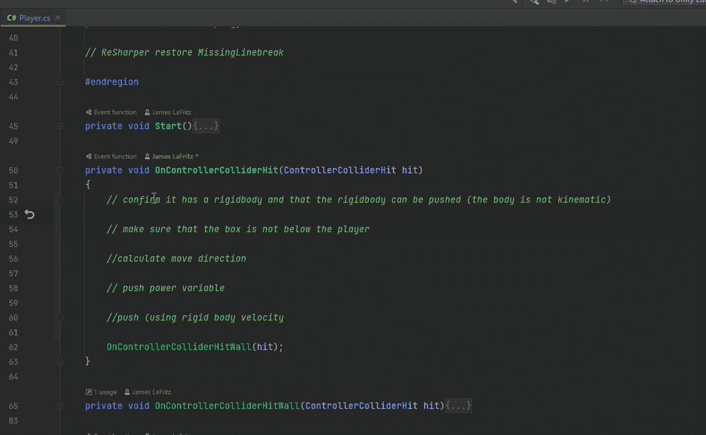

# 推动物体完成拼图

> 原文：<https://blog.devgenius.io/pushing-objects-in-unity-to-complete-puzzles-8181fd4a77d1?source=collection_archive---------1----------------------->

## 推动刚体并激活压力触发器。

我想实现的下一件事是增加在我的游戏中推动盒子来激活触发器的能力。

# 推动刚体

幸运的是，Unity 文档中有这样一个例子。

 [## 角色控制器。OnControllerColliderHit(控制器碰撞)

### 使用 UnityEngine 公共类示例:MonoBehaviour { //这个脚本将角色…

docs.unity3d.com](https://docs.unity3d.com/2021.1/Documentation/ScriptReference/CharacterController.OnControllerColliderHit.html) 

在这个例子中，他们使用刚体推动物体，确保他们没有推动物体下方的物体，而是在 X 和 Z 方向上移动物体。我只需要担心 X 轴。我要把它分解成我行为的步骤。我也要做一个单独的方法来处理刚体的推动。

我在我的场景中有一个可移动的盒子，没有什么特别的，它有刚体组件，位置冻结在 Z 轴上(所以它不会离开平台，Y 轴上的旋转也冻结了(以防止它在 Y 轴上旋转)，还有一个盒子碰撞器。然后我有了一个视觉上的孩子。子对象只是让我能够很容易地把它换成不同的视觉效果。

现在我已经设置了可移动的盒子，我可以用我的播放器来推动它。

如果没有刚体或者刚体是运动学的，我退出这个方法。

然后我确定我没有在我想要推动的物体上方。

我根据 x 轴上的移动方向计算移动方向。

然后我将刚体的速度设置为移动方向乘以推力。

现在这在行动。注意刚体约束的不同效果。如果我有一个更大的盒子要推，我可能会冻结 X 轴上的旋转

我也没有考虑物体的质量，当我推它的时候，我唯一能控制的方法就是通过阻力的大小。

因为我经常使用 hit.rigidbody，所以我决定缓存它。

我创建了一个变量来保存推力计算。我检查刚体质量是否大于 0，如果是，我用它来计算，如果不是，我用 0.1 来计算。我把它除以推力。然后我在计算中使用这个新变量。我也给玩家的推力增加了射程属性，防止它低于 0.1

推动不同质量的箱子。

看来我的数学退步了。我需要把推力除以质量。

现在我在推物体的时候，考虑了物体的质量。我也可以让我的性格变得更坚强。

# 激活压力垫

有几种不同的方式能够激活压力垫。一些游戏让玩家激活它，它被视为一个开关，一些游戏允许玩家在踩上它时激活它，在玩家离开它时停用它，要求玩家在游戏世界中找到一个物体按住它，其他游戏让它激活一个计时器，允许玩家以不同的方式与游戏世界互动。一些游戏通过它的重量来激活它。有些游戏综合了以上所有因素。不管压力垫是如何激活的，基本原理都差不多。

对于这个游戏，我得到的指示是，一旦可移动的盒子完全在上面，或者至少足够远，可移动的盒子应该停止移动，一些事件应该发生，就激活压力垫。

我缓存了我想要激活这个触发器的对象的标签字符串。如果一个激活对象进入了触发器，我也有一个 bool。

在 On Trigger Enter 方法中，我检查进入这个触发器的对象是否是激活对象，如果是，我将 bool 设置为 true。在 On Trigger Exit 方法中，我检查退出该触发器的对象是否是激活对象，如果是，我将 bool 设置为 false。在更新方法中，我检查是否有激活对象。如果不是，我退出这个方法。

我需要知道压力垫的位置。我确保在 Start 方法中缓存它。我还需要一个半径，因为我希望可移动的物体在接触之前大部分都在面板上。我还需要 activator 对象的转换，所以我在 On Trigger Enter 方法中得到它。我还在 On Trigger Exit 中将它设置为 null。在更新方法中，如果我有一个 activator 对象，那么我检查它在 X 轴上的位置，与压力垫的位置进行比较，如果它不在半径范围内，我退出该方法。我也可以使用 Vector3。这个平台的距离或光线投射。

在 Unity 中，我确保将可移动对象的标签设置为压力激活器。

如果 activator 对象足够近，我将 has activation 对象设置为 true，这样更新逻辑就不会运行下一帧。得到激活物体的刚体。如果它有一个，我设置运动学为真。我将激活器变换位置设置为压力垫的位置。我将激活器转换设置为空。

我创建了一个 Unity 事件，如果它不为空，我就调用它。

在 Unity 中，我设置了压力垫的激活事件来改变材质。

现在我创造了一个玩家无法通过的条件。

为了解决这个问题，我将激活的对象变换的旋转设置为相同。

现在我有一个工作压力垫。

