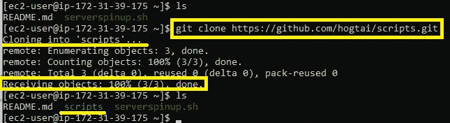

# 将您的远程脚本推送到 GitHub 供以后使用

> 原文：<https://blog.devgenius.io/pushing-your-remote-scripts-to-github-for-later-use-c11ee34e91aa?source=collection_archive---------3----------------------->

*如何通过六个简单易行的步骤将脚本从 AWS EC2 实例推送到 GitHub.com 存储库*


这里有一个想法:如果您正在为一个项目编写一个您认为可能对未来项目有用的脚本，会怎么样？为什么要重新发明“轮子”？通过 CLI 将 Git 和 GitHub 与存储在您本地机器上的工作结合起来，您可以轻松地获取这些脚本，将它们存储在云中，供您以后需要时下载。


在我向您展示如何操作之前，在我们开始之前，您需要对几个项目有一些基本的信心:

# **先决条件**

*   基本的 AWS 服务知识
*   具有正在运行的 EC2 实例的活动 AWS 帐户
*   熟悉 CLI 和基本 Linux 命令
*   基本的 BASH 脚本知识
*   对 Git 和指挥知识有基本的了解
*   具有创建的个人访问令牌(PAT)的 GitHub.com 帐户

# **步骤 1: SSH 到您的 EC2 实例中**

“xx-xxx-xx-xx”应该替换为 EC2 实例的实际公共 DNS。

```
ssh -i "My Web Server Key Pair.pem" ec2-user@ec2-xx-xxx-xx-xx.compute-1.amazonaws.com
```

# **步骤 2:在您的实例上安装 Git**

```
sudo yum install git
```


Git 安装确认

# **步骤 3:在 GitHub.com 上创建一个新的存储库**


我选择将这个存储库设为私有，因为它将包含私有脚本。您可以根据需要选择公共或私有。

# **步骤 4:将你的 GitHub 库克隆到你的实例中**

通过浏览器导航到您的存储库，单击绿色的“代码”按钮，HTTPS 子菜单，然后复制您要克隆的存储库的 HTTPS 位置:


现在回到您的 CLI，运行以下命令并插入您的 HTTPS 地址:

```
git clone https://github.com/<USERNAME>/<REPONAME>.git
```



成功的克隆应该是什么样子

# **步骤 5:使用 Git 添加、提交和推送命令**

我们需要告诉 git，我们希望它跟踪我们的脚本，暂存它并提交它，然后才能将它推回我们的 GitHub 存储库供以后访问。我不会在这里深入讨论这些命令是做什么的，但是如果你感兴趣，我写了一篇关于它的文章[在这里](https://medium.com/dev-genius/all-things-github-forking-cloning-pushing-pulling-d253bc71f5cf)你可以学到更多关于 Git 命令的知识。下面是将我们的脚本移回 GitHub.com 存储库的命令:

```
mv serverspinup.sh scripts/
git add serverspinup.sh
git commit serverspinup.sh
git commit -m "Spins up an Apache Web Server and Updates Automatically"
git push origin main
```

在运行 push 命令将本地 repo 更改移回 GitHub 后，您应该会看到一个类似如下的确认屏幕:


Git 要求您在浏览器中创建一个[‘个人访问令牌’](https://docs.github.com/en/authentication/keeping-your-account-and-data-secure/creating-a-personal-access-token)，以便远程访问 SSH。要了解更多，请访问我以前的文章[这里](https://medium.com/@tait.hoglund/remote-authentication-using-personal-access-tokens-on-github-com-e707646d2f8b)。

# **步骤 6:通过浏览器验证 GitHub 存储库上的结果**


我们可以看到，我们的临时凭证被成功推回到我们的 GitHub.com 回购协议中

我们已经成功地将一个脚本从本地实例转移到我们的 GitHub 存储库中，这意味着我们可以将这个脚本下载下来，并在需要时重用它，而不是将它放在本地实例中。

如果你觉得这些内容有帮助，我会很感激你的“关注”、“鼓掌”或评论。

我是否尽可能高效？在下面留下评论，让我知道。

直到下一次:前进！