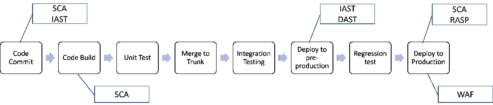

# 将 Sec 置于 DevSecOps 中

> 原文：<https://blog.devgenius.io/putting-the-sec-in-devsecops-3e4f33eb5cc8?source=collection_archive---------13----------------------->

## 引用

## *摘自* [*应用安全程序手册*](https://www.manning.com/books/application-security-program-handbook?utm_source=medium&utm_medium=organic&utm_campaign=book_fisher3_application_12_16_21) *出自费舍尔*

*本文讨论了安全性在开发运维流程中的位置，以及一些常见的方法。*

如果您想了解更多关于将安全性融入 DevOps 的信息，请阅读本书。

在[manning.com](https://www.manning.com/books/application-security-program-handbook?utm_source=medium&utm_medium=organic&utm_campaign=book_fisher3_application_12_16_21)结账时，在折扣代码框中输入 **fccfisher3** 即可享受 35%的折扣**。**

**软件开发和发布的历史情况是，有一个产品团队，一个开发团队，一个测试团队，和一个操作团队，他们都参与了向生产环境交付特性和产品。这通常是以这样一种方式完成的，即每个团队都有开始和完成他们那部分流程的关卡。DevOps 试图简化这个过程，减少或消除团队之间的交接。大多数组织将通过创建一个团队来实现这一点，这个团队不仅拥有代码的开发，还拥有测试和交付。在一些较小的组织中，团队中可能只有几个人自己完成所有这些活动，在较大的组织中，专家将被用来在团队中执行特定的任务。例如，在这些较大的团队中，会有一个或更多的人专注于部署，或者仅仅是测试，同时让开发人员专注于代码。然而，在所有这些情况下，团队将作为一个团队共享工作项。**

****定义:微软将 DevOps 定义为开发(Dev)和运营(Ops)的综合体，DevOps 是人员、流程和技术的结合，持续为客户提供价值。****

**开发运维主要是自动化、工具和流程的功能。当很少或没有人工工作或流程时，这种模式最适合。一些使用 DevOps 模型的最成功的组织能够在几分钟内将代码从开发环境部署到生产环境。他们可以一天多次这样做。为了达到这种速度和信心水平，组织将建立一个 *CI/CD 渠道。***

****定义:CI/CD 管道是使用像 Jenkins 这样的集成工具持续集成(CI)代码，并使用像 Octopus 或 Ansible 这样的部署工具持续交付或部署(CD)代码的地方。代码被构建到包中，这些包被自动推送到生产环境(持续部署)，或者可能需要手动步骤来将代码推送到生产环境(持续交付)。****

**对部署的信心是通过围绕源代码如何被跟踪、合并和版本化的强大控制来建立的。测试必须贯穿整个模型，从开发人员在最底层的单元测试，一直到 API 集成和系统测试。最后，监控生产中的应用程序的潜在问题，并向开发团队提供快速反馈，这将减少在发现问题时修复问题的时间。这给了开发团队更大的信心，他们可以快速部署和修复代码。这当然让开发人员感到被授权了，但是安全性在哪里呢？**

## ****DevOps 更好地支持安全性****

**DevSecOps，SecDevOps，DevOps with Security，它有很多叫法。我经常听说它被称为 DevSecOps，所以我将在这里使用这个术语。就像 DevOps 的父术语一样，DevSecOps 的定义依赖于过程和技术。**

****定义:IBM 将 DevSecOps 定义为在软件开发生命周期的每个阶段自动烘焙安全，以敏捷和 DevOps 的速度实现安全软件的开发。****

**许多开发方法都提供了一种集成安全性的方法，但是 DevOps 方法提供了一个独特的机会，可以将安全性更快地与开发流程中的其他功能结合起来。如前所述，DevOps 和 DevSecOps 允许开发团队在 CI/CD 管道支持的情况下尽快将安全补丁部署到生产环境中。**

**在当今运行应用程序的环境中，安全问题无处不在。2021 年初，Redscan 发布了一份报告，回顾了从 1989 年到 2020 年添加到国家漏洞数据库(NVD)的漏洞趋势。该报告强调了这段时间以来发生的变化，特别是 2020 年是新漏洞最多的一年。该报告发现了以下情况:**

*   **2020 年披露的安全漏洞(18，103 个)比迄今为止的任何其他年份都多，平均每天 50 个**
*   **2020 年，57%的漏洞被归类为“严重”或“高严重性”(10，342)**
*   **2020 年，高和严重程度漏洞的数量超过了 2010 年记录的所有漏洞总数(4，639 个，包括低、中、高和严重)**
*   **2020 年披露的近 4000 个漏洞可被称为“最差中的最差”——符合所有 NVD 过滤器类别中的最差标准**
*   **低复杂性 CVE 呈上升趋势，占 2020 年披露的漏洞的 63%**

**这说明了我们在应用程序安全方面面临哪些挑战？漏洞发布的速度很快，而且越来越容易被利用。这意味着，为了领先于重大问题，应用程序安全性也需要能够快速发展。牢记这一点，工程组织决定使用的方法很重要。例如，在瀑布方法中，可能要等几周甚至几个月才能发布对已发现漏洞的解决方案，这会让组织暴露的时间比需要的时间长得多。即使在敏捷组织中，修复也可能需要几周的时间。速度相当快，但对于一个可能已经拥有利用刚刚公开发布的 CVE 的代码的攻击者来说，还不够快。如今，攻击者可以从 CVE 获取信息，并在几小时内将其转化为漏洞。**

**这就是像 DevSecOps 这样的方法可以支持安全修复的快速部署的地方。根据漏洞的不同，一个经过良好调整的管道应该允许在几个小时内部署一个安全问题的解决方案，假设应用程序安全团队有一个定义良好的流程来划分和分配发现的漏洞，并且 DevSecOps 团队有能力快速引入代码更改、测试和部署。**

****

**图 1。DevSecOps 流程图**

**在将安全性构建到 DevOps 管道中时，有几个关键的实践需要记住。**

*   **安全问题与任何其他软件缺陷没有什么不同。事实上，考虑到漏洞本质上是具有安全含义的软件缺陷，它们应该与软件缺陷无法区分。考虑一个缺陷，比如软件程序中的内存泄漏。攻击者可以利用这一点来消耗服务器上的资源，并使应用程序不可用。然而，即使不考虑安全性，这仍然是影响性能的应用程序问题。**
*   **安全自动化应该是一个优先事项。就像 CI/CD 中有运行测试、执行部署和运行检查的自动化任务一样。安全应该没有什么不同。在这种情况下，静态应用程序安全测试(SAST)、动态应用程序安全测试(DAST)、软件组合分析(SCA)、基础设施代码配置检查等的运行应该成为 CI/CD 的一部分，并向开发团队提供反馈。**
*   **一旦集成了前面的步骤，以确保安全性是 CI/CD 的自动化部分，这些工具中的发现需要尽早呈现给开发团队，并能够阻止构建成功完成和部署易受攻击的代码。最后一点至关重要。不应该允许代码继续进入具有已知漏洞的生产环境。就像回归测试的失败会阻止构建的进展一样。**
*   **一旦应用程序被部署到生产环境中，继续监控它的安全相关问题是很重要的。像不安全的第三方库这样的事情是一个持续的关注点，并且可以在代码被部署到产品中之后被引入。如果 CI/CD 中一切顺利，并且开发的代码没有发现漏洞，这仍然不意味着应用程序使用的第三方库总是安全的。此外，由于基础架构目前被设置和配置为代码，称为基础架构代码(IaC ),因此有一个独特的机会来应用一致的方法来保护基础架构，但为了做到这一点，组织需要有一种方法来监控配置偏差。这是在生产环境中进行单个更改的地方，通常通过手动方式进行，这不同于组织通常使用的 IaC 模板。**

**在开发管道时考虑这些实践将为组织提供更好的保护来抵御大量的漏洞。实践并不总是足够的。在正确的时间集成正确的工具也很重要。**

## ****DevSecOps 示例****

**让我们想象一下，有一家名为 Superior Products 的初创公司，他们使用 DevOps 方法论已经有一段时间了。他们的开发团队由开发人员、测试人员、运营人员等组成。在过去的几个月里，他们不知疲倦地构建了以下工具和流程:**

*   **SAST(静态应用程序安全测试)已经集成到开发人员 IDE(集成开发环境)中，开发人员有机会在早期扫描他们的代码以发现安全问题。**
*   **SCA(软件组合分析)作为插件集成到 IDE 以及每个开发人员的浏览器中。IDE 集成允许开发人员识别他们在构建软件时使用的第三方库中的问题。浏览器插件允许开发者研究新的库，确信没有已知的安全漏洞影响他们正在检查的库**
*   **当开发人员发出提交代码的拉请求时，代码存储库工具要求开发人员在拉请求中提交他们的 SCA 和 SAST 的结果。**
*   **持续集成工具启用了 SAST 和 SCA 工具，当开发人员的代码与来自其他开发人员的额外代码更改集成时，这些工具会增量扫描更改的代码。**
*   **DAST(dynamic analysis security testing，动态分析安全测试)被集成到测试环境中，以确保一旦代码被集成并部署到测试环境中，在应用程序运行时用于扫描的安全测试就会被触发。这还包括使用自动化渗透测试工具来增强 DAST 扫描。**
*   **他们已经集成了在高级产品中使用的标签系统，以便任何识别安全问题的工具将产生缺陷，将其分配给适当的开发团队，并在其协作渠道上提醒他们新的发现。缺陷被打开，扫描工具给出了如何解决所发现问题的建议。**

**这种设置允许高级产品快速识别安全问题，将它们发送给正确的团队，提供有关如何解决的资源，以及基于组织解决策略的关键程度和解决时间表。这台运转良好的机器能够在代码部署到生产环境之前快速发现并解决安全问题。**

**现在让我们想象一下，Superior Products 有一个名为 Acme Services 的竞争对手。它们的速度不如高级产品，尽管它们使用了敏捷方法，但它们的发布每四周才部署到生产中一次。他们仍然依赖于 SAST 工具，该工具仅在代码已经被检入他们的代码库中并且持续集成引擎拾取变更时才运行。此外，开发团队已经决定在发现漏洞时不触发失败的构建，因为时间表承诺在四周冲刺结束时部署代码。这意味着代码是用已识别的漏洞构建的，然后被部署到具有已知漏洞的测试环境中。Acme Services 已经决定与他们的内部渗透测试团队合作，在最终构建包完成之前运行渗透测试。这最终意味着漏洞发现得晚了，目的是将发现的漏洞排列到下一个 sprint 和后续版本中。这使他们可能暴露数周，并显示了在整个过程中集成工具的力量。**

**显然，Superior Products 比 Acme Services 做得更好的部分原因是由于他们采用了 DevSecOps，这使他们能够比竞争对手更快地对问题做出反应。这使得他们的开发人员可以花更多的时间在特性和实际开发上，而不是像谚语所说的灭火。**

**如果你想了解更多，在这里查阅这本书[。](https://www.manning.com/books/application-security-program-handbook?utm_source=medium&utm_medium=organic&utm_campaign=book_fisher3_application_12_16_21)**