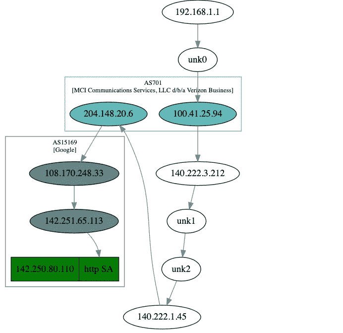

# PyOps — Scapy 简介

> 原文：<https://blog.devgenius.io/pyops-scapy-introduction-c15658b47eca?source=collection_archive---------14----------------------->

## 一个强大的交互式数据包处理程序


# 关于 Scapy

`Scapy`是一个 Python 程序，使用户能够发送、嗅探、解析和伪造网络数据包。该功能允许构建能够探测、扫描或攻击网络的工具。

换句话说，`Scapy`是一个强大的交互式包操纵程序。它能够伪造或解码大量协议的数据包，通过网络发送它们，捕获它们，匹配请求和回复，等等。

`Scapy`可以轻松处理大多数经典任务，如扫描、跟踪路由、探测、单元测试、攻击或网络发现。可以替代 hping、arpspoof、arp-sk、arping、p0f 甚至 Nmap、tcpdump、tshark 的部分功能。

`Scapy`官网:[https://scapy.net/](https://scapy.net/)

# Scapy 模块

`Scapy`该模块提供了多种网络数据包操作方法，包括`send()`、`SYN/ACK`扫描、`sniff()`、`wrpcap()`、`TCP traceroute()`等。本文我们将重点介绍`traceroute()`方法。

## Traceroute

`Traceroute`是一种工具/技术，用于列出数据包到达目标所经过的所有路由器。该技术是向目标发送一系列数据包，并设置生存时间(TTL ),使得路径上的每个路由器都必须通知您数据包的死亡。

该技术基于 IP 协议的设计方式。IP 报头中的 TTL 值被视为跳数限制。每当路由器收到要转发的数据包时，它会将 TTL 减 1，然后转发该数据包。当 TTL 达到 0 时，路由器将向源机器发送一个回复，表明数据包已经死亡。

各种工具背后的技术是相同的，但是它们实现的方式略有不同。Unix 系统使用 UDP 数据报，而 Windows *tracert* 程序使用 ICMP，而 *tcptraceroute* 使用 TCP。

在`Scapy`中，`traceroute`方法的定义如下:

```
traceroute(target, dport=80, minttl=1, maxttl=30, sport=, l4=None, filter=None, timeout=2, verbose=None, **kargs)
```

此方法实现 TCP 跟踪路由功能。关键参数描述如下:

*   target:要跟踪的目标对象，可以是域名，也可以是 IP，类型为列表。支持同时指定多个目标，如["www.qq.com "，" www.baidu.com "，" www . Google . com . hk "]；
*   dport:目的端口，类型为列表，支持同时指定多个端口，如[80，443]；
*   minttl:指定跟踪路由的最小跳数(节点数)；
*   maxttl:指定路由跟踪的最大跳数(节点数)。

# 实践

在本练习中，我们使用`scapy`的`traceroute()`方法来实现从探测器到目标服务器的路由跟踪。

先用 probe 扫描 SYN 模式的 TCP 服务，同时启动 tcpdump 捕获数据包，捕获扫描过程经过的所有路由点，然后通过 graph()方法绘制路由 IP 轨迹，调用中间的 ASN 映射查询 IP 地理信息，生成 svg 过程文档。

## 代码:

```
import time
import warnings
import logging
warnings.filterwarnings("ignore", category=DeprecationWarning)
logging.getLogger('scapy.runtime').setLevel(logging.ERROR)
from scapy import traceroutedomains = input('Please input one or more IP/domain: ')
target = domains.split(' ')
dport = [80]if len(target) >= 1 and target[0] != '':
    res,unans = traceroute(target, dport=dport, retry=-2)
    res.graph(target='> output.svg')
    time.sleep(1)
else:
    print("IP/domain number of errors, exit")
```

## 输出:

```
Please input one or more IP/domain: google.com
Begin emission:
Finished sending 30 packets.
***************************.Begin emission:
Finished sending 3 packets.
Begin emission:
Finished sending 3 packets.
..
Received 30 packets, got 27 answers, remaining 3 packets
   142.250.80.110:tcp80 
1  192.168.1.1     11   
3  100.41.25.94    11   
4  140.222.3.212   11   
7  140.222.1.45    11   
8  204.148.20.6    11   
9  108.170.248.33  11   
10 142.251.65.113  11   
11 142.250.80.110  SA   
12 142.250.80.110  SA   
...
28 142.250.80.110  SA   
29 142.250.80.110  SA   
30 142.250.80.110  SA
```

“11”表示扫描的指定服务没有响应；“SA”表示要扫描的指定服务已经响应，通常是最后一个主机 IP。

## 生成的图形:



通过路由轨迹图，我们可以清楚地看到从检测点到目标节点的路由方向。运营商经常分流路由节点，不排除选择的路由线路不是最优的。

# 结论

`Scapy` asl 有一个终端模式，一旦你安装了它，你只需输入`scapy`就可以启动它:

```
scapy
INFO: Can't import matplotlib. Won't be able to plot.
INFO: Can't import PyX. Won't be able to use psdump() or pdfdump().
WARNING: No IPv4 address found on en5 !
WARNING: No IPv4 address found on en1 !
WARNING: more No IPv4 address found on en2 !
INFO: Can't import python-cryptography v1.7+. Disabled WEP decryption/encryption. (Dot11)
INFO: Can't import python-cryptography v1.7+. Disabled IPsec encryption/authentication.
WARNING: IPython not available. Using standard Python shell instead.
AutoCompletion, History are disabled.

                     aSPY//YASa       
             apyyyyCY//////////YCa       |
            sY//////YSpcs  scpCY//Pp     | Welcome to Scapy
 ayp ayyyyyyySCP//Pp           syY//C    | Version 2.4.5
 AYAsAYYYYYYYY///Ps              cY//S   |
         pCCCCY//p          cSSps y//Y   | [https://github.com/secdev/scapy](https://github.com/secdev/scapy)
         SPPPP///a          pP///AC//Y   |
              A//A            cyP////C   | Have fun!
              p///Ac            sC///a   |
              P////YCpc           A//A   | Craft packets like it is your last
       scccccp///pSP///p          p//Y   | day on earth.
      sY/////////y  caa           S//P   |                      -- Lao-Tze
       cayCyayP//Ya              pY/Ya   |
        sY/PsY////YCc          aC//Yp 
         sc  sccaCY//PCypaapyCP//YSs  
                  spCPY//////YPSps    
                       ccaacs         

>>>
```

要列出所有支持的协议:

```
>>> ls()
AH         : AH
AKMSuite   : AKM suite
ARP        : ARP
ASN1P_INTEGER : None
ASN1P_OID  : None
ASN1P_PRIVSEQ : None
ASN1_Packet : None
ATT_Error_Response : Error Response
ATT_Exchange_MTU_Request : Exchange MTU Request
ATT_Exchange_MTU_Response : Exchange MTU Response
ATT_Execute_Write_Request : Execute Write Request
ATT_Execute_Write_Response : Execute Write Response
ATT_Find_By_Type_Value_Request : Find By Type Value Request
```

要列出所有支持的命令:

```
>>> lsc()
IPID_count          : Identify IP id values classes in a list of packets
arpcachepoison      : Poison target's cache with (your MAC,victim's IP) couple
arping              : Send ARP who-has requests to determine which hosts are up
arpleak             : Exploit ARP leak flaws, like NetBSD-SA2017-002.
...
tshark              : Sniff packets and print them calling pkt.summary().
wireshark           : 
wrpcap              : Write a list of packets to a pcap file
```

`Scapy`有许多其他功能，它是 Python DevOps 分析网络活动和网络数据包的一个非常强大的工具。