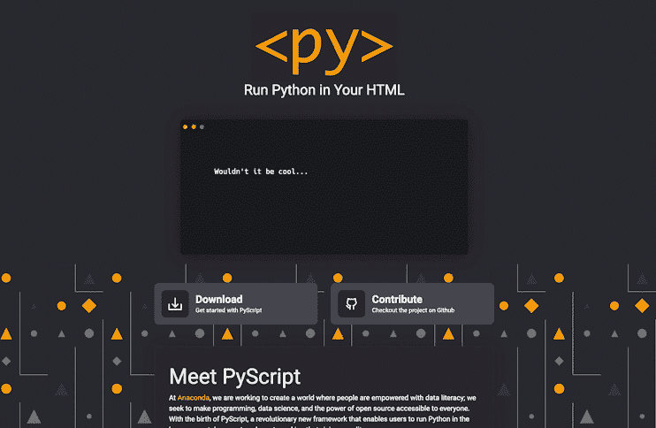
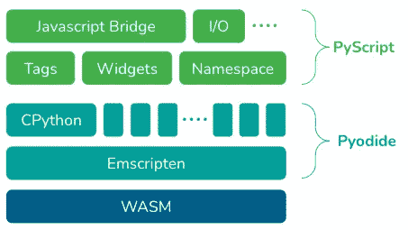
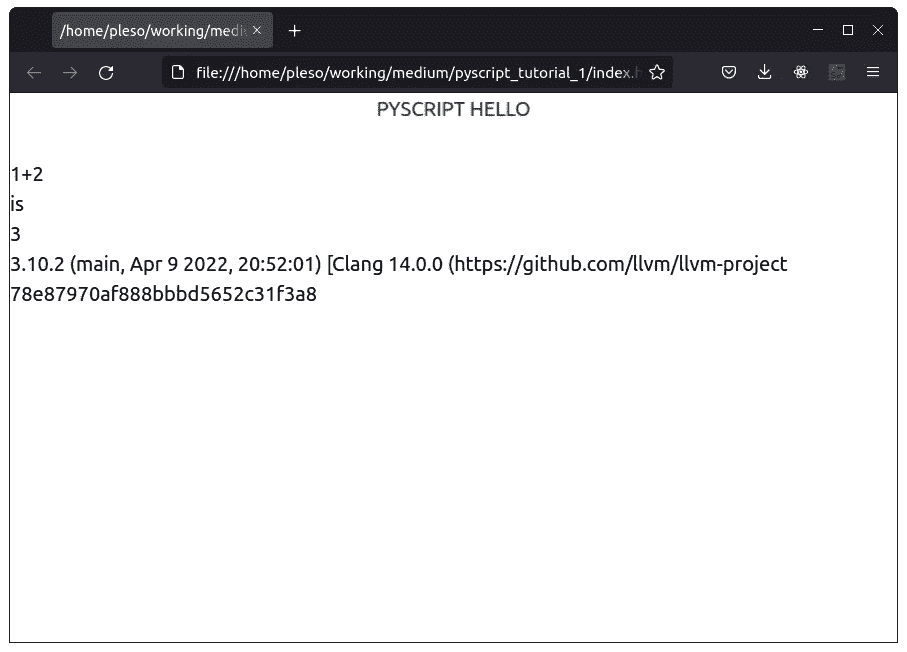
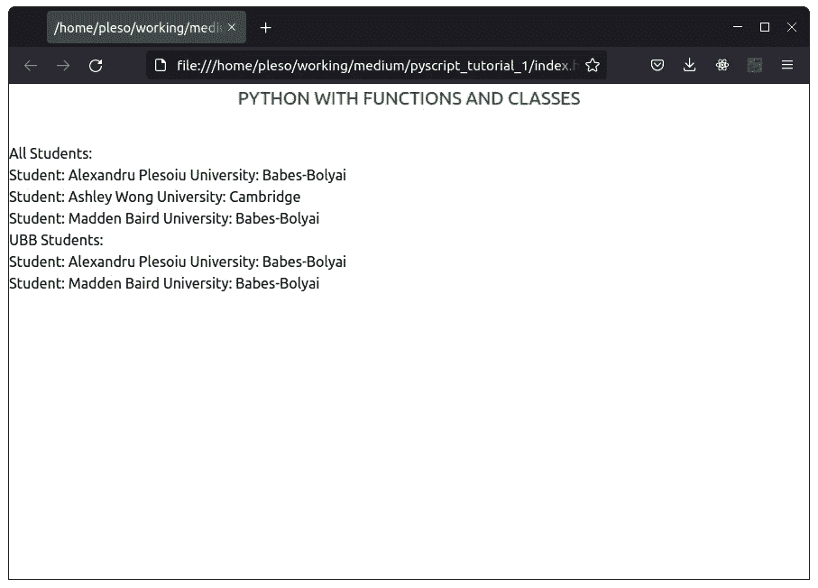
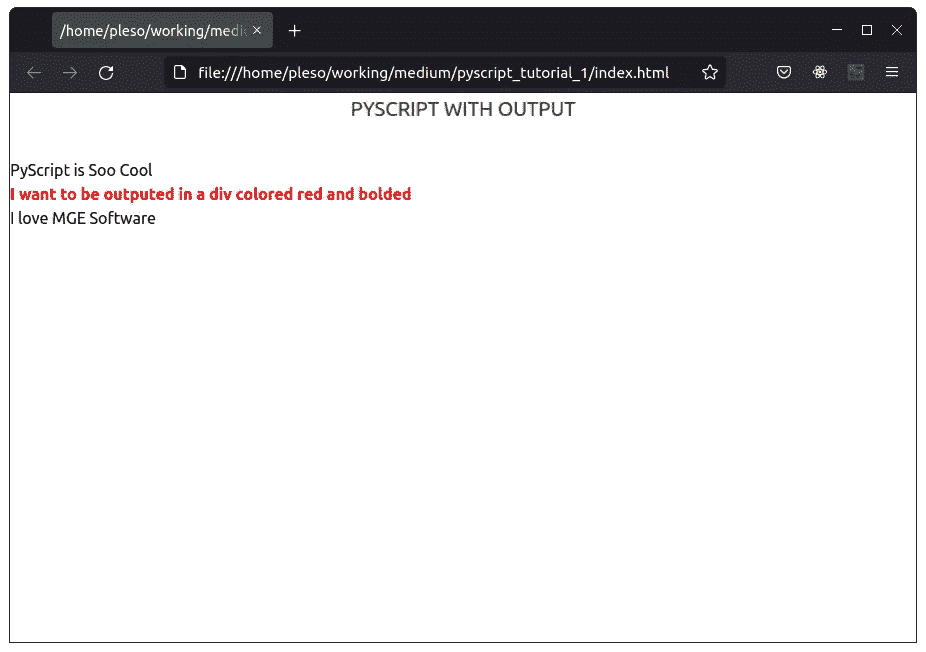
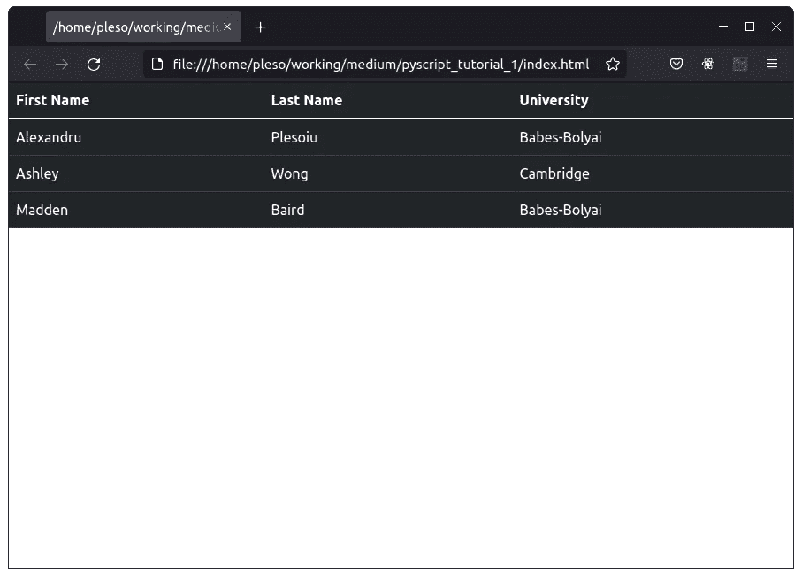
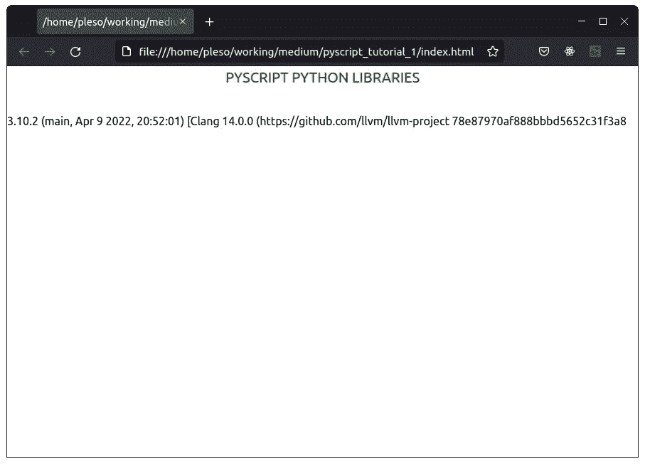
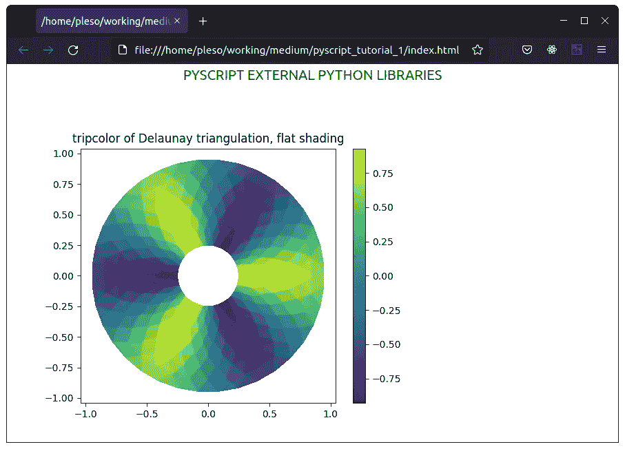

# PyScript——构建 HTML 网站的新方法——初学者教程

> 原文：<https://blog.devgenius.io/pyscript-a-new-way-of-building-html-websites-tutorial-for-beginners-67a75935e039?source=collection_archive---------0----------------------->

## 向您介绍 PyScript 的分步指南



在 PyCon US 2022 的一次演讲中，王蒙杰(Anaconda 的 CEO)宣布了一个令人惊讶的项目——[py script](https://pyscript.net/)。PyScript 是一个基于 [Pyodide](https://pyodide.org/en/stable/) 的项目，它是 [CPython](https://cython.org/) 到 [WebAssembly](https://webassembly.org/) 的一个端口。



PyScript 目前构建于 [Pyodide](http://pyodide.org) 之上

**在浏览器中运行 python 代码**并不是什么新鲜事。你可以只用 **Pyodide** 来实现。

让我们来看看**这个例子**使用 **Pyodide** 在你的浏览器中运行 Python **:**

你也看到了，没那么方便。为了运行您的 Python 代码，您仍然需要编写 JavaScript 代码来加载 **Pyodide** 并调用**run python函数。**

请注意，输出是**打印到控制台**而不是直接打印到页面。

现在， **PyScript** 来解决这个问题。你可以将 python 代码直接运行到**一个叫做 **< py-script >** 的特殊 HTML 标签**中。

让我们看看同一个例子，但是使用了 **PyScript** 。



简单 PyScript

注意，现在输出也直接打印到页面上**。**

N 如果这听起来让你感兴趣，我有个好消息，在这篇文章中我将向你展示更多你可以用 **PyScript** 做的很棒的事情。

## 内容

1.  *安装和设置*
2.  *在 HTML 模板中使用 Python 函数、类等。*
3.  *从文件*导入 Python 脚本
4.  *输出 Python 代码到 HTML 标签*
5.  *使用内置 Python 库*
6.  *使用外部 Python 库*
7.  *用 Python 访问 HTML DOM*
8.  *事件但是使用 Python(点击、悬停等)*
9.  [发出 HTTP 请求](/pyscript-making-http-requests-best-approach-tutorial-8ae062438335)

## **1。安装和设置**

设置 **PyScript** 非常简单。您只需用 HTML `<script>`标签引用它，就像您通常对其他 Javascript 库所做的那样。

就这样，现在你有了一个最小的例子。

如果你不想使用托管文件，你也可以**从[PyScript.net](https://pyscript.net/)下载库**，并将它们添加到你的项目或你自己的 [CDN](https://www.akamai.com/our-thinking/cdn/what-is-a-cdn) 中。

## 2.在 HTML 模板中使用 Python 函数、类等。

从前面的例子中你可能已经知道，你可以通过使用`<py-script>`标签在 HTML 模板中直接使用`Python`代码。

你可以执行任何你想要的 Python 代码。你可以使用类，函数，任何你想要的东西。你只要像平常一样写就行了。

以这个 Python 应用程序为例:

这是一个简单的 python 应用程序，让我们创建一些学生，并根据大学对他们进行筛选。

输出:

```
All Students:
Student: Alexandru Plesoiu University: Babes-Bolyai
Student: Ashley Wong University: Cambridge
Student: Madden Baird University: Babes-Bolyai
UBB Students:
Student: Alexandru Plesoiu University: Babes-Bolyai
Student: Madden Baird University: Babes-Bolyai
```

现在，让我们将这个应用程序**移动到我们的浏览器**中。



是的，我们的学生显示在浏览器中

很简单，是吧？我只是想告诉你**你可以写任何 python 代码**，它会毫无问题地运行。归根结底，只有 Python 解释器可以运行 Python，没什么特别的。

## 3.从文件导入 Python 脚本

如果不想让长文件没有结尾，可以像处理 JavaScript 脚本一样从文件中导入 python 脚本。

```
<py-script src="my-script.py"></py-script>
```

## 4.将 Python 代码输出到 HTML 标签

PyScript 的另一个很酷的地方是它让你通过使用`output`属性将输出到任何给定的 HTML 标签。这很有用，因为它让你可以在任何你想要的地方写你的 PyScript 代码**，比如说，到页面的底部，然后通过 ***指定*** `id` ***属性*** 输出到任何你想要的标签。**

****

**输出到样式化的 div 元素**

**现在让我们做一些真正酷的事情。在本文后面的 ***使用 Python*** 访问 HTML DOM 一章中，我们将把前面应用程序中的学生输出到一个[引导程序](https://www.w3schools.com/whatis/whatis_bootstrap.asp)表 O-O 中。**

****

**Python 应用程序输出到 HTML**

## **5.使用内置 Python 库**

**使用**内置 python 库**很简单，你只需**导入**它们，就像你通常在 python 中做的那样。**

****

**内置 Python 的 sys 库**

## **6.使用外部 Python 库**

**如果使用内置 python 库很容易，那么像`*Pandas*`、`*Matplotlib*`、`*Numpy*`等外部 python 库怎么样？嗯，正如 anaconda 的网站所说，**你使用`*<py-env>*`标签定义它们**。**

> **`*py-env*` **定义了运行你的 Python 代码**所需的 Python 包。**

****

**PyScript 存储库中的 Matplotlib 示例**

## **7.用 Python 访问 HTML DOM**

**在 PyScript 中访问 **DOM** 和在 Javascript 中一样简单。你只要用 JS 库中的`*document*`就可以了。**

**我还注意到**并没有强制**导入这个库，不知何故它们已经被导入了。**

**现在，让我们回到我们的学生管理应用程序，让我们**将**我们的学生**输出到引导表**:**

****

**从 Python 应用程序填充的引导表**

**让我们来看看来自学生类的`*create_html_element()*`方法和`*populate_table()*`函数。正如你所看到的，**我们像在 JavaScript 中一样创建元素**，**我们** **改变**内容，然后**我们将**添加到**一个父元素** *。***

## **8.事件，但使用 Python(点击、悬停等)**

**活动也超级好办。就用`*addEventListener*` *。但是有一个问题:如果你使用函数，**你必须创建一个函数**的代理才能工作*。*那是因为**两种语言之间的**式翻译。***

> **为了在 Python 和 JavaScript 之间通信，我们在两种语言之间“翻译”对象。根据对象的类型，我们可以通过隐式转换或代理来转换对象。通过“转换”一个对象，我们意味着在目标语言中产生一个新的对象，它是来自源语言的对象的等价物，例如将 Python 字符串转换成等价的 JavaScript 字符串。通过“代理”一个对象，我们的意思是用目标语言产生一个特殊的对象，将请求转发给源语言**

**你可以在这里阅读更多关于**型翻译****

**例如，如果用户点击元素，您可以通过**更改元素内容**:**

## **9.发出 HTTP 请求**

**为了发出 HTTP 请求，我在这里写了另一篇文章。**

**感谢你阅读这篇文章。这是**对 *PyScript* 的简要介绍**，如果你想**深入**到 *PyScript* ，**跟我来**。我会在这里讨论的每一章的**上写更多关于 *PyScript* 的**进阶指南**，包括**如何在 *PyScript* 中提出请求**，关于**PyScript 中最新的元素**(py-input box、py-box、py-button、py-register-widget 等)。****