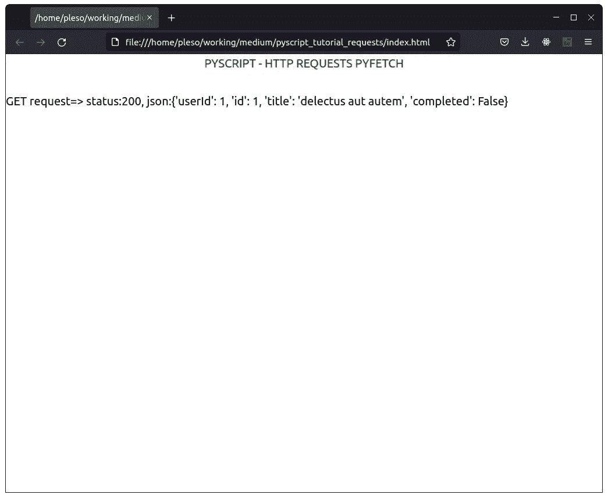
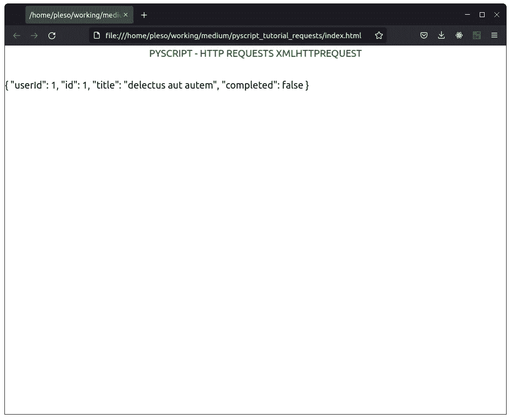

# PyScript —发出 HTTP 请求—最佳方法|教程

> 原文：<https://blog.devgenius.io/pyscript-making-http-requests-best-approach-tutorial-8ae062438335?source=collection_archive---------1----------------------->

## PyScript 的延续——构建 HTML 网站的新方法。

## 向您介绍使用 PyScript 进行 HTTP 请求的分步教程


M 在 [PyScript](/pyscript-a-new-way-of-building-html-websites-tutorial-for-beginners-67a75935e039) 中发出请求是一个热门话题，因为 python 的流行模块`requests` **在 Pyodide 中不被支持**。幸运的是，在 PyScript 中还有其他方法来发出 **HTTP 请求**。

# 方法 1 —使用 Pyodide 的 pyfetch(最佳方法)

由于 PyScript 是在 pyodide 之上构建的，所以您可以使用 pyodide 中的 [**任何** **API** **。**](https://pyodide.org/en/stable/usage/api/python-api.html)

## 但是..什么是真正的 pyfetch？

根据 pyodide 的文档，pyfetch 是 JavaScript fetch 的包装器。

> Pyodide 提供了`*pyodide.http.pyfetch*`，这是一个方便的 JavaScript `*fetch*`的**包装器**。

相对于 python 的**未支持的**模块**请求**、来说，`fetch` **是异步的**。

> 主要问题是`requests` **是同步**而`fetch` **是异步**。可以用`XMLHttpRequest`进行同步调用，但是**不能支持很多选项，效率也不是很高**。

我们来看看`*pyodide.http.pyfetch*`的定义

```
async http.pyfetch(url: str, **kwargs) → pyodide.http.FetchResponse 
```

文档指出`**kwargs` **可以是用于 [Javascript 的获取 API](https://developer.mozilla.org/en-US/docs/Web/API/fetch#parameters) 的可选**参数**中的任何一个**。

这些参数包括`body`、`headers`、`method`

```
from pyodide.http import pyfetch
import asyncioresponse = await pyfetch(url="https://jsonplaceholder.typicode.com/todos/1", method="GET")output = f"GET request=> status:{response.status}, json:{await response.json()}"
```

这里的**最重要的**是你**必须**导入`asyncio`包，否则会得到**奇怪的错误**。这个 ***未记录的细节*** 困扰了我好几个小时。幸运的是，我找到了[一篇很棒的文章](https://www.jhanley.com/pyscript-loading-python-code-in-the-browser/)帮助了我。希望当你阅读这篇文章时，这个问题已经解决了。

使用`pyfetch`的`HTTP GET` **请求**的**完全工作**示例:

用于 HTTP 请求的 PyScript 和 pyfetch



使用 pyfetch 的简单 GET HTTP 请求

# 方法#2 — `*XMLHttpRequest*` 和其他 JS 功能

在 **PyScript** 中生成 **HTTP 请求**的第二种方法是使用其他 **JavaScript 函数**。使用 **JS 模块**可以调用 PyScript 中的**任何** javascript 函数/对象。(关于**使用 **JS 模块** [访问 HTML DOM &事件](/pyscript-a-new-way-of-building-html-websites-tutorial-for-beginners-67a75935e039)**的例子，点击这里)。

```
from js import XMLHttpRequest

req = XMLHttpRequest.new()
req.open("GET", "https://jsonplaceholder.typicode.com/todos/1", False)
req.send(None)
output = str(req.response)
```

> 记住，如果你以这种方式使用`XMLHttpRequest`,你需要发出一个有一些实际原始输出/ json 的 web 请求。如果没有，它会弹出一个 CORS 错误，如果你愿意，你可以在浏览器中禁用这个 tho。

使用`XMLHttpRequest`的**请求**的**完全工作**示例:

用于 HTTP 请求的带有`XMLHttpRequest`的 PyScript



使用`XMLHttpRequest`的简单 GET HTTP 请求

# 结论

总之，PyScript 中的请求并不难掌握。它们只是现有`*JavaScript*`函数的**包装器**。

我不想在这里深究细节，关键是你可以像在`JavaScript`中一样在`PyScript`中发出 **HTTP GET / POST** / etc **请求**。如果你想了解更多关于**JavaScript API**的知识，我建议你去**前查看文档**。

感谢你阅读这篇文章。想要**深入**进入 *PyScript* ，**跟我来**。我将很快写更多关于 PyScript*的**高级指南**，包括 PyScript 中的***最新元素**(py-inputbox、py-box、py-button、py-register-widget 等)*。***