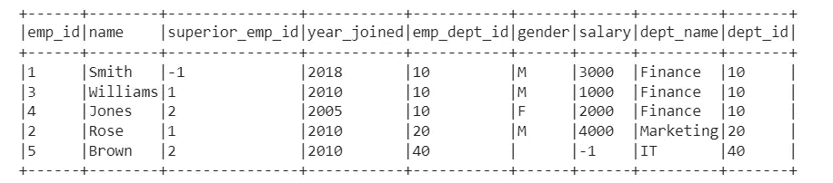

# Pyspark 数据帧连接、分组、UDF 和处理缺失值

> 原文：<https://blog.devgenius.io/pyspark-for-begineers-part-3-pyspark-dataframe-db02f0fcd275?source=collection_archive---------11----------------------->

> DataFrame 现在是一个行业流行语，人们倾向于在各种情况下使用它。在上一篇文章中，我们了解了 Pyspark 中的数据帧，它的特性、重要性、创建以及 Pyspark 数据帧的一些基本功能。在本文中，我们将了解更多关于 Groupby 和聚合函数、连接、填充缺失值以及 Pyspark DataFrame 中的其他概念。

要了解我之前关于 Pyspark DataFrame 的文章，请点击此链接

[](https://muttinenisairohith.medium.com/pyspark-for-begineers-part-2-pyspark-dataframe-60008da53e30) [## 初学者用 Pyspark |第 2 部分:Pyspark 数据框架

### DataFrame 现在是一个行业流行语，人们倾向于在各种情况下使用它。在这篇文章中，我们将学习…

muttinenisairohith.medium.com](https://muttinenisairohith.medium.com/pyspark-for-begineers-part-2-pyspark-dataframe-60008da53e30) 

**分组和聚合函数:**

与 SQL `GROUP BY`子句类似，PySpark `groupBy()`函数用于将相同的数据收集到 DataFrame 上的组中，并对分组的数据执行 count、sum、avg、min 和 max 函数。

开始之前，让我们创建一个简单的数据框架。使用的 CSV 文件可以在 这里找到 [**。**](https://github.com/muttinenisairohith/Encoding-Categorical-Data/blob/ffb93bdf21a91a03362d0a3ab5d56c94d24ed962/data/test2.csv)

```
from pyspark.sql import SparkSessionspark =SparkSession.builder.appName("Practice").getOrCreate()df_pyspark= spark.read.csv("test2.csv",header=True,inferSchema=True)
df_pyspark.show()
```


**groupBy():**

在数据框的`Departments`列上`groupBy()`，然后使用`sum()`函数找到各部门的`salary`之和。

```
#group by Departments which gives summation of salariesdf_pyspark.groupBy("Departments").sum("salary").show()
```


类似地，我们可以使用 groupBy 函数执行 min、max、mean、avg 和 count。

```
df_pyspark.groupBy("Departments").min("salary").show()
df_pyspark.groupBy("Departments").max("salary").show()
df_pyspark.groupBy("Departments").avg("salary").show()
df_pyspark.groupBy("Departments").mean("salary").show()df_pyspark.groupBy("Departments").count().show()  #count of number of people in each Department
```

**使用多列的 groupBy()**

```
df_pyspark.groupBy("Name","Departments").sum("salary").show()
```

**groupBy()和 agg()函数**

```
df_pyspark.groupBy("Departments").agg(({"salary":"sum"})).show()
```


我们也可以在整个数据帧上执行 agg()函数，而不用 groupBy()

```
df_pyspark.agg(({"salary":"sum"})).show()+-----------+ 
|sum(salary)| 
+-----------+ 
|      73000| 
+-----------+
```

使用**Pivot/UnPivot**—Spark SQL 提供`pivot()`函数将数据从一列旋转到多列(转置行到列)。这是一种聚合，其中一个分组列值被转置到具有不同数据的各个列中。可以使用类似的 UnPivot。

```
df_pyspark.groupBy("Departments").pivot("Name").sum("salary").show()
```


**处理缺失值 Pyspark**

对于这个任务，我们将使用这个 [**CSV 文件**](https://github.com/muttinenisairohith/Encoding-Categorical-Data/blob/b0bb96f293adbb803e24c26b7780e078372d3703/data/test3.csv)

```
df_pyspark1=spark.read.csv("test3.csv",header=True,inferSchema=True)
df_pyspark1.show()
```


删除基于空值的行

```
df_pyspark1.na.drop().show()
```


drop()有以下参数— how、thresh 和 subset

```
1\. df_pyspark1.na.drop(how="all").show() # if all values in rows are null then drop # default any2\. df_pyspark1.na.drop(how="any",thresh=2).show() #atleast 2 non null values should be present3\. df_pyspark1.na.drop(how="any",subset=["salary"]).show() # only in that column rows get deleted
```

填充缺失值-单值

```
df_pyspark1.na.fill('Missing Values').show() #string values will get replaced as string is given as inputdf_pyspark1.na.fill(0).show() #integer values will get replaced as integer is given as input
```

借助估算函数，使用平均值、中值或众数填充缺失值

```
#filling with meanfrom pyspark.ml.feature import Imputerimputer = Imputer(inputCols=["age"],outputCols=["age_imputed"]).setStrategy("mean")
```

在 setStrategy 中，我们可以使用均值、中值或众数。

```
imputer.fit(df_pyspark1).transform(df_pyspark1).show()
```


**Pyspark 数据帧中的 orderBy()和 sort()**

我们将切换回以前使用的 CSV 文件


***sort()***-使用一列或多列对数据帧进行排序，默认-升序


```
df_pyspark.sort("salary").show() # Sort based on single columndf_pyspark.sort(df_pyspark["salary"].desc()).show() # sort based on descending orderdf_pyspark.sort("salary","Name").show() # Sort based on first column then second column
```

或者，也可以使用 orderBy。

```
df_pyspark.orderBy("salary").show() # Sort based on single column
```

**使用 pyspark 连接()**

PySpark Join 用于组合两个数据帧，通过链接这些数据帧，您可以连接多个数据帧；它支持传统 SQL 中可用的所有基本连接类型操作，如`INNER`、`LEFT OUTER`、`RIGHT OUTER`、`LEFT ANTI`、`LEFT SEMI`、`CROSS`、`SELF`连接。


连接

让我们从创建两个数据帧开始:

```
emp = [(1,"Smith",-1,"2018","10","M",3000),(2, "Rose",1 , "2010", "20","M", 4000),(3,"Williams",1,"2010","10","M",1000),(4, "Jones",2 ,"2005","10","F",2000),(5,"Brown",2,"2010","40","",-1),(6, "Brown", 2, "2010","50","",-1)]empColumns = ["emp_id","name","superior_emp_id","year_joined", "emp_dept_id","gender","salary"]

empDF = spark.createDataFrame(data=emp, schema = empColumns)
empDF.printSchema()
empDF.show()

dept = [("Finance",10),("Marketing",20),("Sales",30),("IT",40)]
deptColumns = ["dept_name","dept_id"]
deptDF = spark.createDataFrame(data=dept, schema = deptColumns)
deptDF.printSchema()
deptDF.show()
```


```
empDF.join(deptDF,empDF.emp_dept_id ==  deptDF.dept_id,"inner") .show()
```



内部连接

```
empDF.join(deptDF,empDF.emp_dept_id ==  deptDF.dept_id,"outer").show()
#Or
empDF.join(deptDF,empDF.emp_dept_id ==  deptDF.dept_id,"full").show()
#Or
empDF.join(deptDF,empDF.emp_dept_id ==  deptDF.dept_id,"fullouter").show()
```


外部连接

```
empDF.join(deptDF,empDF.emp_dept_id ==  deptDF.dept_id,"left").show()
#Or
empDF.join(deptDF,empDF.emp_dept_id ==  deptDF.dept_id,"leftouter").show()
```


左连接

```
empDF.join(deptDF,empDF.emp_dept_id ==  deptDF.dept_id,"right").show()
#Or
empDF.join(deptDF,empDF.emp_dept_id ==  deptDF.dept_id,"rightouter").show()
```


右连接

```
empDF.join(deptDF,empDF.emp_dept_id ==  deptDF.dept_id,"leftsemi").show()
```


左半连接

```
empDF.join(deptDF,empDF.emp_dept_id ==  deptDF.dept_id,"leftanti").show()
```


左反连接

Pyspark DataFrame 中没有可用的自连接，但是可以使用上面任何可用的方法来完成。

**Union()使用 pyspark**

要合并相同模式或结构的两个或多个数据帧，需要使用 union()。

```
unionDF = df.union(df2)
```

要合并而不重复，distinct()与 union()一起使用

```
disDF = df.union(df2).distinct()
```

**用户定义的功能(UDF):**

UDF 用于扩展框架的功能，并在多个数据框架上重用这些功能。例如，如果我们想把一个名字串中一个单词的每一个首字母都转换成小写。PySpark 内置功能没有此功能，因此我们可以创建一个 UDF，并根据需要在许多数据框上重复使用。UDF 一旦创建，就可以在几个数据帧和 SQL 表达式中重用。

```
def lowerCase(str):
     return str.lower()
```

随着 lowerCase()函数的创建，让我们来看看 UDF 代码。

```
from pyspark.sql.functions import udfupperCaseUDF = udf(lambda z:upperCase(z))deptDF.withColumn("dept_name", ulowerCaseUDF(deptDF["dept_name"])).show()
```


南非民主统一战线(United Democratic Front)

我想我有 Pyspark DataFrame 中的大部分主题。我写这篇文章是为了学习 Pyspark，并在某个地方写些东西，这样我可以在需要的时候引用它们。希望这能有所帮助。

快乐编码和学习…

**参考文献:**

SparkbyExamples.com