# PySpark —设置三角洲湖

> 原文：<https://blog.devgenius.io/pyspark-setup-delta-lake-971e2e37330d?source=collection_archive---------3----------------------->

三角洲湖是目前围绕大数据领域的热门话题之一。它在数据湖的可靠性方面带来了很多改进。但是为什么它会获得如此多的关注呢？

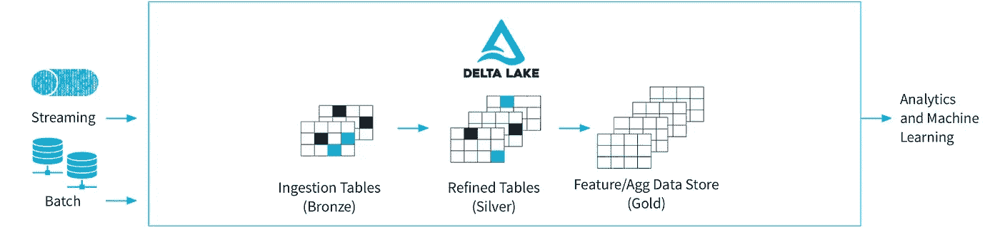

代表图像(鸣谢:delta.io)

根据 Delta IO 文档—“*Delta Lake 是一个开源项目，支持在数据湖之上构建湖屋架构。Delta Lake 提供 ACID 事务、可扩展的元数据处理，并在现有数据湖(如 S3、ADLS、GCS 和 HDFS* )的基础上统一流式和批量数据处理。

有这么多与三角洲湖相关的重要特征，查看下面的图片

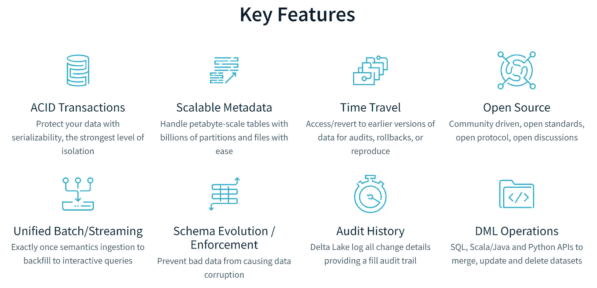

主要功能(学分:delta.io)

今天，我们将使用 PySpark 设置 delta lake，并为我们的 metastore 启用相同的功能。

为了让 PySpark 支持 Delta Lake，我们需要将 delta-core jar 导入 SparkSession 并正确设置配置。

```
**# Create Spark Session with Delta JARS and conf**

from pyspark.sql import SparkSession

spark = SparkSession \
    .builder \
    .appName("Delta with PySpark") \
    .config('spark.jars.packages', 'io.delta:delta-core_2.12:2.1.1') \
    .config("spark.sql.extensions", "io.delta.sql.DeltaSparkSessionExtension") \
    .config(
        "spark.sql.catalog.spark_catalog",
        "org.apache.spark.sql.delta.catalog.DeltaCatalog",
    ) \
    .config("spark.sql.warehouse.dir", "spark-warehouse") \
    .master("local[*]") \
    .enableHiveSupport() \
    .getOrCreate()

spark
```

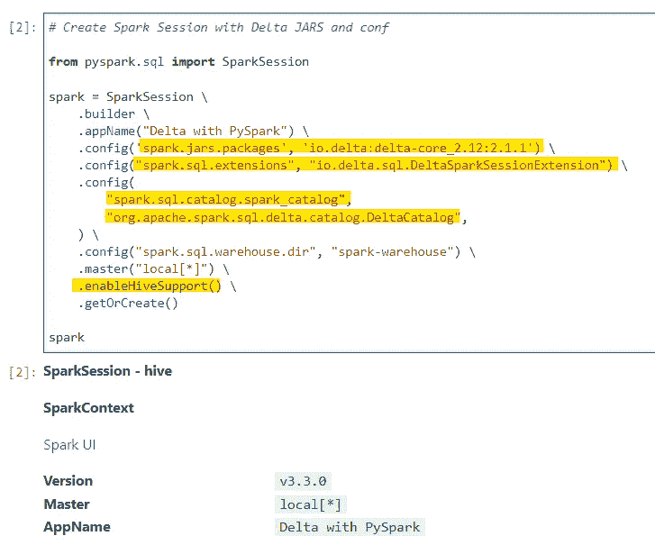

生成 SparkSession

> 确保启用持久化 metastore。查看我以前的博客，在同一个——[https://urlit . me/blog/py spark-implementing-persisting-metastore/](https://urlit.me/blog/pyspark-implementing-persisting-metastore/)

现在，我们准备与三角洲湖合作。为了创建我们的第一个增量表，让我们读取销售拼花数据。

```
**# Lets read our Sales dataset**

df_sales = spark.read.parquet("dataset/sales.parquet/*parquet")
df_sales.printSchema()
df_sales.show(10, False)
```

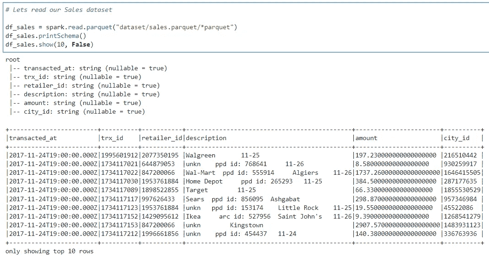

销售数据集

现在，我们将这些数据转换并写成增量表。

```
**# Lets create a sales managed delta table**
from pyspark.sql.functions import to_timestamp, expr

df_formatted = (
    df_sales
    .withColumn("transacted_at", to_timestamp("transacted_at"))
    .withColumn("amount", expr("CAST(amount as decimal(14,2))"))
               )

df_formatted.write \
    .format("delta") \
    .mode("overwrite") \
    .option("mergeSchema", True) \
    .saveAsTable("sales_delta_managed")
```

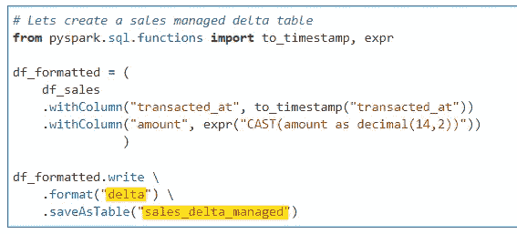

销售增量表

由于我们没有指定任何外部位置，默认情况下，它将是一个内部管理的增量表。

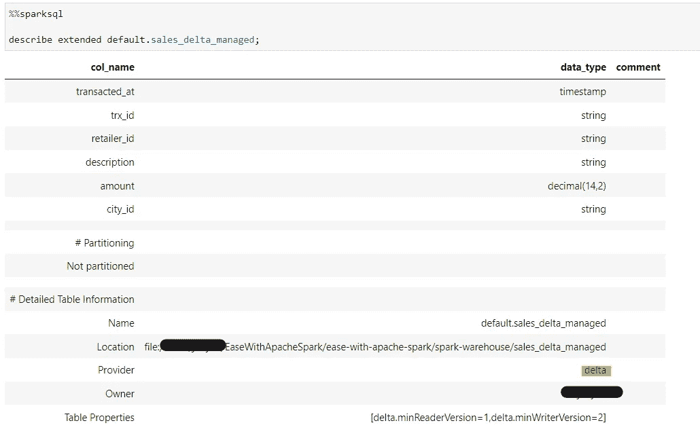

表格定义

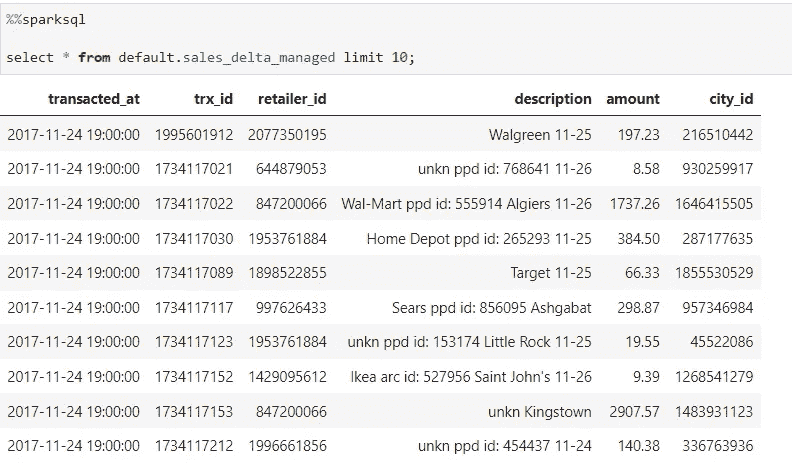

列表数据

因为，增量表支持版本控制

```
**# Lets check the current version of the table**

from delta import DeltaTable

dt = DeltaTable.forName(spark, "sales_delta_managed")
dt.history().select("version", "timestamp").show(truncate=False)
```

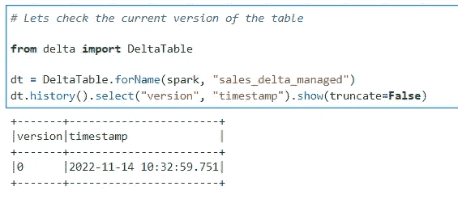

增量表版本控制

让我们更新一个记录来查看版本控制中的变化

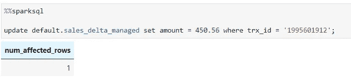

ACID 事务支持

记录更新没有任何麻烦(*三角洲湖支持 DML 操作*)

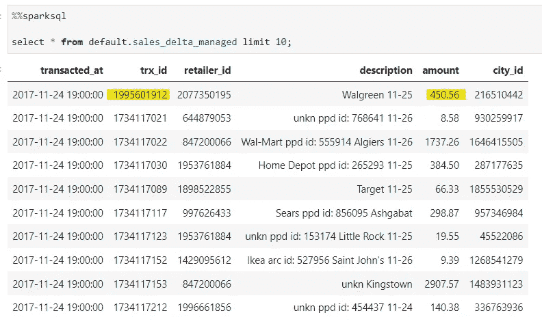

记录已更新

版本控制的变化

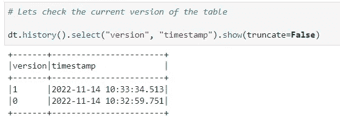

DML 操作后版本更新

让我们验证给定的表位置是否是增量表

```
**# Verify if a given table is Delta**

print(DeltaTable.isDeltaTable(spark, "spark-warehouse/sales_managed/"))
print(DeltaTable.isDeltaTable(spark, "spark-warehouse/sales_delta_managed/"))
```

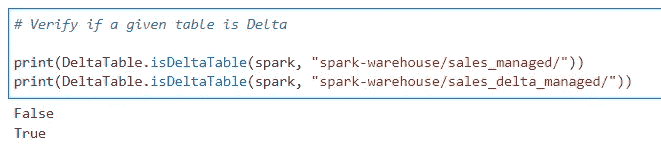

验证增量表

**奖励:将拼花数据转换为 delta 的快捷方式**

```
**# Shortcut to create a Parquet location to delta table
# We will convert the sales_managed table to delta**

DeltaTable.convertToDelta(spark, "parquet.`spark-warehouse/sales_managed`")
```

验证位置是否转换为增量

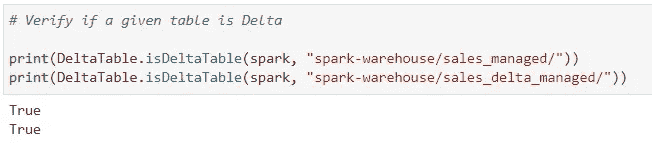

确认

但是，如果我们检查 Catalog 中的元数据，它仍然是一个 hive 表。

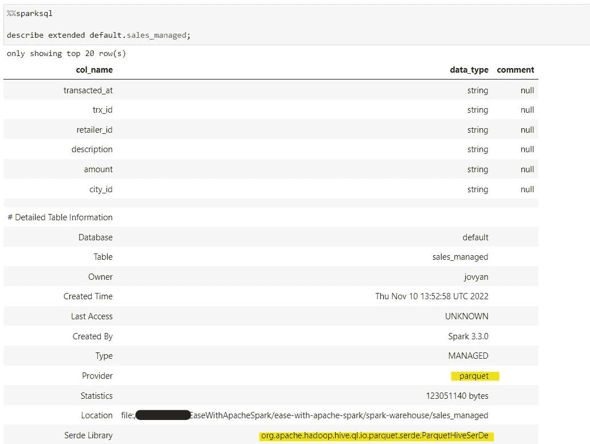

所以，也要转换元数据

```
%%sparksql

CONVERT TO DELTA default.sales_managed;
```

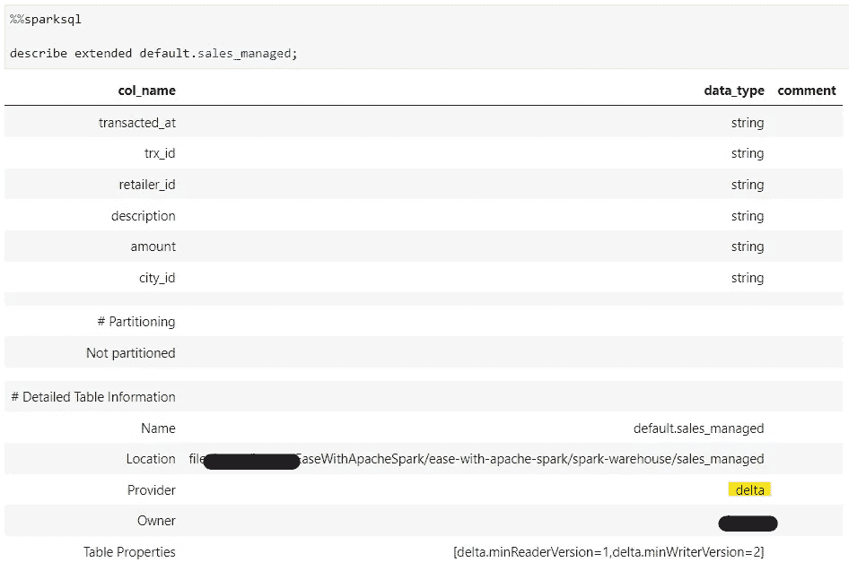

转换为增量的表格

我们将在接下来的博客中涉及更多的三角洲湖概念。

在 Github 上查看 iPython 笔记本—[https://Github . com/subhamkharwal/ease-with-Apache-spark/blob/master/27 _ delta _ with _ py spark . ipynb](https://github.com/subhamkharwal/ease-with-apache-spark/blob/master/27_delta_with_pyspark.ipynb)

查看我的个人博客—[https://urlit.me/blog/](https://urlit.me/blog/)

查看 PySpark Medium 系列—[https://subhamkharwal . Medium . com/learn bigdata 101-spark-Series-940160 ff4d 30](https://subhamkharwal.medium.com/learnbigdata101-spark-series-940160ff4d30)