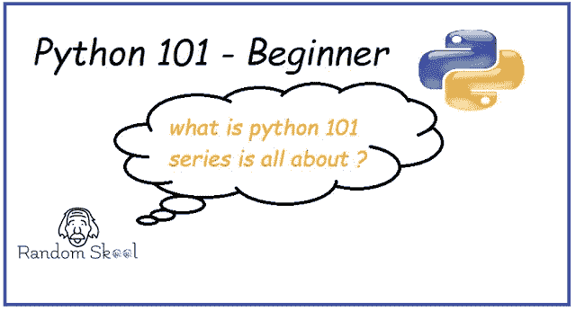
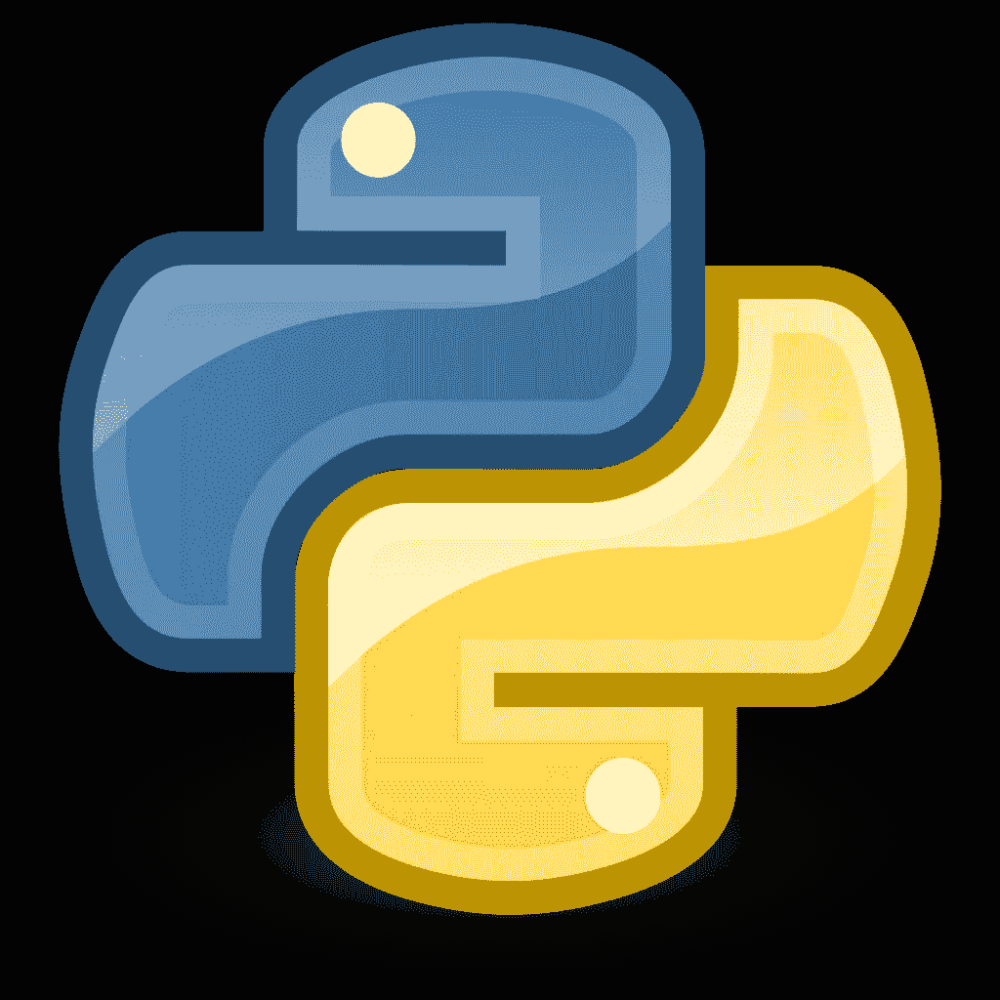

# Python 101 初学者教程

> 原文：<https://blog.devgenius.io/python-101-beginner-tutorial-a78c9efc1633?source=collection_archive---------37----------------------->

# Python 101 初学者教程

# 什么是 Python 101 —初学者？

Python 101 —初学者是“ [**掌握太空石**](https://randomskool.blogspot.com/2020/07/python-programming-101-beginner-tutorial.html) ”系列的一部分。

在 Python 101 的第一个系列中，您将以一种非常互动的方式学习 Python 的所有基础知识，如安装、语法、条件、函数等等。

而且，借助这样一个分分钟重要的概念，我们会在最后开发出一个羽翼丰满的游戏。

什么是“掌握太空石”？

[**《掌握太空石》是给我所有准备学习 python 从初级到高级的复仇者伙伴们的免费系列。**](https://randomskool.blogspot.com/2020/07/python-programming-101-beginner-tutorial.html)

该系列由下面列出的**三个阶段**组成:

[**Python 101 —初学**](https://randomskool.blogspot.com/2020/07/python-programming-101-beginner-tutorial.html)

[**Python 201 —中级**](https://randomskool.blogspot.com/2020/07/python-programming-101-beginner-tutorial.html)

[**Python 301 —高级**](https://randomskool.blogspot.com/2020/07/python-programming-101-beginner-tutorial.html)

以下是详细的主题:

在 Python 101 中，我们将学习-

***a)Python 简介***

***f)决策和循环***

***g)元组、列表和字典***

在 Python 201 中，我们将学习-

***a)OOPS(使用 Python 的面向对象编程)范式***

***b)正则表达式***

在 Python 301 中，我们将学习-

***a)网页抓取/抓取(使用 Python 101 和 201 概念)***

***b)使用 python 的数据科学概念***
***c)Python Web 开发***

d)学习不同的高级模块，帮助减少最大努力。

准备好潜水了！！！！

谢谢，请订阅 RandomSkool 获取每日更新。

*最初发表于*[*【https://randomskool.blogspot.com】*](https://randomskool.blogspot.com/2020/07/python-programming-101-beginner-tutorial.html)*。*