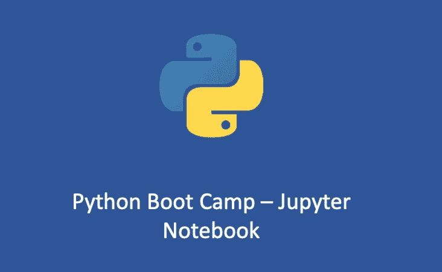
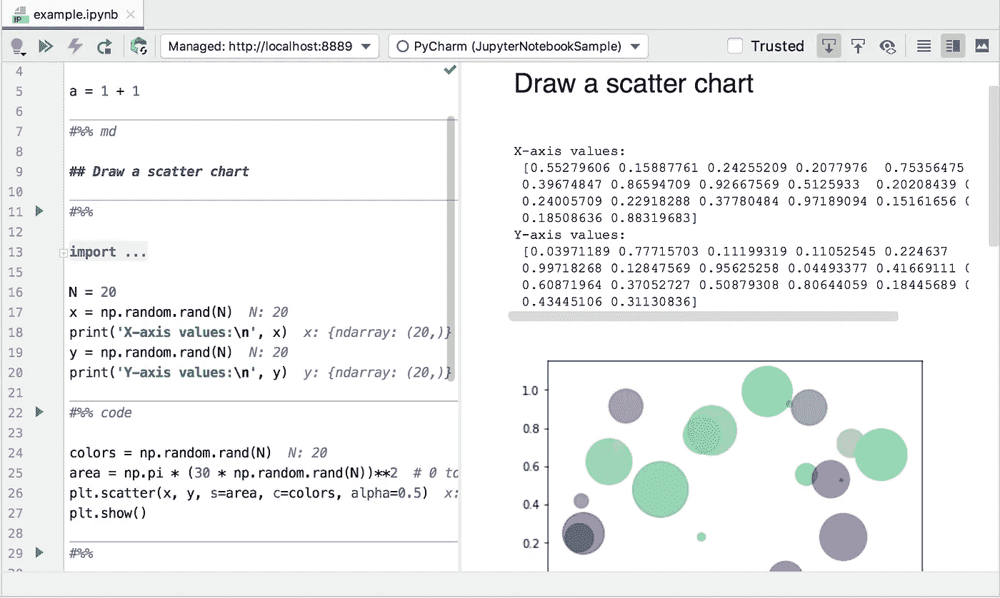
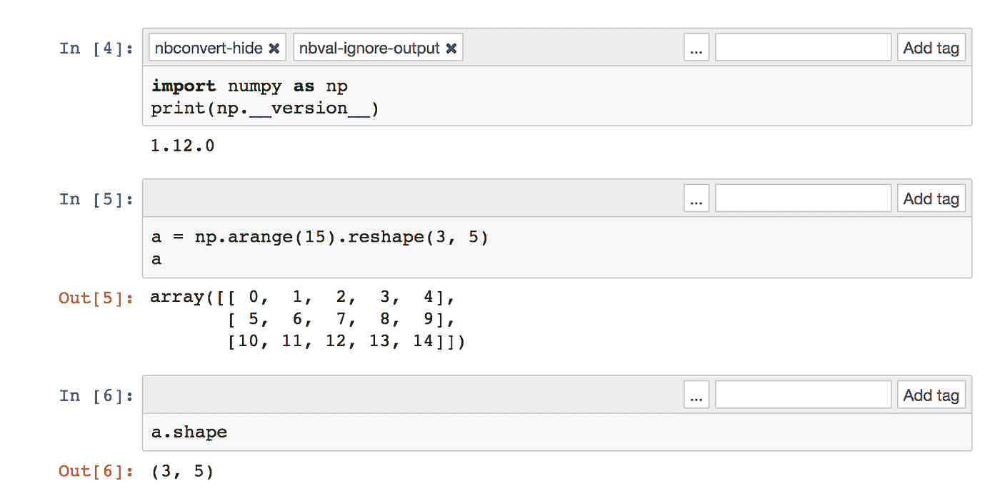
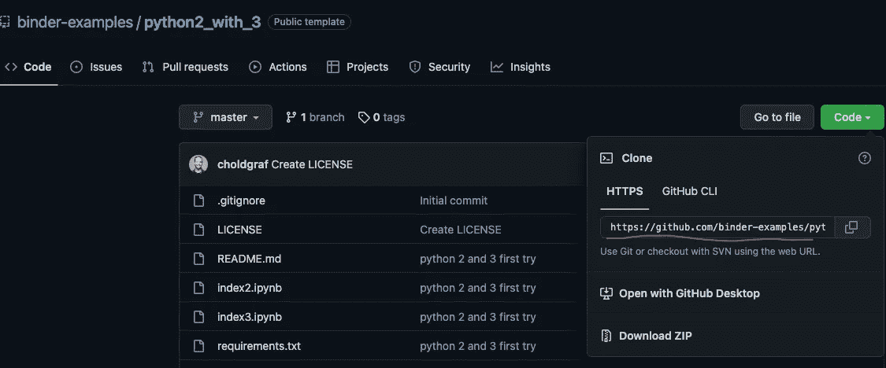
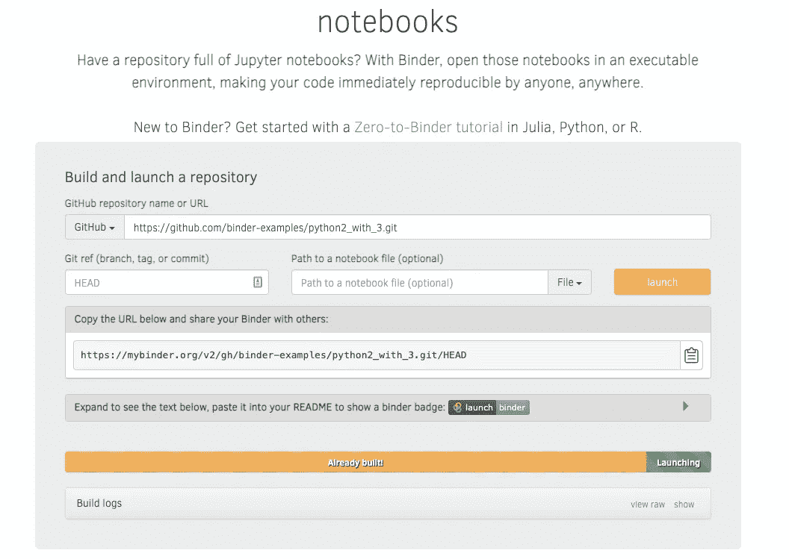
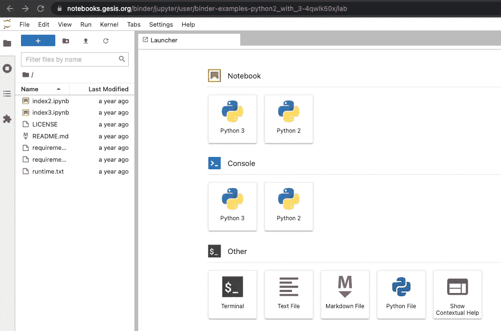
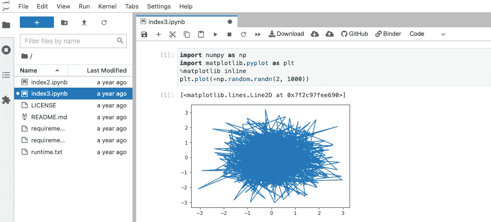

# Python 新兵训练营 1 — Jupyter 笔记本

> 原文：<https://blog.devgenius.io/python-boot-camp-1-jupyter-notebook-f8a2850a2575?source=collection_archive---------4----------------------->

## 你为什么要学习 Jupyter 笔记本？

# Jupyter 笔记本是什么？

据`Jupyter`的创始人**费尔南多·佩雷斯**介绍，他最初的梦想是做一个集成了三种科学计算语言的计算工具平台:

*   朱(朱丽亚)
*   Py (Python)
*   稀有

所以他把它命名为 **Ju-Py-te-R** 。到目前为止，`Jupyter`已经成为一个多功能的科学计算平台，支持几乎所有的语言，可以集成软件代码、计算输出、解释文档、多媒体资源。

一张图胜过千言万语，让我们看看下面这张图，你就明白什么是 Jupyter 笔记本了:

图片来自 [Jetbrains](https://resources.jetbrains.com/)

正如你所看到的，你可以直接在一个框中键入代码，运行它，它会立即给你下面的输出，你甚至可以添加 Markdown 类型的注释，是不是很酷？

你可能会疑惑，这么“花哨”的东西真的是 Python 社区的颠覆者吗？说实话，几年前我也不信。那么 Jupyter 笔记本的影响有多大呢？

# Jupyter 笔记本的影响

当我们衡量一项技术的影响力，或者用自己的技术影响世界的时候，我们无法回避这项技术对教育领域的影响。

从 2017 年开始，北美已经有大量顶尖的计算机课程开始使用`Jupyter Notebook`作为工具。比如加州大学伯克利分校的《数据科学基础》课程，从 2017 年开始，所有作业都用`Jupyter Notebook`完成。

而`Jupyter Notebook`在工业世界甚至有更大的影响力。在 Meta，虽然大规模的后台开发还是依靠一个全功能的 IDE，但是几乎所有的中小型程序，比如一些内部的离线分析软件，机器学习模块都是借助`Jupyter Notebook`进行训练的。

据我所知，硅谷的其他一线公司，比如谷歌的 AI 研究部门 Google Brain，也是独家使用 Jupyter 笔记本，虽然他们使用的是自己改进的定制版，名为 Google Colab。

`Jupyter Notebook`主要用于多项操作，包括:

*   **数据可视化**:您可以使用它从代码中生成图表和图形，使用可用的模块如 [*Bokeh*](https://docs.bokeh.org/en/latest/) 、 [*Plotly*](https://plotly.com/python/) 和 [*Matplotlib*](https://matplotlib.org/) 。更重要的是，`Jupyter Notebook`的结构使得它可以在创建图表的代码下面直接生成图表。
*   **代码共享**:您可以创建代码、执行代码、查看结果，以及添加基于文本的注释，所有这些都可以通过您的 web 浏览器来完成。然后，您可以保存该文件，并将其发送给与您合作的任何人。
*   **记录代码:**这个开源应用程序上的笔记本环境使你能够逐行解释你的代码，从而使任何人都容易理解你的推理。
*   **多媒体支持**:作为 web 应用，`Jupyter Notebook`支持多媒体文件。
*   **网页抓取** : `Jupyter Notebook`派上了用场，甚至创造了一个完整的独立生态系统。Python 抓取也提供了一种可行的方法。

# Jupyter 笔记本的优势

## 整合所有资源

在真正的软件开发中，上下文切换会占用很多时间。那是什么意思？比如你需要切换窗口看一些文档，然后切换窗口用另一个工具画画等等。这些都是影响生产效率的因素。

前面提到过，`Jupyter Notebook`通过把所有写软件相关的资源放在一个地方，解决了这个问题。当你打开一个`Jupyter Notebook`，你已经可以看到相应的文档、图表、视频和相应的代码。

这样，你不需要切换窗口来查找信息，只需查看一个文件，你就可以获得关于该项目的所有信息。

## 交互式编程体验

在机器学习和数理统计领域，Python 编程尤其具有实验性。经常会发生这样的情况，例如，一小段代码需要重写 100 次，以便尝试 100 种不同的方法，但没有其他代码不想移动。

这与传统的 Python 开发非常不同。如果是在传统的 Python 开发过程中，每次实验都要花费开发人员大量的时间重新运行所有的代码。

尤其是在一个有几千万行的代码库里，即使整个公司的底层架构已经优化的足够好，再运行一次也要几分钟。

`Jupyter Notebook`引入了 Cell 的概念，每个实验只能在 Cell 中运行一小段代码；并且，所见即所得，你可以直接在代码下面看到结果。

如此强的交互性，让 Python 研究人员可以专注于问题本身，不用被复杂的工具链所累，也不用直接在命令行上切换，所有的科研工作都可以在`Jupyter`上完成。

一个单元格示例:

图片来自[blog.jupyter.org](https://blog.jupyter.org/jupyter-notebook-5-0-909c6c172d78)

## 零成本复制结果

同样是在机器学习和数理统计领域，Python 的使用时间非常短，速度也很快。一个常见的场景是，我在论文里看到别人的方法效果很好，但是我去复制的时候发现需要 pip 重装一堆依赖。这些准备工作会消耗你 80%的时间，并不是真正有成效的。

`Jupyter Notebook`如何解决这个问题？

现在的技术趋势是完全基于云的，比如 Jupyter 的官方 Binder 平台(介绍文档:[https://mybinder.readthedocs.io/en/latest/index.html](https://mybinder.readthedocs.io/en/latest/index.html))和 Google 提供的 Google Colab 环境(介绍:[https://colab.research.google.com/notebooks/welcome.ipynb](https://colab.research.google.com/notebooks/welcome.ipynb))。

他们制作类似 graphite documents 和 Google Doc online documents 的 Jupyter 笔记本，点击浏览器中的链接即可运行。

所以，现在当你在 GitHub 上用 Binder 打开一个 Jupyter 笔记本的时候，不需要安装任何软件，只需要在浏览器中打开一段代码，在云端运行即可。

# Jupyter 笔记本演示

学习技术最好的方法是使用技术。在 Binder 中，你只需要输入对应的 GitHub 资源库的名称或者 URL，就可以在云端打开整个资源库，选择你需要的笔记本，就可以看到下面的界面。

例如，假设我们想要试用这个“[活页夹-示例](https://github.com/binder-examples/python2_with_3)”，您需要做的只是复制这个回购的 url:

然后进入[活页夹](https://mybinder.org/)，输入 Github repo 网址，点击“启动”:

几分钟后，你将有你的笔记本电脑运行！：

只需选择“index3.ipynb”文件并单击 run，您将看到以下输出:

# 在本地运行 Jupyter 笔记本

如果想在本地运行 Jupyter 笔记本，可以使用 Visual Studio 代码。Visual Studio 代码支持本机使用 Jupyter 笔记本。要在 Jupyter 笔记本中使用 Python，您必须在 VS 代码中激活一个 Anaconda 环境，或者另一个已经安装了 [Jupyter 包](https://pypi.org/project/jupyter/)的 Python 环境。

一旦你配置好虚拟环境，你就可以通过从命令面板运行 **Jupyter:创建新的 Jupyter 笔记本**命令或者在你的工作区创建一个新的`.ipynb`文件来创建一个 Jupyter 笔记本。

更多详细信息，请访问:[https://code . visual studio . com/docs/data science/jupyter-notebooks](https://code.visualstudio.com/docs/datascience/jupyter-notebooks)

如果你有 PyCharm，可以按照这里的说明:[https://www . jetbrains . com/help/py charm/jupyter-notebook-support . html](https://www.jetbrains.com/help/pycharm/jupyter-notebook-support.html)

感谢 Alistair Mackay 提供如何在 VSCode 中运行 Jupter Notebook 的信息。

# 结论

在本文中，我向您介绍了`Jupyter Notebook`,并告诉您为什么它成为 Python 社区必须学习的技术。

这主要是因为它的三个特点:

*   整合所有资源
*   交互式编程体验
*   零成本复制结果。

但是还是那句话，学习技术需要动手实践。

我推荐以下 Jupyter 笔记本作为你练习的第一站。

*   Jupyter 官方:[https://hub . gke 2 . my binder . org/user/binder-examples-lot lib-versions-zm 679 nj3/notebooks/matplotlib _ versions _ demo . ipynb](https://hub.gke2.mybinder.org/user/binder-examples-lotlib-versions-zm679nj3/notebooks/matplotlib_versions_demo.ipynb)
*   二是 Google Research 提供的 Colab 环境，特别是针对机器学习的实际应用:[https://Colab . Research . Google . com/notebooks/basic _ features _ overview . ipynb](https://colab.research.google.com/notebooks/basic_features_overview.ipynb)