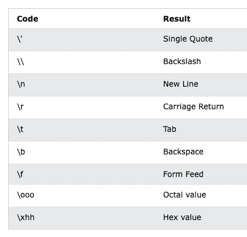

# Python Boot Camp 4 —字符串

> 原文：<https://blog.devgenius.io/python-boot-camp-4-strings-22330594eb1a?source=collection_archive---------7----------------------->

## Python 字符串


`String`也是 Python 中很常见的数据类型，比如日志打印、程序中的函数注释、数据库访问、变量的基本操作等。，都用字符串。当然，我相信你自己已经对弦乐有所了解了。

在今天的文章中，我主要带大家回顾一下弦乐的常见操作，并详细讲解其中的一些小技巧。

# 字符串基础

什么是字符串？字符串是一系列独立的字符，通常用单引号(')、双引号( "" )或三引号(`'''`或`"""`)括起来，如下所示:

```
name = 'jason'
city = 'my city1'
text = "welcome to my city!"
```

上面定义的三个变量:`name`、`city`和`text`都是字符串类型。我们知道 Python 中单引号，双引号，三引号的字符串是完全一样的，没有区别。例如，以下示例中的 s1、s2 和 s3 完全相同。

```
s1 = 'hello'
s2 = "hello"
s3 = """hello"""
s1 == s2 == s3
True
```

Python 的三重引号字符串主要用在多行字符串的上下文中，比如函数注释等等。

```
def calculate_similarity(item1, item2):
    """
    Calculate similarity between two items
    Args:
        item1: 1st item
        item2: 2nd item
    Returns:
      similarity score between item1 and item2
    """
```

同时，Python 还支持转义字符。所谓转义字符就是以反斜杠开头的字符串，代表某种特定的含义。



# 字符串常见操作

您可以将一个字符串看作一个单个字符的数组，因此 Python 字符串也支持索引、切片和遍历操作。

```
name = 'jason'
name[0]
'j'
name[1:3]
'as'
```

和列表、元组等其他数据结构一样，字符串的索引也是从 0 开始，`index=0`表示第一个元素(字符)，`[index:index+2]`表示元素的`index-th`到`index+1`子串。迭代字符串也和迭代字符串中的每个字符一样简单:

```
for char in name:
    print(char)   
j
a
s
o
n
```

特别注意 Python 字符串是不可变的。因此，使用以下操作来更改字符串中的字符是错误的，是不允许的。

```
s = 'hello'
s[0] = 'H'
Traceback (most recent call last):
  File "<stdin>", line 1, in <module>
TypeError: 'str' object does not support item assignment
```

Python 中对字符串的修改通常只能通过创建新的字符串来完成。例如，在上面的示例中，如果我们想将“hello”的第一个字符“H”改为大写的“H ”,我们可以执行以下操作:

```
s = 'H' + s[1:]
s = s.replace('j', 'H')
```

你可能知道，在其他语言中，比如 Java，有可变的字符串类型，比如`StringBuilder`，每增加、改变或删除一个字符，不需要创建新的字符串，时间复杂度只有 O( 1)。

这大大提高了程序的运行效率。但遗憾的是，Python 中没有相关的数据类型，你还是要创建新的字符串。所以每次要改变字符串，往往要花费`O(n)`时间复杂度，其中 n 是新字符串的长度。

但是随着 Python 版本的更新，越来越智能，性能也越来越好。

让我们看看下面的例子:

```
s = ''
for n in range(0, 100000):
    s += str(n)
```

你认为这个例子的时间复杂度是多少？似乎每次循环都要创建一个新的字符串；并且每创建一个新的字符串，都需要 O(n)的时间复杂度。

因此，总时间复杂度为 O(1) + O(2) + … + O(n) = O(n)。这样对吗？

乍一看，这个分析确实有道理，但是必须注意，这个结论只适用于旧版本的 Python。从 Python 2.5 开始，每次串并(`str1 += str2`)时，Python 首先检查`str1`是否有其他引用。如果没有，它将尝试就地扩展字符串缓冲区的大小，而不是重新分配一块内存来创建新的字符串并复制它。在这种情况下，上例中的时间复杂度只有`O(n)`。

所以以后写程序遇到字符串拼接的时候，如果用'`+=`'更方便，就可以放心使用，不用太担心效率问题。

另外，对于字符串拼接，除了使用加法运算符，我们还可以使用字符串内置的 join 函数。`string.join(iterable)`，意思是按照指定的格式连接各个元素。

```
l = []
for n in range(0, 100000):
    l.append(str(n))
l = ' '.join(l)
```

接下来，我们来看看`split()`拆分字符串的函数。`string.split(separator)`，表示根据分隔符将字符串拆分成子字符串，并返回拆分后的子字符串的组合列表。

```
def query_data(namespace, table):
    """
    given namespace and table, query database to get corresponding
    data         
    """path = 'hive://ads/training_table'
namespace = path.split('//')[1].split('/')[0] # return 'ads'
table = path.split('//')[1].split('/')[1] # return 'training_table'
data = query_data(namespace, table)
```

此外，常见的功能有:

*   `string.strip(str)`，意思是去掉开头和结尾的 str 串；
*   `string.lstrip(str)`，表示只去掉开头的 str 字符串；
*   `string.rstrip(str)`，这意味着只有尾部的 str 字符串被删除。

# 字符串格式

通常我们用一个字符串作为模板，模板里会有格式字符。这些格式说明符为随后的基本事实保留位置，以呈现基本事实应该出现的格式。字符串格式，通常用于程序输出、日志记录和其他场景。

例如，我们有一个任务，给定一个用户的`userid`，在数据库中查询关于该用户的一些信息，并返回。而如果数据库里没有这个人的信息，我们一般会记录下来，有利于以后的日志分析，或者是调试网上的 bug 等等。

```
print('no data available for person with id: {}, name: {}'.format(id, name))
```

其中，`string.format()`就是所谓的格式化功能；而花括号`{}`就是所谓的格式字符，用来给后面的实际值预留位置——变量名。如果`id = ‘123’`、`name=’jason’`，那么输出是:

```
'no data available for person with id: 123, name: jason'
```

可能有人会问，为什么一定要用格式化函数？上面的例子不能用字符串串联吗？是的，在许多情况下，字符串连接确实满足格式化函数的需要。但是使用格式化函数更清晰，更易读，更标准化，更不容易出错。

注意，从 Python 3.6 开始，f 字符串是一种格式化字符串的新方法。它们不仅比其他格式更易读、更简洁、更不易出错，而且速度也更快！如果你对 f 弦感兴趣，可以看看我之前的文章:“ [Python f 弦](https://python.plainenglish.io/python-f-strings-far-beyond-the-expectation-e2245cfef629)”。

# 结论

在这篇文章中，我主要介绍了 Python 字符串的一些基础知识和常用操作，并用具体的例子和场景进行了讲解。尤其需要注意以下几点。

*   Python 中的字符串用单引号、双引号或三引号表示，它们的意思都一样，没有区别。其中，三引号字符串通常用于多行字符串。
*   字符串在 Python 中是不可变的(除了前面描述的 Python 新版本中的串联操作符'+= ')。因此，不允许任意更改字符串中字符的值。
*   在 Python 的新版本(2.5+)中，字符串连接变得比以前更加高效，您可以放心地使用它。
*   Python 中的字符串格式化(string.format)常用于输出和日志记录等场景。