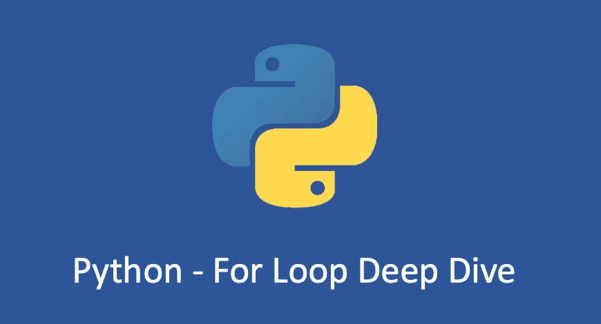
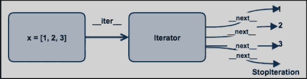

# python——你能解释一下“for 循环”是如何工作的吗？

> 原文：<https://blog.devgenius.io/python-can-you-explain-how-for-loop-works-d9d8618f39f1?source=collection_archive---------3----------------------->

## 用于循环深潜的 Python



`for ... in`语句可能是 Python 编程中使用最多的语句。用于`iterate`覆盖容器对象中的元素，可以是`lists`、`tuples`、`dictionaries`、`sets`、`files`，甚至可以是自定义的类或函数，比如:

在`list`上:

```
>>> for element in [1, 2, 3, 4]:
...    print(element)
...
1
2
3
4
```

在`tuples`上:

```
>>> **for** element **in** ("a", "b", 30):
...     print(element)
...
a
b
30
```

在文件上:

```
>>> **for** line **in** open("requirement.txt"):
...     print(line, end="")
...
Fabric==1.12.0
Markdown==2.6.7
```

你可能会问为什么这么多不同类型的对象支持`for`语句，还有哪些类型的对象可以用在`for`语句中？在回答这个问题之前，我们需要了解一下 for 循环背后的执行原理。

# For 循环

for 循环是对一个容器进行迭代的过程，**什么是迭代？迭代是从一个容器对象中一个接一个地读取元素，直到容器中不再有元素。**那么，哪些对象支持迭代运算呢？任何物体都可以？首先，尝试自定义一个类，看看它是否有效:

```
>>> **class** **MyTest**:
...     **def** **__init__**(self, num):
...         self.num = num
...
>>> **for** i **in** MyTest(10):
...     print(i)
...
Traceback (most recent call last):
  File "<stdin>", line 1, **in** <module>
TypeError: 'MyTest' object **is** **not** iterable
```

错误堆栈日志非常明确的告诉我们`MyTest`类不是`iterable`对象，所以不能用于迭代。什么样的物体叫做`iterable`？

在 Python 中， **Iterable 对象需要实现** `**__iter__**` **方法并返回一个迭代器。迭代器只需要实现** `**__next__**` **方法**。现在让我们验证为什么列表支持迭代:

```
>>> x = [1,2,3]
>>> l= x.__iter__() *# l is iterable*
>>> l
<list_iterator object at 0x100f32198>

>>> l.__next__()   # l is a iterator
1
>>> l.__next__()
2
>>> l.__next__()
3
>>> l.__next__()
Traceback (most recent call last):
  File "<stdin>", line 1, **in** <module>
StopIteration
```

从测试结果来看，list 是一个`iterable`对象，因为它实现了`__iter__`方法；iterator 对象(list_iterator) *是*，因为它实现了`__next__`方法*。*

我们看到它一直调用*的 __next__* 方法，实际上是迭代获取容器中的元素，直到容器中不再有元素抛出`StopIteration`异常。

那么`for`语句是如何循环的呢？：

1.  首先判断对象是否是一个`iterable`对象，如果不是，直接报错，抛出一个`TypeError`异常。如果是，它调用`__iter__`方法并返回一个`iterator`。
2.  继续调用`iterator`的`__next__`方法，每次依次返回`iterator`中的一个值。
3.  在迭代结束时，如果没有更多的元素，就会抛出异常`StopIteration`。这个异常将由 Python 自己处理，不会向开发人员公开。

整个流程如下所示:



对于`tuples`、`dictionaries`、`strings`也是如此。理解了 for 的执行原理后，我们就可以实现自己的迭代器用于 for 循环了。

之前的`MyTest`类报告了一个错误，因为它没有在迭代器协议中实现这两个方法。现在继续改进:

```
**class** **MyTest**:
    **def** **__init__**(self, num):
        self.i = 0
        self.num = num

    **def** **__iter__**(self):
        **return** self

    **def** **__next__**(self):
        **if** self.i < self.num:
            i = self.i
            self.i += 1
            **return** i
        **else**:
            **raise** StopIteration()
```

因为实现了`__next__`方法，`MyTest`本身已经是一个迭代器，所以对象本身是`__iter__`返回的。现在在 for 循环中尝试一下:

```
**for** i **in** MyTest(3):
    print(i)*# Output*
1
2
3
```

**for 循环的本质是不断调用迭代器** `**__next__**` **的方法，直到发生 StopIteration 异常退出循环**。所以任何`iterable`都可以用在 for 循环中。

# 中断并继续

使用`break`语句，我们可以在循环完所有项目之前停止循环:

```
fruits = ["apple", "banana", "cherry"]
for x in fruits:
    print(x)
    if x == "banana":
      break# Output
apple
banana
```

使用`continue`语句，我们可以停止循环的当前迭代，并继续下一个:

```
fruits = ["apple", "banana", "cherry"]
for x in fruits:
    if x == "banana":
        continue
    print(x)# Output
apple
cherry
```

您也可以在`for`循环中使用`else`关键字来指定循环结束时要执行的代码块:

```
for x in range(10):
    print(x)
else:
    print("Finished!")# Output
0
1
2
3
4
5
6
7
8
9
finished!
```

**注意:**如果循环被`break`语句停止或者`for`循环出现异常，则`else`块不会被执行。

# 小贴士:对于 vs While

`while`和`for`是 Python 中常用的两个实现循环的关键字，它们的运行效率其实是有差距的。如果您执行以下代码:

```
import timeit

def while_loop(n=100_000_000):
    i = 0
    s = 0
    while i < n:
        s += i
        i += 1
    return s

def for_loop(n=100_000_000):
    s = 0
    for i in range(n):
        s += i
    return s

def main():
    print('while loop\t\t', timeit.timeit(while_loop, number=1))
    print('for loop\t\t', timeit.timeit(for_loop, number=1))

if __name__ == '__main__':
    main()
*# => while loop               4.718853999860585*
*# => for loop                 3.211570399813354*
```

你可以看到`for`循环比`while`循环快 1.5 秒。区别主要在两者的机制上。

在每个循环中，`while`做两个操作:

*   变量的边界检查和递增。也就是说，每次执行循环时，while 都会进行边界检查(`while i < n`)和自动增量计算(`i +=1`)。这两步都是显式的纯 Python 代码。
*   `for`循环不需要进行边界检查和自动递增操作，也没有添加显式的 Python 代码(纯 Python 代码比低级 C 代码效率低)。当循环次数足够多时，效率差距明显。

一般来说，如果您只是迭代一个已知的集合，找到满足条件的元素，并执行适当的操作，那么使用`for`循环会更简洁。但是如果需要不断重复某些操作，直到满足某个条件，并且没有特定的集合要遍历，那么一般会使用一个`while`循环。