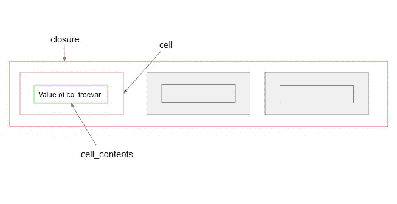

# Python 闭包——去神秘化

> 原文：<https://blog.devgenius.io/python-closures-b71e8847286f?source=collection_archive---------15----------------------->

[真诚媒体](https://unsplash.com/@sincerelymedia?utm_source=medium&utm_medium=referral)在 [Unsplash](https://unsplash.com?utm_source=medium&utm_medium=referral) 上拍摄的照片

你好，python 爱好者，在跳到实际主题之前，我希望你熟悉 python 嵌套函数的基础。人们经常混淆闭包和嵌套函数这两个术语，并互换使用。这些是同一个概念吗？让我们找出答案。

# 什么是闭包？

> 闭包是嵌套函数记住其封闭函数变量的状态的原因，即使在执行完成之后。这些变量的类型可以是另一个可调用的(即函数或类)或任何标准的数据类型。

在上面的例子中，当' *greeter_fun'* 函数被调用时，它创建新的函数' *greet'* ,并返回它。因此' *say_my_name'* 将持有新创建函数的引用。

这里，内部函数打印消息“Hello <name>，但是它从哪里获得' *name'* 的值呢？**这里，结束进入了画面。**</name>

> 不要混淆嵌套函数和闭包- **它们是不一样的！！**

闭包导致嵌套函数以某种方式运行，即记住自由变量的状态。

我们将很快讨论自由变量…

# 闭包是如何工作的？

***步骤 1*** :当外部函数' *greeter_fun'* 被调用时，构建嵌套函数' *greet'* 。

***第二步*** :拍摄' *greet'* 函数的状态快照(包括 *name* = '海森堡'的值)。

***第三步*** :将此快照或元数据附加到' *greet'* 函数中。这不过是功能的封闭。

***第四步*** :返回新创建的' *greet'* 函数引用。

现在，每当我们调用' *say_my_name'* 时，它将始终拥有由变量' *name'* 和值 *'Heisenberg'* 组成元数据。

# 自由变量

> 在一个程序块中使用但没有在该程序块中定义的变量称为自由变量。

> 在我们的例子中，' ***名称'*** 变量内部' ***问候'*** 函数是**自由变量**

自由变量存在于附属于函数的元数据中。幸运的是，python 可以访问这些元数据。由于的 *ay_my_name'* 持有嵌套函数' *greet '的引用，所以可以通过两种方式访问 i* ts 元数据 *-*

## **1。via *__code__* 属性:**

> __code__ 属性包含' *co_freevars'* 字段，该字段是在代码块中定义的自由变量元组。

例如

## 2.使用 __closure__ 属性:

> __closure__ 返回' *cell'* 对象的元组，其中每个对象保存一个名为' *cell_contents '的属性，t*his '*cell _ contents '*保存当前的 *'co_freevar'* 值。

图表会让它更清楚……:-)

图像:__closure__ 属性的结构

例如

如果你想修改自由变量呢？你可以去改变它，对吗？

默认情况下，这些自由变量是只读的，你必须使用**非局部关键字**将它们显式声明为非局部变量，以便修改它们。

闭包提供了数据隐藏，因为当您需要对全局范围变量隐藏功能时，可以使用它们。此外，闭包可能是一个优雅的解决方案，而不是为更少的方法和属性编写类。

闭包在装饰者中被广泛使用。如果你想了解更多，请查看我关于[装修工](https://medium.com/analytics-vidhya/python-decorators-a-weapon-to-be-mastered-be310b519ac5)的详细文章。

如果您读到这里，我希望这篇文章能帮助您理解 python 中的闭包。

***干杯！***