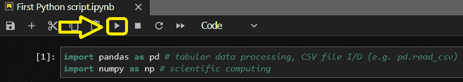

# Python 数据处理-导入库和数据

> 原文：<https://blog.devgenius.io/python-data-processing-importing-libraries-data-datatelier-b3b4c7ac43e1?source=collection_archive---------10----------------------->


在我的关于 Python 数据处理的介绍性文章中，我谈到了在 Anaconda 上使用 Jupyter Notebook，这是一种简单的方法，只需点击几下鼠标就可以获得完全可操作的 Python 环境。我们还看到了用于数据处理的 Python 脚本的一般结构，这只是为了快速入门，而不是深入细节。

在这篇文章中，我想给你更多的元素来理解实际的代码，这样你就可以开始一步一步地构建你自己的 Python 脚本。

```
· [Python essential Packages and Libraries for Data Science](#2a7c)
· [Importing Libraries in our Python script](#63d5)
· [Importing data into Python](#6987)
```

# 用于数据科学的 Python 基本包和库

我们现在想开始用 Python 处理数据。实际上，不是“通用”Python，而是通过
使用一些使数据操作和分析非常方便的包。

数据处理的核心包是**熊猫**，能够处理表格数据、导入文本文件、处理时间序列等。
作为补充，我们经常需要使用另一个著名的包 **NumPy** (用于科学计算，
多维数组，高级数学运算等。)，这简化了我们可能需要做的一些操作。

然后，我们可能想要创建数据可视化或图形分析，为此，Matplotlib 库是我们的首选。

还有其他非常有用的包和库，比如 **Seaborn** (用于统计数据可视化) **Scikit-learn** (用于机器学习)，在某些时候我们可以使用。

关于措辞“库”vs“包”的注意事项:严格来说，“包”是
模块的集合，“库”是包的集合。但实际上，你会经常看到 Pandas
和 Numpy 被称为“库”，这是合理的，因为它们是非常复杂的包。

从现在开始，我将使用“库”来做任何事情，保持简单。

现在让我们开始构建我们的第一个 Python 数据处理脚本。

# 在我们的 Python 脚本中导入库

在我们所有的 Python 数据处理中，我们从导入库开始，至少是 **Pandas** 和 **NumPy** 。

让我们先看看代码，然后再了解一些相关的理论

```
import pandas as pd # tabular data processing, CSV file I/O (e.g. pd.read_csv) import numpy as np # scientific computing
```

你可以把它写在我们的 Jupyter 笔记本上(参见我的[介绍文章](https://datatelier.com/getting-started-with-python-data-processing/)了解如何写)，然后按 Run 执行代码，我们没有得到任何输出，这是正常的。



在我们当前的脚本中， **import** 命令导入一个库，一个包，甚至一个模块。通过这样做，外部组件的所有功能都被导入并可以在我们的脚本中使用。

**as pd** 部分告诉 Python，我们希望通过一个简短的别名来引用导入的库，以用于脚本的其余部分。

pd 和 np 是最常用的别名。

现在让我们从 Python 中的实际数据处理开始。首先:最自然的开始是将数据导入 Python。

# 将数据导入 Python

数据可以来自不同的来源:文本文件、数据库等，但最终，在 Python 中，我们以相同的方式存储它们，通过相同的数据“容器”结构(称为“数据帧”)，我们将在另一篇文章中讨论。

让我们导入一个逗号分隔文件(csv ),并探索一些有用的选项来正确解释源格式。你可以在这里得到源文件[。](https://datatelier.com/download/832/)

通常源文件看起来非常丑陋，人们想知道我们如何能得到对它有洞察力的分析。嗯，这是 Python 熊猫的用武之地，将允许真正深入和好看的分析。我们在本帖中使用的源 csv 给出了一些关于客户的信息:每一行是一个不同的客户，对于任何一个客户给出了 5 个不同的信息:


为了在我们的 Jupyter 笔记本中将它导入 Python，我们使用 read_csv 方法，其最简单的形式是:

```
df = pd.read_csv('./JupyterSourceFiles/Mall_Customers.csv')
```

注意，对于文件名，语法指的是 Anaconda 主文件夹中的相对文件夹路径。你可以选择任何其他路径，甚至是绝对路径。

**pd.read_csv** 部分从 pd 库中调用 read_csv 方法，结果存储在变量 df 中，这是一个 DataFrame 结构，我们将在其他帖子中讨论。一旦运行了命令(在 Jupyter 笔记本中)


看起来什么都没发生，但实际上是的，您刚刚将第一个 csv 文件导入到 Python 中。要显示导入的内容，只需输入刚刚创建的变量来存储导入的文件，在我的例子中是 **df**


这里我们使用的是 csv，但是 Pandas 有许多其他方法专门用于几种文件类型:excel、json 等。

让我们看看主 read_csv()的常见变体，以获得灵活性:

```
df = pd.read_csv('./JupyterSourceFiles/Mall_Customers.csv', sep=';')df = pd.read_csv('./JupyterSourceFiles/Mall_Customers.csv', header = None)
```


```
df = pd.read_csv('./JupyterSourceFiles/Mall_Customers.csv', index_col = 'CustomerID')
```


你可以从[这里](https://datatelier.com/download/1177/)下载 Jupyter 笔记本文件。

下一步将是，理解数据框架如何工作，操纵和探索它们的方法。

感谢阅读。

[随时订阅我的**【分享数据知识】**简讯**。**](http://eepurl.com/humfIH)


如果你想订阅《灵媒》,请随意使用我的推荐链接[https://medium.com/@maw-ferrari/membership](https://medium.com/@maw-ferrari/membership):对你来说，费用是一样的，但它间接有助于我的故事。

*原为 2022 年 7 月 24 日在*[*https://datatelier.com*](https://datatelier.com/python-data-processing-importing-libraries-data/)*发布。*