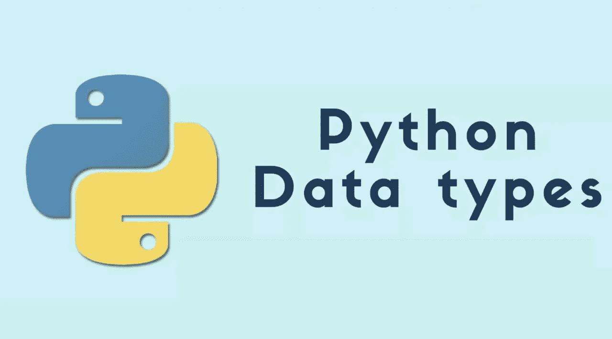
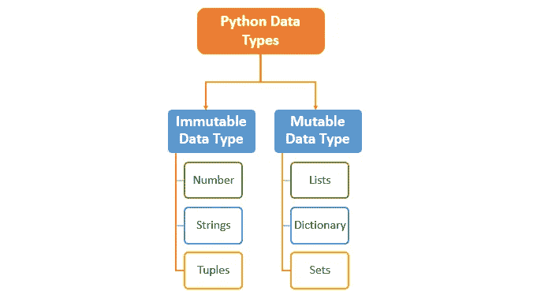
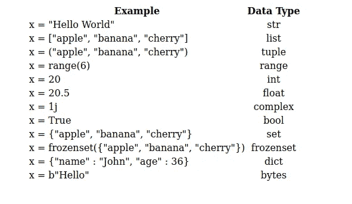

# Python 数据类型

> 原文：<https://blog.devgenius.io/python-data-types-3f8b9a1db1a?source=collection_archive---------19----------------------->

在编程中，数据类型是一个重要的概念。

变量可以存储不同类型的数据，不同的类型可以做不同的事情。

Python 中的每个值都有一个数据类型。因为在 Python 编程中一切都是对象，所以数据类型实际上是类，变量是这些类的实例(对象)。

# **Python 包含 12 种内置数据类型**

*   4 数值类型[ int，float，complex，bool ]
*   4 序列类型[字符串、列表、元组、范围]
*   2 组类型[组，冷冻组]
*   1 映射类型[字典]
*   1 二进制类型:[字节]

## 可变与不可变

*   **可变**→数值改变
*   **不可变**→数值不能改变

# 实际数据类型

因此，试着用这些片段。