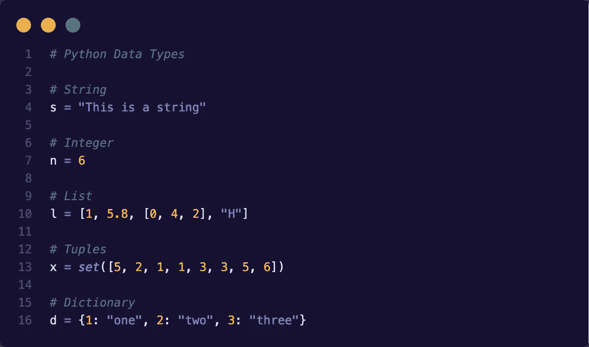

# Python 数据类型

> 原文：<https://blog.devgenius.io/python-data-types-4959eb84635f?source=collection_archive---------15----------------------->

了解主要的 Python 数据类型



Python 数据类型

这一次我想告诉你关于 Python 语言的一个基本话题，但是，我认为了解它是非常重要的，我正在谈论数据类型，所以让我们进入主题。

Python 有一系列数据类型，它们定义了一组具有特征和特定属性的值，这些数据类型允许我们处理诸如:整数、浮点数、复数、字符串、列表、元组、字典、文件对象等信息。

在 Python 中需要记住的是，一切都是对象，所以数据类型是决定特征和属性的类。另一方面，我们代码中定义的变量是我们指定的数据类型的实例。如果你不理解[类](https://en.wikipedia.org/wiki/Class_(computer_programming))和[实例](https://en.wikipedia.org/wiki/Instance_(computer_science))的概念，我邀请你访问链接以了解详情。

现在，我将根据数据类型的特征、属性、可变性或不变性对它们进行分组，我的目标是使理解更容易:

# 1.不可变数据类型

不可变数据类型是一种一旦其状态或值被创建或赋值就不能被修改的数据类型。在 Python 中，以下数据类型具有此条件:

## 1.1 数字

Python 只有四种类型的数字:

*   **整数**:在这种情况下，整数在语言中没有限制，它们只受到可用内存空间的限制。例如:-8，9，999999，-33333。
*   **Float** :和整数不一样，Float 有一个定义好的限制，根据 sys 模块，最大值是 1.7976931348623157e + 308，我邀请你用下面的代码检查一下:

```
import sys
sys.float_info
```

例子:7.0，-6.5，3e13。

*   复数:由一个实部和一个后缀为 j 的虚部组成。例如:6 + 3j，-7 + 34j。
*   布尔型:它们只有两个可能的值真或假。这些值在内部存储为 1 和 0，这就是它们被视为数字数据类型的原因。

## 1.2.用线串

字符串至少由一个或多个字符组成。有许多分隔字符串的选项:

*   "当一个字符串包含“单引号”时，可以使用双引号."
*   当字符串包含“双引号”时，可以使用单引号。
*   ' ' \t 当字符串以制表符(\ t)开始，以换行符(\n)结束时，使用三个单引号。' ' \n ' ' '
*   " " "当你有一个可以包含换行符的字符串时，你可以使用三重双引号."""

字符串示例:

```
x = "Hello world"y = '"Python is love!" (DevGenius, 2020, On Medium)'
```

## 1.3 元组( )

这种数据类型非常类似于 Python 中的列表，但区别在于元组是不可变的(剧透！).这个特性使它们比列表更有效。元组可以包含数据类型的组合，如字符串、元组、列表、字典、函数、文件对象和任何数字类型。

元组示例:

```
x = (2, 6, 4.5, "siete", ["a", "b"], (5, 0))y = (1, 9, 3, 10, 5)
```

# 2.可变数据类型

可变数据类型与不可变数据类型相反，因为可变数据类型在创建或定义后可以改变其值。在 Python 中，以下数据类型具有此条件:

## 2.1 列表[ ]

Python 中的列表是一种非常强大的数据类型。列表与其他编程语言中的数组非常相似，但有所不同，因为在 Python 中，列表可以包含数据类型的组合，如字符串、元组、列表、字典、函数、文件对象和任何类型的数字。

Python 中的列表有两种可能的索引方式:

*   从头到尾:我们可以从 0 到 N 的位置，用正指数来计算。
*   从结束到开始:我们可以这样做，使用负指数，从 N 到 0 的位置。

n:它是列表长度- 1，在 Python 中列表从零开始。

列出示例:

```
x = [2, 6, 4.5, "seven", ["a", "b"], (5, 0)]matrix = [[1, 2, 3], [4, 5, 6], [7, 8, 9]]
```

索引示例:

## 2.2 词典{ }

Python 中的字典为我们提供了一个关联数组类型，通过两个元素，一个键和一个值，这些是完全相关的。这种类型的结构对于数据搜索非常有效。

重要的是要知道，Python 字典有一个限制，即键必须是不可变的数据类型，目标是保持字典的一致性。另一方面，与键相关联的值可以是任何 Python 数据类型，从而可以在创建或定义后更改它们。

词典示例:

```
x = {1: "one", 2: "two", 3: "three"}y = {'first': 1, ("Python", "Year"): ("Love", 1991)}
```

## 2.3 套([ ])

Python 中的集合是对象的无序集合，用于唯一性是我们需要的主要特征之一的情况。集合的行为类似于字典，但没有键和值元素。

树立榜样:

```
x = set([1, 2, 3, 1, 3, 3, 5])print(x)Output:{1, 2, 3, 5}
```

本文中描述的数据类型是一些最重要的数据类型，在我看来，您通常必须在 Python 中使用它们。将来，我会写更多关于这些数据类型的文章，包括适用于它们的转换、操作和方法。

请在本文中随意评论任何没有提到的细节。

非常感谢你来到这里。😊 👈

这篇文章是受这本书的启发📖"[快速蟒书](https://books.google.co.cr/books/about/The_Quick_Python_Book.html?id=urVEzQEACAAJ&source=kp_book_description&redir_esc=y)"📖如果你想了解这门语言的基本概念，同时想了解其他高级主题，我向你广泛推荐。