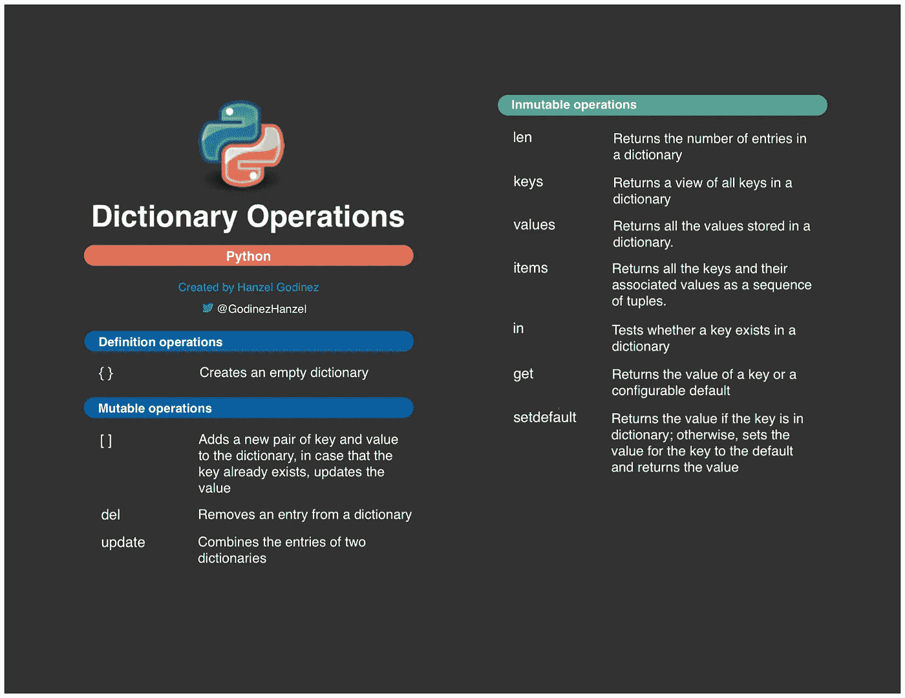
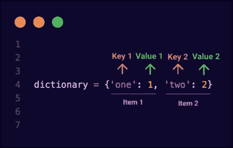

# Python 字典操作

> 原文：<https://blog.devgenius.io/python-dictionary-operations-68e19b08ea30?source=collection_archive---------1----------------------->

Python 中最常见的字典操作



字典操作

在开始学习 Python 中字典支持的操作之前，我想推荐文章 [Python 数据类型](https://medium.com/dev-genius/python-data-types-4959eb84635f)，这是一篇好文章，在开始学习稍微高级一些的文章之前。

字典在其他编程语言中被称为哈希表，它们通过两个元素，一个键和一个值，为我们提供了一个可变的关联数组类型，这是完全相关的。这种类型的结构对于数据搜索非常有效。



重要的是要知道，Python 字典有一个限制，即键必须是不可变的数据类型，目标是保持字典的一致性。另一方面，与键相关联的值可以是任何 Python 数据类型，从而可以在创建或定义后更改它们。

词典示例:

```
x = {1: "one", 2: "two", 3: "three"}y = {'first': 1, ("Python", "Year"): ("Love", 1991)}
```

现在，我们更好地理解了字典，让我们看看 Python 中支持这些字典的不同操作。

# 字典操作

我将根据对这些操作的影响对列表操作进行分组，我的目标是使解释和理解更容易:

## 1.定义操作

这些操作允许我们定义或创建一个字典。

**1.1。{ }**

创建一个空字典或一个有初始值的字典。

```
y = {}x = {1: "one", 2: "two", 3: "three"}
```

# 2.可变操作

这些操作允许我们使用字典，但是改变或修改它们以前的定义。

**2.1。【**

向字典中添加一对新的键和值，但是如果字典中已经存在键，我们可以更新值。

```
y = {}y['one'] = 1y['two'] = 2print(y)Output:{'one': 1, 'two': 2}y['two'] = 'dos'print(y)Output:{'one': 1, 'two': 'dos'}
```

正如我之前告诉你的，键值应该是不可变的数据类型，因此如果你试图用可变的数据类型定义一个字典，Python 会抛出一个 type error:unhashable type exception。

**2.2。del**

Del 语句可以用来从字典中删除一个条目(键值对)。

```
y = {'one': 1, 'two': 2}print(y)Output:{'one': 1, 'two': 2}del y['two']print(y)Output:{'one': 1}
```

**2.3。更新**

这个方法用第二个字典的所有键值对更新第一个字典。两个字典共有的键，第二个字典的值会覆盖第一个字典的值。

```
x = {'one': 0, 'two': 2}y = {'one': 1, 'three': 3}x.update(y)print(x)Output:{'one': 1, 'two': 2, 'three': 3}
```

# 3.不可变操作

这些操作允许我们在不改变或修改字典先前定义的情况下使用字典。

**3.1。len**

返回字典中条目(键值对)的数量。

```
x = {'one': 0, 'two': 2}print(len(x))Output:2
```

**3.2。按键**

这个方法允许你获取字典中的所有键。它通常用在循环的[中来迭代字典的内容。](https://wiki.python.org/moin/ForLoop#:~:text=for%20loops%20are%20traditionally%20used,executing%20the%20block%20each%20time.&text=For%20loop%20from%200%20to%202%2C%20therefore%20running%203%20times.)

```
x = {'one': 1, 'two': 2}print(x.keys())Output:dict_keys(['one', 'two'])
```

**3.3。价值**

这个方法可让您取得储存在字典中的所有值。

```
x = {'one': 1, 'two': 2}print(x.values())Output:dict_values([1, 2])
```

**3.4。项目**

以元组序列的形式返回所有密钥及其关联值。

```
x = {'one': 1, 'two': 2}print(x.items())Output:dict_items([('one', 1), ('two', 2)])
```

**3.5。在**

试图访问不在字典中的密钥将引发异常。若要处理这个例外状况，您可以使用 in 方法，测试金钥是否存在於字典中，如果字典有值储存在指定的金钥下，则传回 True，否则传回 False。

```
y = {'one': 1, 'two': 2}del y['three']Output:KeyError: 'three'y = {'one': 1, 'two': 2}if 'three' in y: 
    del y['three']

print(y)Output:{'one': 1, 'two': 2}
```

**3.6。获得**

如果字典包含某个密钥，则返回与该密钥相关联的值。如果字典不包含该密钥，则可以指定第二个可选参数以返回默认值。如果不包含该参数，get 方法将返回 None。

```
y = {'one': 1, 'two': 2}print(y.get('one'))print(y.get('three'))print(y.get('three', 'The key does not exist.'))Output:1NoneThe key does not exist.
```

**3.7。setdefault**

这个方法类似於 get 方法，它会传回与金钥相关联的值(如果字典包含该金钥)，但在字典不包含金钥的情况下，这个方法会在字典中建立新项目(金钥-值对)，其中这个方法的第一个引数是金钥，而第二个引数是值。第二个参数是可选的，但如果不包括此参数，则值将为 None。

```
y = {'one': 1, 'two': 2}print(y.setdefault('three', '3'))print(y.setdefault('two', 'dos'))print(y)Output:32{'one': 1, 'two': 2, 'three': '3'}
```

这些是与 Python 字典相关的一些最常见和最重要的操作，这是详细了解它们的主要原因之一。

我请你对没有提到的任何细节发表评论。我相信你的贡献将是非常宝贵的。

在说再见之前，我先留下下面的[链接](https://github.com/hgodinez89/dict-operations-cheat-sheet)，在这里你可以看到一份关于所有字典操作的备忘单。

非常感谢各位来到这里。😊 👈

这篇文章受这本书的启发📖[妙语连珠📖，这一点我广泛地向你推荐，如果你想了解语言的基本概念，同时，还要了解其他高级的话题。](https://books.google.co.cr/books/about/The_Quick_Python_Book.html?id=urVEzQEACAAJ&source=kp_book_description&redir_esc=y)