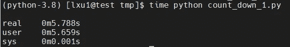
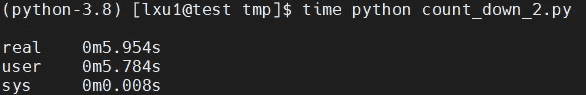
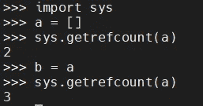
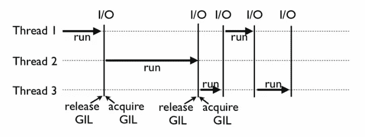
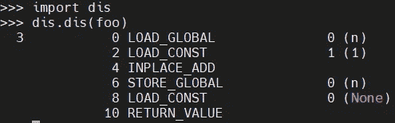
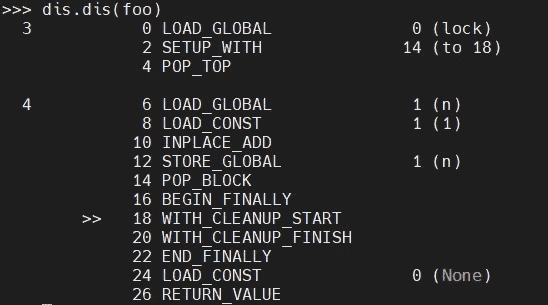

# python——你真的了解 GIL 吗？

> 原文：<https://blog.devgenius.io/python-do-you-really-understand-gil-8944fcd773cd?source=collection_archive---------5----------------------->

## Python 全局解释器锁深潜


Python 全局解释器锁或 GIL，简而言之，是一个互斥体(或锁)，只允许一个线程控制 Python 解释器。这意味着在任何给定的时间，只有一个线程可以处于执行状态。

如果你只开发单线程 Python 程序，你可能感觉不到影响。但是如果你正在做多线程 Python 编程，GIL 会成为一个瓶颈。

让我们来看一个例子，下面是一个非常简单的 cpu 绑定代码:

```
def count_down(n):
    while n > 0:
        n -= 1
```

现在，假设一个很大的数字`n = 100000000`，让我们试着在单线程中执行`count_down(n)`。

我的测试环境有 2 个 CPU，执行时间是:



这时候我们就试着用多线程来加速吧，比如下面这几行:

```
from threading import Thread def count_down(n):
    while n > 0:
        n -= 1if __name__ == '__main__':
    n = 100000000
    t1 = Thread(target=CountDown, args=[n // 2])
    t2 = Thread(target=CountDown, args=[n // 2])
    t1.start()
    t2.start()
    t1.join()
    t2.join()
```

再次执行上面的程序，这次的结果看起来像:



您可以看到结果现在更慢了，总时间为 5.954 秒。即使您尝试使用四个线程，总执行时间仍将接近两个线程的执行时间。

这是怎么回事？Python 线程是假线程吗？Python 的线程确实封装了底层操作系统线程。在 Linux 系统中是 Pthread(全称是 POSIX Thread)，在 Windows 系统中是 Windows Thread。

此外，Python 线程也完全由 OS 管理，比如协调何时执行、管理内存资源、管理中断等等。

# 为什么是 GIL？

GIL 是最流行的 Python 解释器 CPython 中的一个技术术语。它代表`Global Interpreter Lock`，本质上是一个互斥体。**每一个 Python 线程，在 CPython 解释器中执行时，都会先锁定自己的线程，防止其他线程执行。**

当然，CPython 做了一点小技巧来依次执行 Python 线程。通过这种方式，用户看到的是“伪并行”——Python 线程是交错的，以模拟真正的并行。

所以你可能会问，为什么 CPython 需要 GIL？这其实和 CPython 的实现有关。CPython 使用引用计数来管理内存。在 Python 脚本中创建的所有实例都有一个引用计数来记录有多少个指向它的指针。当引用计数为 0 时，内存自动释放。

您可以使用`sys.getrefcount()`来检查参考计数:



`a`、`b`、`getrefcount`均引用空列表。

这样，如果两个 Python 线程同时引用`a`，就会造成引用计数竞争情况，引用计数可能只增加 1。那么当第一个线程结束时，引用计数可能会减少 1，内存可能会被释放。然后当第二个线程再次尝试访问`a`时，就找不到有效的内存了。

因此，CPython 引入 GIL 主要有两个原因:

*   **一是设计者避免了内存管理等复杂的竞争条件；**
*   **第二是因为 CPython 使用了很多 C 语言库，但是大多数 C 语言库本身并不是线程安全的(线程安全降低了性能，增加了复杂性)。**

# GIL 是如何工作的？

下图是 Python 中 GIL 程序的工作示例。其中，线程 1、2 和 3 依次执行。

每个线程开始执行时，都会锁定 GIL，阻止其他线程执行；类似地，每个线程执行一段时间后，会释放 GIL 让其他线程执行。



在 CPython 中，有一种机制叫做`check_interval`，这意味着 CPython 解释器会轮询检查线程 GIL 的锁状态。每隔一段时间，Python 解释器会强制当前线程释放 GIL，以便其他线程有机会执行。

> 注意:当执行 I/O 操作时，当一个线程被阻塞时，GIL 将被立即释放，因此其他线程可以继续运行。

# Python 中的线程安全

然而，有了 GIL，并不意味着我们 Python 程序员不用担心线程安全。尽管我们知道 GIL 只允许一个 Python 线程执行，正如我前面提到的，Python 也有一个抢占机制，比如检查间隔。让我们考虑这样一段代码:

```
import threadingn = 0def foo():
    global n
    n += 1threads = []
for i in range(100):
    t = threading.Thread(target=foo)
    threads.append(t)for t in threads:
    t.start()for t in threads:
    t.join()print(n)
```

如果你执行它，你会发现虽然它大部分时间都打印`100`，但有时也会打印`99`或`98`。

这其实是因为代码`n+=1`让线程变得不安全。如果翻译 foo 函数的`bytecode`，你会发现它实际上由下面四行`bytecode`组成:



而`bytecode`的这四行中间很可能会被打断！所以即使有了 GIL，你仍然需要注意线程安全。GIL 的设计主要是为了方便 CPython 解释器级别的编写人员，而不是 Python 应用程序级别的程序员。

作为 Python 用户，我们仍然需要使用`lock`来保证线程安全:

```
n = 0
lock = threading.Lock()def foo():
    global n
    with lock:
        n += 1
```

新的`bytecode`看起来像:



# 为什么 GIL 还没有被移除？

GIL 显然可以被移除，开发者和研究人员在过去已经多次这样做了，但所有这些尝试都破坏了现有的 C 扩展，这些扩展严重依赖于 GIL 提供的解决方案。

Python 的创始人、BDFL 吉多·范·罗苏姆在 2007 年 9 月的文章[“移除 GIL 并不容易”](https://www.artima.com/weblogs/viewpost.jsp?thread=214235)中给了社区一个答案:

> *“只有当*单线程程序(以及多线程但 I/O 受限的程序)*的性能不下降*时，我才会欢迎 Py3k* 中的一组补丁*

*从那以后的任何尝试都没有满足这个条件。*

*好的一面是 GIL 是 CPython 解释器强加的一个限制。如果您的代码不需要 CPython 解释器来执行，它就不再受 GIL 的限制。*

*其实很多高性能应用场景已经有大量用 C 实现的 Python 库，比如`NumPy`的矩阵运算，都是用 C 实现的，不受 GIL 的影响。*