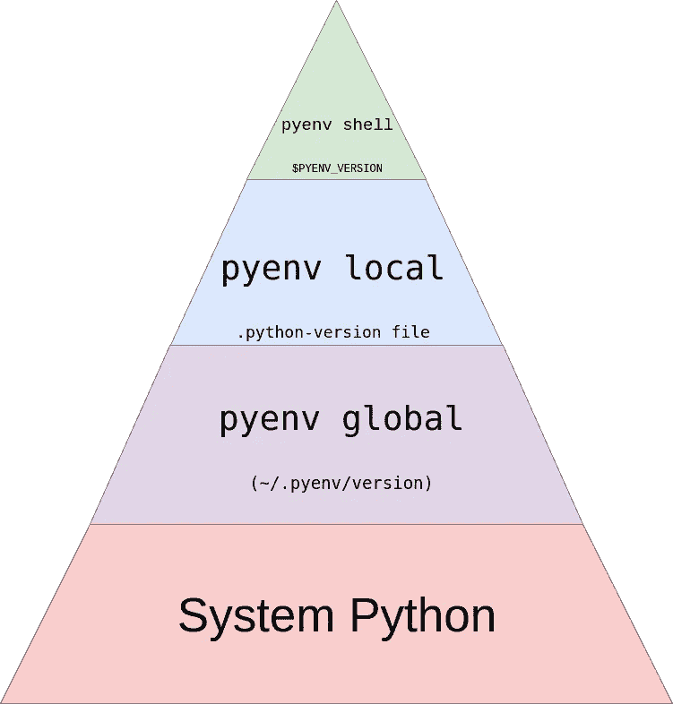

# Python 环境管理

> 原文：<https://blog.devgenius.io/python-environment-management-d920f20ea53e?source=collection_archive---------3----------------------->

## Python 版本、虚拟环境、依赖性、包管理

曾几何时，开发人员的笔记本电脑上只有一个 Python 版本和一个 Python 环境，一切都运行得很完美。直到有一天，你需要处理多个项目，这些项目有不同的 Python 包需求，你的老板希望你的应用程序支持最新最好的 Python 版本。对于第一个问题，您可能已经使用 conda、venv、pip 来管理您的 Python 环境，对于第二个问题，您可以安装最新的 Python 版本。然而，如果呢

1.  您的应用程序需要支持多个 Python 版本
2.  您希望虚拟环境与 Python 项目相关联并随项目一起管理，而不必手动管理。

注意，我们只讨论 Python 开发环境。对于部署，通常的做法应该是将 Python 依赖关系容器化，每个容器化的环境只支持一个版本。

# Python 版本管理

当你使用上面的[方法](/interesting-python-tricks-77567d75e2bd)安装 Python 时，Python 实际上是系统 Python，与你的项目无关。 [pyenv](https://realpython.com/intro-to-pyenv/) 可以为你的项目创建本地 Python。链接解释了一个场景:一个项目需要支持 Python 3.6，并使用 3.8-dev 进行实验。可以使用“pyenv local<project>3 . 6 . 8”在不同 Python 版本之间快速切换。

[](https://realpython.com/intro-to-pyenv/)

# 虚拟环境管理

[Python 虚拟环境](https://realpython.com/python-virtual-environments-a-primer/)管理 Python 包。在项目环境中，你的项目正常运行所依赖的是依赖关系(例如 pandas，yaml 包，通常可以在 [Python 包索引](https://pypi.org/)中找到)。这方面的主要工具有:

*   virtualenv: Python 2 没有原生虚拟环境管理器，由 virtualenv 提供 venv:这是一个 Python 原生模块，用于创建轻量级虚拟环境。
*   Pip:这是 Python 的包安装程序。您可以使用它从 Python 包索引和其他索引安装包。
*   Conda: Conda 是一个软件包和环境管理系统，可以在你的本地机器上创建、保存、加载和切换环境。它主要关注数据科学
*   Pipenv:这是一个包管理器，用于管理 Python 项目的依赖性。
*   诗歌:这是最近才出现的，通常被认为是用于项目依赖管理的简单 Python 工具。

下面的文章有一个表格来比较不同的工具

https://testdriven.io/blog/python-environments
pipenv 和诗歌很有趣，因为他们和 pyenv 一起工作。他们很像但是诗歌甚至支持[发布你的包](https://www.earthinversion.com/utilities/easiest-way-to-publish-a-python-package-using-poetry/)到 [PyPI](https://pypi.org/) 。

[](https://remastr.com/blog/pip-pipenv-poetry-comparison) [## 发展您的业务- Remastr

### 在开发 Django 应用程序时，有几种方法可以管理项目依赖关系。在本文中，它…

remastr.com](https://remastr.com/blog/pip-pipenv-poetry-comparison) 

使用 poems
* py project . toml 作为中央配置文件的好处
*一个配置文件用于所有依赖项及其配置
*无需手动创建和管理虚拟环境
*自动解析已安装插件的依赖项

最流行的 Python IDE 之一 Pycharm 集成了一些工具，例如 [virtualenv](https://www.jetbrains.com/help/pycharm/creating-virtual-environment.html) 、 [conda](https://www.jetbrains.com/help/pycharm/conda-support-creating-conda-virtual-environment.html) 、 [pipenv](https://www.jetbrains.com/help/pycharm/pipenv.html) 、[poetics](https://www.jetbrains.com/help/pycharm/poetry.html)。这里还有一篇 [VSCode 带诗](https://www.pythoncheatsheet.org/blog/python-projects-with-poetry-and-vscode-part-1)的文章，也表明了这些工具的流行。

# 试用 pyenv

让我们看看 pyenv 支持基于项目的 Python 版本管理有多容易。我在用谷歌 Colab。

## 安装 pyenv

```
#[https://github.com/pyenv/pyenv-installer](https://github.com/pyenv/pyenv-installer)
!curl [https://pyenv.run](https://pyenv.run) | bash
```

## 初始化 pyenv

```
!export PYENV_ROOT="$HOME/.pyenv" && export PATH="$PYENV_ROOT/bin:$PATH" && eval "$(pyenv init — path)"
```

结果:您可以看到 pyenv 在“$HOME/”下有自己的文件夹。pyenv "

```
# Load pyenv automatically by appending
# the following to 
your shell's login startup file (for login shells)
and your shell's interactive startup file (for interactive shells) :export PYENV_ROOT="$HOME/.pyenv"
command -v pyenv >/dev/null || export PATH="$PYENV_ROOT/bin:$PATH"
eval "$(pyenv init -)"# Restart your shell for the changes to take effect.
```

## 检查 pyenv 支持的 Python 版本

```
!export PYENV_ROOT="$HOME/.pyenv" && export PATH="$PYENV_ROOT/bin:$PATH" && pyenv install -list | grep "3\.[89]"
```

结果:以下是使用 pyenv 的可安装和可管理的 Python 版本。

```
 3.8.0
  3.8-dev
  3.8.1
  3.8.2
  3.8.3
  3.8.4
  3.8.5
  3.8.6
  3.8.7
  3.8.8
  3.8.9
  3.8.10
  3.8.11
  3.8.12
  3.8.13
  3.9.0
  3.9-dev
  3.9.1
  3.9.2
  3.9.4
  3.9.5
  3.9.6
  3.9.7
  3.9.8
  3.9.9
  3.9.10
  3.9.11
  3.9.12
  3.9.13
  miniconda-3.8.3
  miniconda-3.9.1
  miniconda3-3.8.3
  ...
```

## 安装 Python 3.9.10，列出 pyenv 管理的 Python 版本

```
# install python 3.9.10
!export PYENV_ROOT="$HOME/.pyenv" && export PATH="$PYENV_ROOT/bin:$PATH" && pyenv install 3.9.10
!export PYENV_ROOT="$HOME/.pyenv" && export PATH="$PYENV_ROOT/bin:$PATH" && pyenv versions
```

结果

```
Downloading Python-3.9.10.tar.xz...
-> [https://www.python.org/ftp/python/3.9.10/Python-3.9.10.tar.xz](https://www.python.org/ftp/python/3.9.10/Python-3.9.10.tar.xz)
Installing Python-3.9.10...
WARNING: The Python ctypes extension was not compiled. Missing the libffi lib?
Installed Python-3.9.10 to /root/.pyenv/versions/3.9.10
# pyenv list
system
* 3.9.10 (set by /content/.python-version)
```

## 创建项目 1，设置 Python 版本并列出 Python 版本

```
!export PYENV_ROOT="$HOME/.pyenv" && export PATH="$PYENV_ROOT/bin:$PATH" && mkdir -p /content/project1 && cd /content/project1 && pyenv virtualenv 3.9.10 project1
!export PYENV_ROOT="$HOME/.pyenv" && export PATH="$PYENV_ROOT/bin:$PATH" && pyenv versions
```

结果

```
 system
* 3.9.10 (set by /content/.python-version)
  3.9.10/envs/project1
  project1
```

## 检查项目 1 与哪个 Python 版本相关联

```
export PYENV_ROOT="$HOME/.pyenv" && export PATH="$PYENV_ROOT/bin:$PATH" && pyenv local project1 && pyenv which python
!export PYENV_ROOT="$HOME/.pyenv" && export PATH="$PYENV_ROOT/bin:$PATH" && eval "$(pyenv init --path)" && pyenv local project1 && cd /content/project1 && python -V
```

结果:当我们使用“pyenv 本地项目 1”时，它使用的是项目 1 的相关 Python。

```
/root/.pyenv/versions/project1/bin/python
Python 3.9.10
```

## 安装 Python 3.8.10，项目 2 将使用它

```
!export PYENV_ROOT="$HOME/.pyenv" && export PATH="$PYENV_ROOT/bin:$PATH" && pyenv install 3.8.10
```

## 立即列出版本

```
!export PYENV_ROOT="$HOME/.pyenv" && export PATH="$PYENV_ROOT/bin:$PATH" && pyenv versions
```

结果:我们现在在 pyenv 列表中有 3.8.10，但是全局 Python 仍然是 3.9.10

```
 system
  3.8.10
* 3.9.10 (set by /content/.python-version)
  3.9.10/envs/project1
  project1
```

但是项目 2 可以通过以下命令使用 Python 3.8.10

```
!export PYENV_ROOT="$HOME/.pyenv" && export PATH="$PYENV_ROOT/bin:$PATH" && eval "$(pyenv init --path)" && mkdir -p /content/project2 && cd /content/project2 && pyenv local 3.8.10 
&& python -V
```

结果

```
Python 3.8.10
```

# 尝试诗歌

## 安装

```
!curl -sSL [https://raw.githubusercontent.com/python-poetry/poetry/master/get-poetry.py](https://raw.githubusercontent.com/python-poetry/poetry/master/get-poetry.py) | python3 -
```

## 创建一个包

```
!source $HOME/.poetry/env && poetry new my-package
```

## 查看包配置

```
!cat my-package/pyproject.toml
```

结果

```
[tool.poetry]
name = "my-package"
version = "0.1.0"
description = ""
authors = ["Your Name <you@example.com>"]

[tool.poetry.dependencies]
python = "^3.7"

[tool.poetry.dev-dependencies]
pytest = "^5.2"

[build-system]
requires = ["poetry-core>=1.0.0"]
build-backend = "poetry.core.masonry.api"
```

## 用诗歌来建造包裹

```
!cd /content/my-package && source $HOME/.poetry/env && poetry build
!ls /content/my-package
!ls /content/my-package/dist
```

结果

```
dist  my_package  poetry.lock  pyproject.toml  README.rst  tests
my_package-0.1.0-py3-none-any.whl  my-package-0.1.0.tar.gz
```

## 添加包依赖项

```
!cd /content/my-package && source $HOME/.poetry/env && poetry add PyYAML==6.0
```

## 诗歌自动更新包配置

```
!cat my-package/pyproject.toml
```

结果:诗歌在 tool . poem . dependencies 中添加 PyYAML

```
[tool.poetry]
name = "my-package"
version = "0.1.0"
description = ""
authors = ["Your Name <[you@example.com](mailto:you@example.com)>"][tool.poetry.dependencies]
python = "^3.7"
***PyYAML = "6.0"***[tool.poetry.dev-dependencies]
pytest = "^5.2"[build-system]
requires = ["poetry-core>=1.0.0"]
build-backend = "poetry.core.masonry.api"
```

更新依赖项，诗歌更新包配置

```
!cd /content/my-package && source $HOME/.poetry/env && poetry add PyYAML==6.0b1
!cat my-package/pyproject.toml
```

结果

```
[tool.poetry]
name = "my-package"
version = "0.1.0"
description = ""
authors = ["Your Name <you@example.com>"]

[tool.poetry.dependencies]
python = "^3.7"
***PyYAML = "6.0b1"***

[tool.poetry.dev-dependencies]
pytest = "^5.2"

[build-system]
requires = ["poetry-core>=1.0.0"]
build-backend = "poetry.core.masonry.api"
```

## 诗与诗的融合

```
# [https://python-poetry.org/docs/managing-environments/](https://python-poetry.org/docs/managing-environments/)
!export PYENV_ROOT="$HOME/.pyenv" && export PATH="$PYENV_ROOT/bin:$PATH" && eval "$(pyenv init --path)" && pyenv local project1 && cd /content/my-package && source $HOME/.poetry/env && poetry env use $(pyenv which python) && poetry env info
```

结果

```
Creating virtualenv my-package-wwvm3iRB-py3.9 in /root/.cache/pypoetry/virtualenvs
Using virtualenv: /root/.cache/pypoetry/virtualenvs/my-package-wwvm3iRB-py3.9

**Virtualenv**
Python:         3.9.10
Implementation: CPython
Path:           /root/.cache/pypoetry/virtualenvs/my-package-wwvm3iRB-py3.9
Valid:          True

**System**
Platform: linux
OS:       posix
Python:   /root/.pyenv/versions/3.9.10
```

# 附录

[](https://www.cyberithub.com/python-introduction-to-pipenv-and-poetry-with-examples/) [## python:Pipenv 和诗歌介绍及最佳范例| CyberITHub

### 在本教程中，我们将研究两个著名的 Python 包管理器 pipenv 和 poems。在 python 世界中…

www.cyberithub.com](https://www.cyberithub.com/python-introduction-to-pipenv-and-poetry-with-examples/)  [## Python 开发从 pyenv & poem 开始

### Python 是数据科学社区中使用最广泛的编程语言之一。虽然 Python 有…

medium.com](https://medium.com/@sri_40116/starting-with-pyenv-poetry-for-python-development-9180720bbed5) [](https://serpapi.com/blog/python-virtual-environments-using-virtualenv-and-poetry/) [## 使用虚拟和诗歌的 Python 虚拟环境教程

### 这篇博文讲的是什么这篇博文大部分是针对没有与之共事的人。在这里你会发现…

serpapi.com](https://serpapi.com/blog/python-virtual-environments-using-virtualenv-and-poetry/) [](https://dev.to/bowmanjd/python-tools-for-managing-virtual-environments-3bko) [## 用于管理虚拟环境的 Python 工具

### Python 虚拟环境是“一个自包含的目录树，其中包含针对特定应用程序的 Python 安装……

开发到](https://dev.to/bowmanjd/python-tools-for-managing-virtual-environments-3bko) [](https://pythonspeed.com/articles/conda-vs-pip/) [## pip vs Conda:Python 两种打包系统的深入比较

### 如果您在数据科学或科学计算领域使用 Python，您将很快发现 Python 有两个…

pythonspeed.com](https://pythonspeed.com/articles/conda-vs-pip/) 

据我所知， [conda](https://docs.conda.io/en/latest/) 在数据科学界非常受欢迎，尤其是因 [Anaconda](https://www.anaconda.com/products/distribution) 而受欢迎。

[](https://whiteboxml.com/blog/the-definitive-guide-to-python-virtual-environments-with-conda) [## 使用 conda - WhiteBox 的 Python 虚拟环境指南

### 有两种类型的数据科学家，一种是花时间掌握 conda 的，另一种是没花时间掌握 conda 的

whiteboxml.com](https://whiteboxml.com/blog/the-definitive-guide-to-python-virtual-environments-with-conda) [](https://www.freecodecamp.org/news/manage-multiple-python-versions-and-virtual-environments-venv-pyenv-pyvenv-a29fb00c296f) [## 如何管理多个 Python 版本和虚拟环境

### 2019 年 1 月补充:如果你在升级到 macOS Mojave 后回到这个博客，请查看这个 github 问题…

www.freecodecamp.org](https://www.freecodecamp.org/news/manage-multiple-python-versions-and-virtual-environments-venv-pyenv-pyvenv-a29fb00c296f) 

*多个 Python 版本:在同一台机器上安装不同的 Python，例如 2.7 和 3.4。
*虚拟环境:隔离的独立环境，可以安装特定版本的 Python 和任何特定于项目的包，而不影响任何其他项目。
如果您使用的是单一版本的 Python，比如 3.3+版本，并且想要管理不同的虚拟环境，那么 venv 就是您所需要的。
如果你想在 3.3+中使用多个版本的 Python，不管有没有虚拟环境，那么继续阅读 pyenv。如果你也想使用 Python 2，那么 pyenv-virtualenv 是一个可以考虑的工具。

[](https://medium.com/semantixbr/getting-started-with-conda-or-poetry-for-data-science-projects-1b3add43956d) [## 数据科学项目的 Conda 或诗歌入门

### 如何在 Python 中管理虚拟环境、包和依赖关系，并使用 Conda 启动您的数据科学项目

medium.com](https://medium.com/semantixbr/getting-started-with-conda-or-poetry-for-data-science-projects-1b3add43956d) [](https://stackoverflow.com/questions/38217545/what-is-the-difference-between-pyenv-virtualenv-anaconda) [## pyenv，virtualenv，anaconda 有什么区别？

### 我是一名试图学习 python 的 ruby 程序员。我非常熟悉 pyenv，因为它就像是从……复制和粘贴

stackoverflow.com](https://stackoverflow.com/questions/38217545/what-is-the-difference-between-pyenv-virtualenv-anaconda) [](https://towardsdatascience.com/python-the-system-path-and-how-conda-and-pyenv-manipulate-it-234f8e8bbc3e) [## Python，系统路径以及 conda 和 pyenv 如何操纵它

### 深入探究当您在 shell 中键入“python”时会发生什么，以及流行的环境管理工具如何操纵…

towardsdatascience.com](https://towardsdatascience.com/python-the-system-path-and-how-conda-and-pyenv-manipulate-it-234f8e8bbc3e) [](https://blogs.sap.com/2022/05/08/why-you-should-use-poetry-instead-of-pip-or-conda-for-python-projects/) [## 为什么在 Python 项目中应该使用诗歌而不是 Pip 或 Conda

### 依赖管理是任何编程项目的一个重要方面，它要求我们使用…

blogs.sap.com](https://blogs.sap.com/2022/05/08/why-you-should-use-poetry-instead-of-pip-or-conda-for-python-projects/) [](https://ealizadeh.com/blog/guide-to-python-env-pkg-dependency-using-conda-poetry) [## Python 环境、依赖和包管理指南:Conda +诗歌

### 如果您在不同的开发阶段从事多个 Python 项目，您可能会有不同的环境…

ealizadeh.com](https://ealizadeh.com/blog/guide-to-python-env-pkg-dependency-using-conda-poetry) [](https://github.com/python-poetry/poetry/issues/105) [## Conda 兼容性问题# 105 python-诗歌/诗歌

### 嗨！我试着在我的 miniconda env 旁边安装诗歌。它是通过 curl 安装程序安装的。起初，似乎…

github.com](https://github.com/python-poetry/poetry/issues/105) [](https://www.activestate.com/blog/which-python-dependency-manager-should-i-choose/) [## 我应该选择哪个 Python 依赖管理器？-活动状态

### Python 的美妙之处之一是它全面的库生态系统，通常称为包。他们…

www.activestate.com](https://www.activestate.com/blog/which-python-dependency-manager-should-i-choose/) [](https://www.adaltas.com/en/2021/06/09/pyrepo-project-initialization/) [## 现代 Python 第 1 部分:用 pyenv & poem 开始一个项目

### 当学习一门编程语言时，重点基本上是理解语法、代码风格和…

www.adaltas.com](https://www.adaltas.com/en/2021/06/09/pyrepo-project-initialization/) [](https://ahmed-nafies.medium.com/pip-pipenv-poetry-or-conda-7d2398adbac9) [## Pip，Pipenv，诗歌或康达

### 2020 年用哪个 python 包管理器？pip 的替代方案。

ahmed-nafies.medium.com](https://ahmed-nafies.medium.com/pip-pipenv-poetry-or-conda-7d2398adbac9) 

上面的文章讲述了每个工具的典型工作流程，容易上手
[https://github.com/python-poetry/poetry/issues/5252](https://github.com/python-poetry/poetry/issues/5252)

[](https://towardsdatascience.com/python-environment-101-1d68bda3094d) [## Python 环境 101

### pyenv 和 pipenv 有何不同，何时应该使用它们

towardsdatascience.com](https://towardsdatascience.com/python-environment-101-1d68bda3094d) [](https://towardsdatascience.com/a-guide-to-python-environment-dependency-and-package-management-conda-poetry-f5a6c48d795) [## Python 环境、依赖和包管理指南:Conda +诗歌

### 如何将包自动添加到您的环境文件中，而不必担心依赖关系

towardsdatascience.com](https://towardsdatascience.com/a-guide-to-python-environment-dependency-and-package-management-conda-poetry-f5a6c48d795) [](https://betterprogramming.pub/5-reasons-why-poetry-beats-pip-python-setup-6f6bd3488a04) [## 诗歌击败 Pip Python 设置的 5 个原因

### 通过切换到诗歌的依赖性和虚拟环境管理，使您的 python 开发过程现代化。

better 编程. pub](https://betterprogramming.pub/5-reasons-why-poetry-beats-pip-python-setup-6f6bd3488a04) 

Dev dependencies，npm package.json 配置文件
[https://python . plain English . io/poem-a-better-version-of-python-pipenv-561611 a029 D1](https://python.plainenglish.io/poetry-a-better-version-of-python-pipenv-561611a029d1)

使用 PEP 518 推出的新标准 pyproject.toml 文件管理项目的依赖列表和各种元信息，用于替换 Pipfile、requirements.txt、setup.py、setup.cfg、MANIFEST.in 等各种配置文件。
*依赖关系有两种类型，生产环境和开发依赖关系。例如 pytest