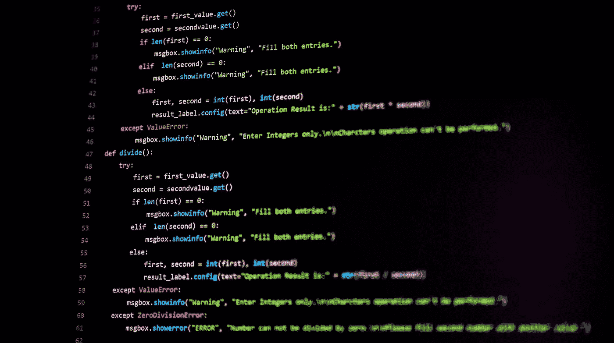

# Python 错误处理

> 原文：<https://blog.devgenius.io/python-error-handling-8bed3f5b5769?source=collection_archive---------3----------------------->

## 像专家一样处理 Python 中的错误

Python 中的错误处理，图片由作者提供

当程序执行期间，Python 遇到错误时，它会停止。这可能是由两种类型的错误引起的，语法错误或异常。在本文中，我们将讨论第二个异常，并展示如何处理、捕捉和引发它们。

# 什么是例外？

异常是当语法正确的代码执行时 Python 报告的错误，以及异常情况的发生。例如，看看下面的代码。

引发异常的程序

这个程序试图将数字十除以零，这在 Python 中是不可能的。

当您执行这个程序时，Python 会引发一个 ZeroDivisionError 并终止应用程序。

`> python3 main.py
Traceback (most recent call last):
File “main.py”, line 3, in <module>
result = number / divider
ZeroDivisionError: division by zero`

这个 ZeroDivisionError 是一个**异常**。每个异常都是从一个公共基类派生的 Python 类。在本例中，来自 BaseException。

Python 有许多内置的异常。例如，AssertionError、AttributeError、EOFError、FloatingPointError、ImportError、ModuleNotFoundError、IndexError、MemoryError 和 NotImplementedError。

这些都记录在优秀的 [Python 文档](https://docs.python.org/3/library/exceptions.html)中。

# 我们如何处理异常？

正如我们之前看到的，如果一个异常发生而没有处理它，Python 将会报告错误并终止你的应用程序。

通常，这不是你想要的。为了防止这种情况，您可以通过将语句包含在 try-except 语句中来处理可能的异常。

处理 ZeroDivisionError 异常

这个 try-except 语句的工作方式如下。首先，Python 执行`try`和`except`之间的语句。这些语句称为 try 子句。

如果没有异常发生，跳过`except`以下的语句，结束`try`语句的执行。`except`下面的语句称为 except 子句。

但是，如果在 try 子句的执行过程中出现异常，则跳过其余的语句。然后，如果类型匹配以`except`语句命名的异常，则执行 except 子句。执行在`try`语句后继续。

## 处理多个异常

可以为一个 try 子句创建多个 except 子句来处理多个特定的异常。这使您能够在特定异常发生时更好地控制要执行的语句。

在这个例子中，我们处理一个`ZeroDivisionError`和一个`ValueError`。当用户不输入数字时会出现`ValueError`，当用户输入 0 时会出现`ZeroDivisionError`。

处理多种类型的异常

这里我们打印一条消息，但是您可以想象根据异常的类型，您可以执行不同的语句。

## 通用异常处理程序

还可以添加另一个 except 子句来捕获一般的异常。这样，您就创建了一个安全网来捕捉所有其他异常。

添加一个通用的 except 子句来捕获所有异常

如果发生了除`ZeroDivisionError`或`ValueError`之外的异常，则触发第九行的一般 except-子句。这样可以确保所有的异常都得到处理。

except 子句的顺序很重要，总是从最具体的异常开始。如果我们从一般的 except-clause 开始，那么具体的 except-clause 就永远不会被执行。

不会执行 except-clause ZeroDivisionError 和 except-clause ValueError

# 最后使用 Try

无论 try- and except 块的结果如何，`finally`块都允许您执行代码。这有时会很有用。例如，在处理文件时。

使用 finally 块

在这个例子中，`finally` 块关闭了文件。即使出现异常，也会执行`finally`块并关闭文件。

## With 语句

Pythons 的`with`语句可以用来简化使用`try-finally`的代码。让我们看看如何使用`with`重写前面的例子。

使用 with 确保文件被关闭

通过在打开文件时使用`with`，可以确保当`with`块完成时，文件自动关闭。结果与使用 finally 相同，但看起来更干净一些。

# 提出你自己的例外

在我们讨论处理由标准 Python 模块引发的异常之前。也有可能从代码中引发异常。

现在，你为什么要提出一个例外呢？

假设您开发了一个 Python 模块，它需要某个配置文件才能正常工作。当找不到配置文件时，您可能会引发异常。

引发异常

在这种情况下，我们会引发 FileNotFoundError 异常，它是标准 Python 模块的一部分。我们也可以定义自己的异常类并引发该异常。

## 定义自定义异常类

为了能够引发自定义异常，我们需要定义一个从 exception 派生的类。在`ConfigureError` init 中，我们称之为超类的 init。

定义和引发自定义异常

## 记录和引发异常

引发异常的另一个原因是为了日志记录。您捕获异常，记录错误消息，并重新引发异常。

在这种情况下，确保调用`raise`时不带任何参数。这将确保调用堆栈信息保持完整。

# 结论

在本文中，我们看到了什么是异常以及如何处理它们。我们使用 *try-finally* 和 *with* 来定义清理动作。最后，我们看到了如何引发自定义异常。

有了这些信息，您应该能够处理所有的 Python 错误。

感谢您的阅读！